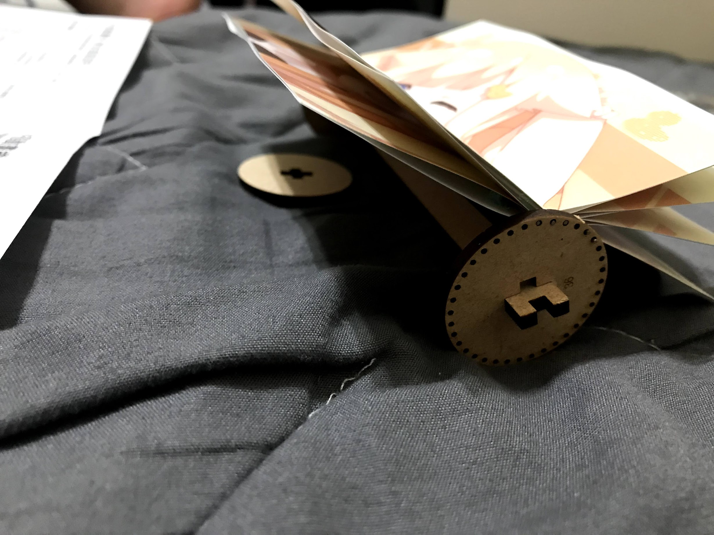
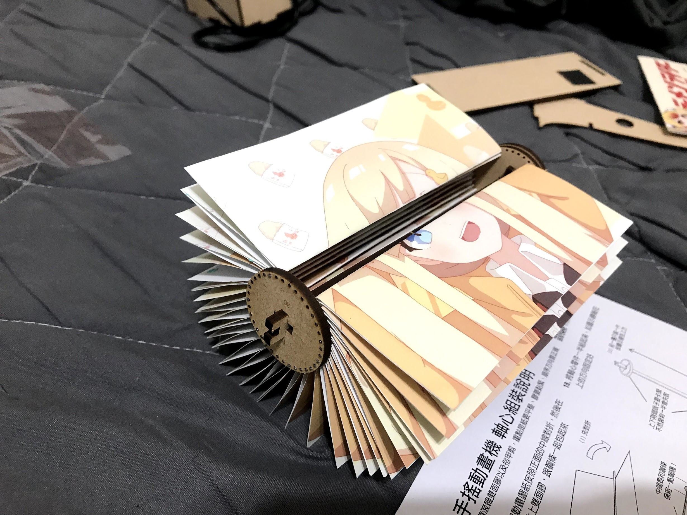

# 在FF36買的動畫機開箱

## 前言

如果有在逛FF的各位小夥伴

是不是有發現

最近這一兩年的攤位

似乎多了會一直轉，播放逐格動畫的機器

.

以前看覺得一組就要600實在狗幹貴

都可以買三四本本本了

.

但仔細想想

買本本回來也是放著

但買動畫機回來可以轉誒

還可以換成自己喜歡的`gif`

感覺好像還更划算(?

加上手賤有點想組

還有想看轉起來長什麼樣子(攤位不是有...

所以就買了一組

本體(`600`)加上馬達(`400`)套總共`1000`

.

然後動畫機的本體價格主要是根據張數不同

張數越高價格越高

.

QQ

就當肥宅稅吧

反正一年頂多繳兩次

.

## 正文

先曬一下這次買的本本

都是全年齡向的

讚讚讚

.

除了全年齡向的本本外

這次買的最有趣的東西就是這台動畫機了

.

可以讓身處衣食無憂，整天換抱枕換老婆的各位肥宅

透過手作的方式知道動畫組的辛苦

進而多買BD~~救救可憐小日本~~

.

本次主角，動畫機和他的驅動馬達小夥伴

.

為了怕之後動畫轉一轉女主角開始脱起衣服

這次買比較保險的食用系少女

簡單來說，~~就是很會吃的意思~~

~~除了吃和賣萌以外沒有其他特色和專長~~

.

打開來後，有這堆東西

- 鋼線
- 泡了水後很容易潮濕的木板
- 工商名片
- 36張動畫紙，能打能畫畫的肥宅也不多了，先幫大家畫好。
- 黏性黏土和砂紙
- 說明書

.

說明書第一頁

簡單說明動畫機是如何運作的

.

第二頁，教你怎麼安裝，和怎麼把那堆紙固定上去

.

拆

.

首先先把這坨木板安裝好

.

然後把這坨紙拿出來

對折，按照順序摺出一堆出來

.

盡量對齊中線，不過沒完全對齊也沒差

反正之後轉起來也看不太出來

.

全部摺好後，選擇黏貼的方式

不才選擇黏性黏土

因為裡面有付

但份量狗幹少，可能需要省點用

.

大概像這樣

黏貼五個點點

.

然後可以看到紙的下面有數字

照著說明書的順序排列

.

如果怕排成反順序在裝時可以翻翻看

新的畫面應該要在舊的畫面的上面

.

裝好一部分了

裝的時候有一點建議

- 確認扣上去的洞洞有裝好沒掉
- 確認安裝時中間沒有空的洞洞，因為洞洞的數量和動畫張數是剛好的
- 安裝時保持水平，如果看到有哪一張鬆掉也不要現在調整，因為這時候拿起來看很容易散掉

.

[40分鐘後]

哦哦哦大部分都裝上去了

.

然後把兩邊的木片固定上去

.

裝到架子上，就大功告成了

.

一開始如果發現轉起來很卡，用手撥動旁邊的木輪多轉幾次

可能會稍微好轉一點

如果還是覺得有點卡，就多放幾天，會發現很神奇的變好轉了

.

如果轉起來卡卡的不要把把手插上去硬轉，把手可能會爛掉QQ

.

馬達部分

.

然後如果發現沒有太難轉，但馬達就是推不動的情況

可以從側邊把馬達盒子拆開

.

如果中間有縫隙

壓到沒縫隙這樣

再重新裝一下，應該就可以順利推動動畫機了

.

如果會拆裝馬達，可以嘗試把馬達軸心比較短的那一面換到有零件的那面

交換馬達連接驅動器的兩隻腳可以改變馬達轉動方向

.

不會拆就算了www

.

## 結論

原本想帶去公司炫耀，但想想已經裝好了

再帶過去反而會覺得自己很廚

還是算了

.

然後換成自己得gif...

不才現在有夠懶

等之後有時間再說好了wwwwww

.