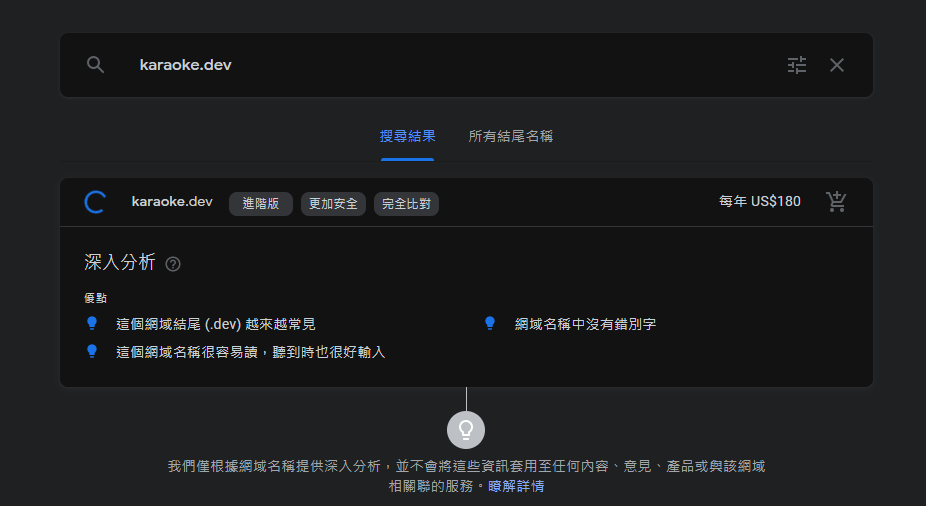
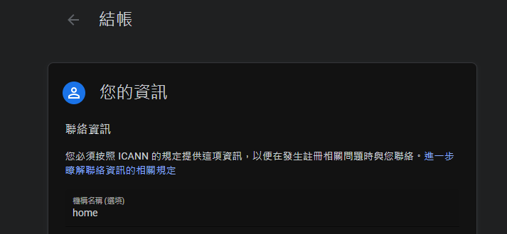
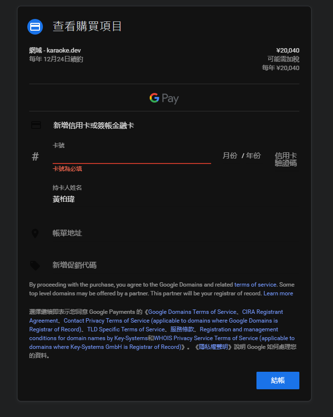
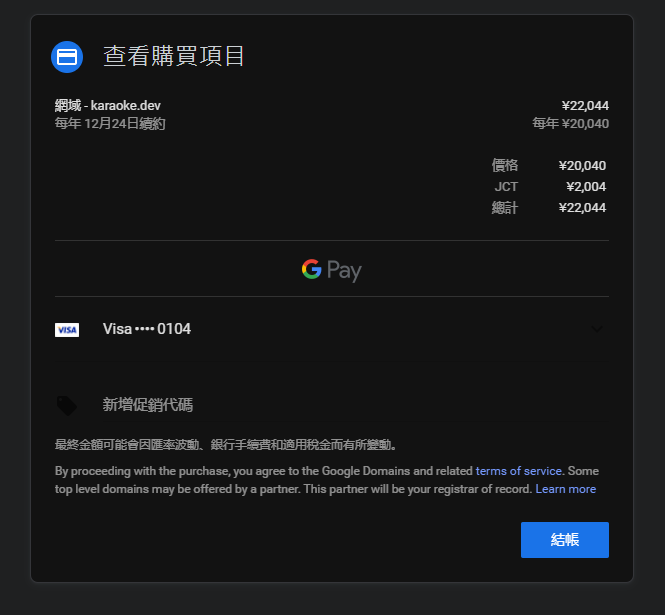
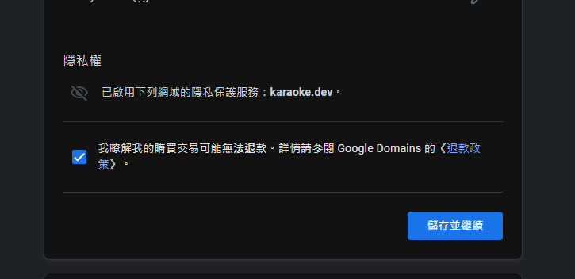
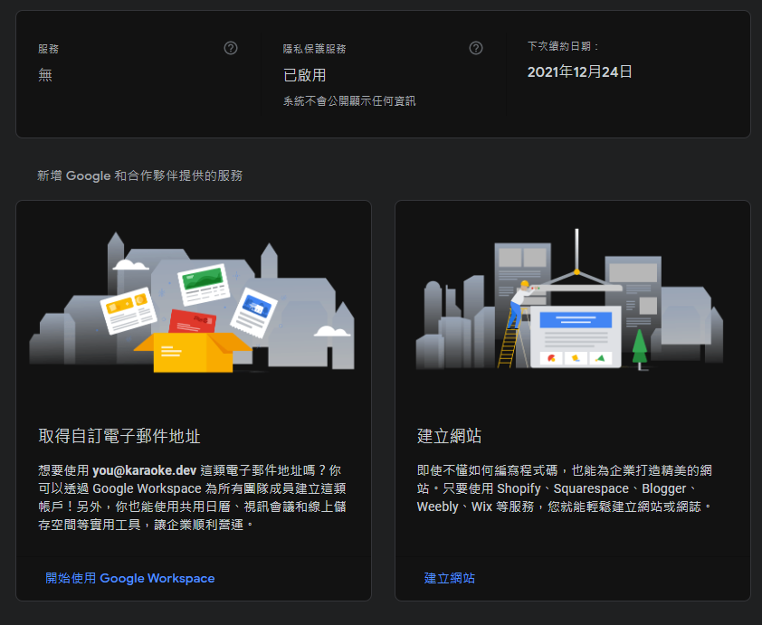
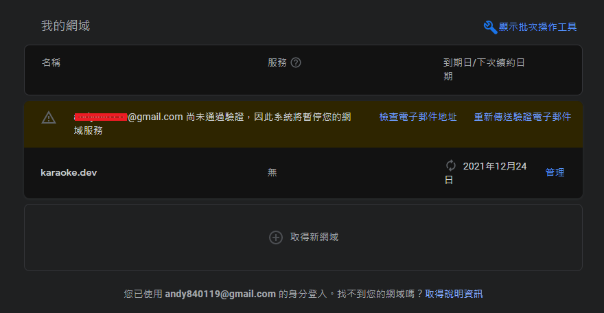
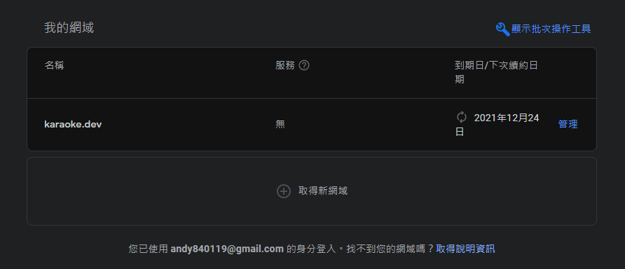

# [教學] 如何在google domain上面買網域

## 前言

因為家中的網域用完了，所以出門添購(X

.

沒，主要是因為手邊有新的專案，未來應該會需要一個domain

不才隨手逛一下後發現有一個相當喜歡的

但怕未來被搶走，不然就是漲價

猶豫了幾天後

最後還是

買了

.

## 正文

要買的 domain google 和 godaddy 都有賣

雖然說 godaddy 首年加上優惠後比較便宜，但怕哪天一言不合就漲價

最後還是選擇google domain

.

先搜尋一下想要的網域還在不在

.

.

.

