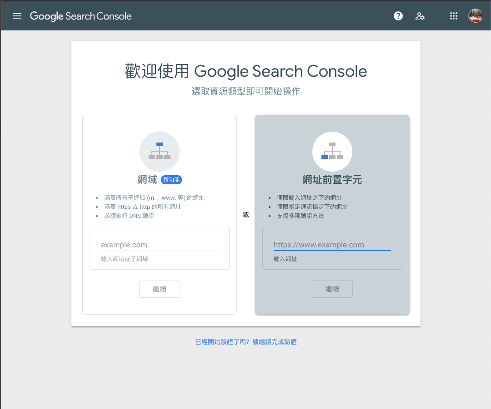
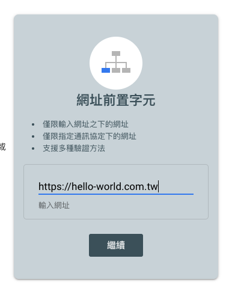
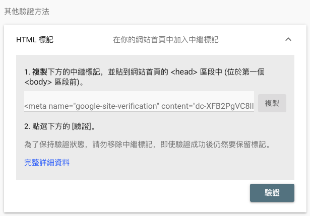
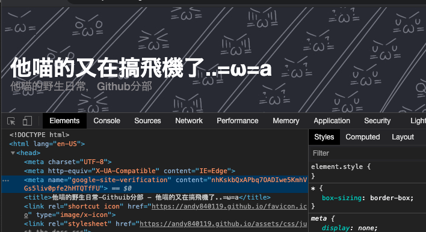
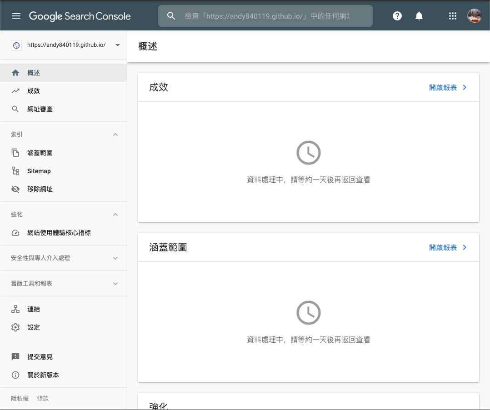

# 如何在讓自己的Github page被google搜尋到

## 前言

如果各位有在用github page寫部落格的小夥伴們，應該會注意到一件事

> SEO都弄了，怎麼在google上面都搜尋不到自己的部落格

hmm...

原因也很簡單，因為`google`也不知道你的網址

自然也不會被加到爬蟲清單中

.

所以要先告訴google自己網站的網址

還有確認這個網站是自己的

google才會幫你把網址加到搜尋引擎中

.

## 正文



https://search.google.com/search-console/welcome

首先先到這邊

.



然後填上自己的網址

.

接著會有提示，要求在自己的網站中加點東西



有幾種認證方式

不才推薦用html標記的方式，因為最簡單

.

https://github.com/jekyll/jekyll/issues/3514#issuecomment-75968258

參考這篇的方法

首先要修改jekyll template 的header

如果使用公版`temppate`可能要clone 或是 fork 一份到自己的 github 帳號底下

可以看一下不才的[pr](https://github.com/andy840119/tameowder-theme/pull/6)怎麼做的

.

然後在自己文章repo(xxx.github.io)repo中修改一下config，加一下設定

可以參考一下[這個PR](https://github.com/andy840119/andy840119.github.io/pull/27)的更動

.



確定部署上去，meta 也有 

``` html
<meta name="google-site-verification" content="nhKskbQxAPbq7OADIwe5KmhVGs5liv0pfe2hHTQTfFU">
```

後，就可以按驗證給google去檢查了

.



沒問題的話應該就會出現在後臺上了

.

以上

## 結論

// todo : 等待測試是不是在google 搜尋引擎上

.