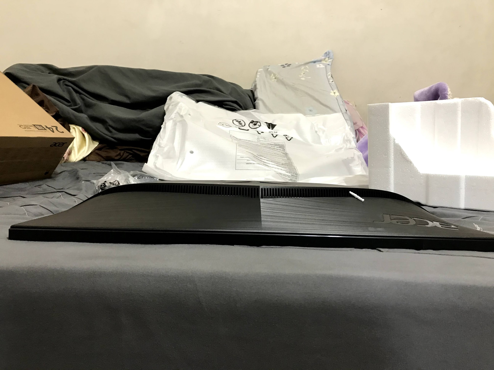
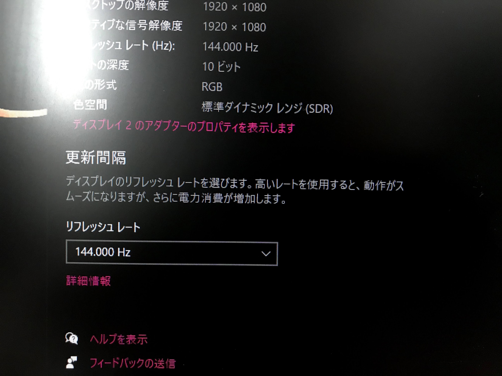

# [開箱] VG242Y P 24型 IPS 165Hz 0.5ms HDR400 極速電競螢幕

## 前言

因為之前便宜幹來的螢幕掛了(Dell U2414H)

螢幕背光會一閃一閃

換了電源模組也修不好

雞掰

.

所以就換個新螢幕吧

至少人家是新的還有保固

然後很不巧的不才的書桌只能放得下23寸

所以就23寸裡面挑個買

.

需求大概是:
- 23寸
- IPS，不才認為VA和TN面板都是大便屏，不接受反駁(X
- 至少一個DP和兩個HDMI，這種東西總是多多益善
- 不要太貴(大概5000內吧，花太多錢又不是買32寸螢幕總覺得有點心痛)
- [optional]高刷屏
- [optional]HDR

最後剛好看到MOMO上面有賣

價格也差不多

比起之前的螢幕有HDR和高刷屏可以玩玩看

又剛好要在10點下單才保證當天出貨

沒啥思考就買了

.

大概下午五點到

雖然沒有PChome快

不過看在MOMO找東西比PCHome方便的份上

算了

.

## 開箱

東西到了

盒子正面

.

側面

有支援 AMD 的 FreeSync，簡單來說就是用很少的成本(和Nvidia需要在螢幕裡安貴死人的晶片比起來)達到玩遊戲時幀數不穩定不會產生撕裂感的效果

24寸但實際上是23.8

HDR400(HDR標準裡面最低的)

IPS

還有很快的反應速度

.

打開

螢幕一台

.

整體給人的感覺嘛....

傻

大

粗

厚

厚

厚

.

狗幹厚的螢幕

真TM厚

之前在公司買的32寸螢幕下方也沒那麼厚

.

下方一個電源孔

一個DP

兩個HDMI

一個耳機孔

沒了

.

大概就該有的都有了

.

配件嘛

一條電源線

一個底座

一條HDMI線

一條DP線

.

終於沒有附上垃圾VGA線了

.

壞掉的螢幕換下來

終於有新螢幕可以使用了

.

抱歉忘了整理書桌，總覺得有點傷眼

.

大概就是安在這個位置

總覺得這書桌也挺強的，從國小能這樣用到現在

放書到最後放螢幕，還有整線也都想好了

發明這個書桌的人是未來人嗎?

.

準備安裝螢幕

把線嘟嘟嘟的都插上去

.

安上去，就大功告成了

.

不才懷疑自己是個天才

換螢幕和換彈藥包一樣快速俐落(#

.

好險螢幕厚厚厚雖歸厚，但至少還是能塞進書桌裡(汗

.

一裝上去後電腦就自動識別到144hz

10bit 色彩輸出...

.

OSD可以選繁體中文不用心擔心

.

然後挺讓不才意外的，這台螢幕居然有PIP(子母畫面)

簡單來說，就是能在同個畫面上輸出兩個不同來源的訊號

.

例如，不才能用主畫面顯示PS4，然後在左上角顯示電腦畫面

.

又或是相反

.

又或是兩邊平行顯示

.

也能選擇聲音要從哪邊出來

.

但不太聰明的， 如果不才把主訊號原從PC變成PS4，副訊號源不會自動從PS4變成PC

算是有點可惜的地方

.

還有有一點需要注意的

在"遊戲"選單內

如果沒有把"超低延遲打開"，就算電腦輸出調成144hz

螢幕上也看不出來

.

之前預設是打開的，但不知道為什麼不才在玩PIP玩到一半好像就被弄關了

.

大概是這樣吧

.

另外在上面看到輸出的顏色深度是10bit

想說這螢幕該不會也支援10bit?

後來無聊去搜尋了一下

https://www.displayspecifications.com/en/model/ba6e20e7

發現是6bit + FRC 抖出來了

.

用10bit的訊號在6bit硬抖成8bit的螢幕上顯示畫面

感覺有點神秘

.

然後正當不才在想都2021年了

哪家廠商那麼無良還生得出6bit的鬼螢幕出來時

無聊查了一下，發現現在5000塊底下的螢幕，很多其實都是用6bit + FRC

.

對比較便宜的螢幕(3500~4300)，都是6bit + FRC:
- VX239H : [https://www.displayspecifications.com/en/model/7d44f38](https://www.displayspecifications.com/en/model/7d44f38)
- VZ249H : [https://www.displayspecifications.com/en/model/96a27ca](https://www.displayspecifications.com/en/model/96a27ca)
- K243Y : [https://www.displayspecifications.com/en/model/5fa62192](https://www.displayspecifications.com/en/model/5fa62192)
- VX2458-MHD(這款有144hz，但TN): [https://www.displayspecifications.com/en/model/e1c21626](https://www.displayspecifications.com/en/model/e1c21626)
- VA2732-h : [https://www.displayspecifications.com/en/model/00db210e](https://www.displayspecifications.com/en/model/00db210e)

.

之前的螢幕U2414H，也是6bit + FRC:
- Dell U2414H : [https://www.displayspecifications.com/en/model/d7d174](https://www.displayspecifications.com/en/model/d7d174)

.

公司買的32吋螢幕(VX3276-2K-MHD-2)，那時候買不到7000，居然是8bit + FRC抖成10bit :
- VX3276-2K-MHD-2 : [https://www.displayspecifications.com/en/model/83a92553](https://www.displayspecifications.com/en/model/83a92553)

整整多出兩個bit

三個顏色共六個

.

VX3276-2K-MHD-2 算是一款顏值不錯

中規中矩，該少的不會少，該多的也不會多

然後是32寸2K螢幕中僅存少數平面屏

還有HDR10

堪稱良心之作，混亂界的綠洲

.

回到正題，雖然目前開箱的這台螢幕(VG242Y)只是個用6bit + FRC的渣渣

但反正上一個螢幕也是6bit + FRC

還有和公司那台也看不出來有啥差別

就算了

.

然後有[HDR400](https://www.zhihu.com/question/325302989)加持，~~雖然聽名稱感覺有點屌但實際看了下感覺這標準怎麼有點鬆啊~~

不才覺得在看對比度比較高的畫面

又或是玩玩EDF(地球防衛軍，FPS遊戲)時，的確黑比較黑，白比較白

跟之前的Dell螢幕比起來

.

大概是這樣吧

.

## 總結

最後總結一下優缺點好了

優點:
- IPS
- 接頭算多了，可以讓你接一台電腦+PS4+Switch剛好接滿
- HDR400，雖然感覺HDR400標準挺鬆的
- 子母畫面，雖然在23寸的螢幕上實在沒啥用處
- 144Hz螢幕，用過以後真的回不去，會覺得之前60hz刷新率的螢幕都是大便屏，不接受反駁(#
- 電源供應器內置在螢幕裡(雖然現在87%螢幕都是這樣)
- 薄邊框(雖然現在隨便撿一台便宜的螢幕都是薄邊框)

缺點:
- 大陸面板(雖然也沒太別在意就是了)
- 傻大粗厚厚厚
- 找不到關機鍵，不才也懶得找了
- 支架不好鎖

如果以現在最便宜的IPS螢幕來說，算3500吧

等於多花1500能夠換到：
- 多一個孔
- HDR
- 144hz刷新率
- 傻大粗

.

大概是這種感覺吧

雖然現在不才用這螢幕也用得挺滿意的

但還是一分錢一分貨

便宜的螢幕總是會在看不到的地方縮水

.

最後附上螢幕科普:

[https://www.intel.com.tw/content/www/tw/zh/gaming/resources/everything-you-need-to-know-about-gaming-monitors.html](https://www.intel.com.tw/content/www/tw/zh/gaming/resources/everything-you-need-to-know-about-gaming-monitors.html)

還有差不多價位螢幕參考(144hz):

[https://monitor.buyerguide.info/pre-selection/144hzfhd](https://monitor.buyerguide.info/pre-selection/144hzfhd)

以上

.