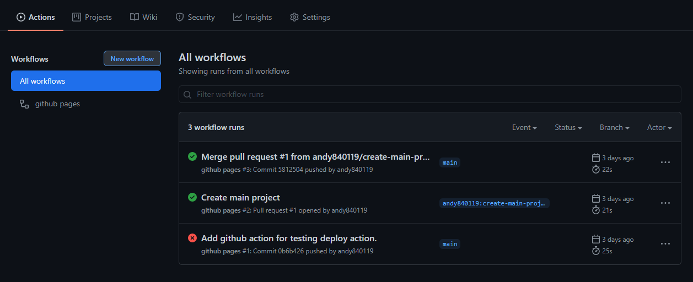
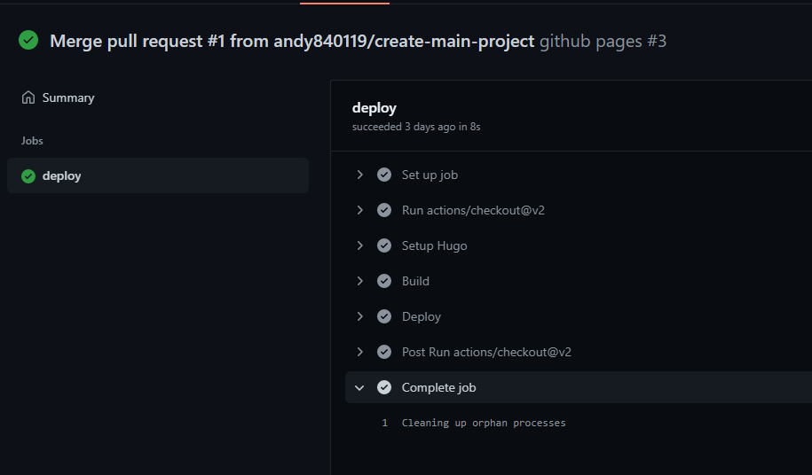
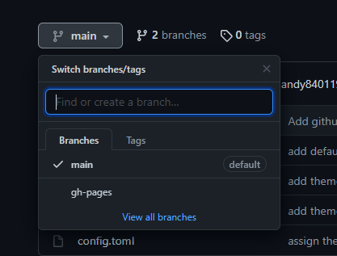
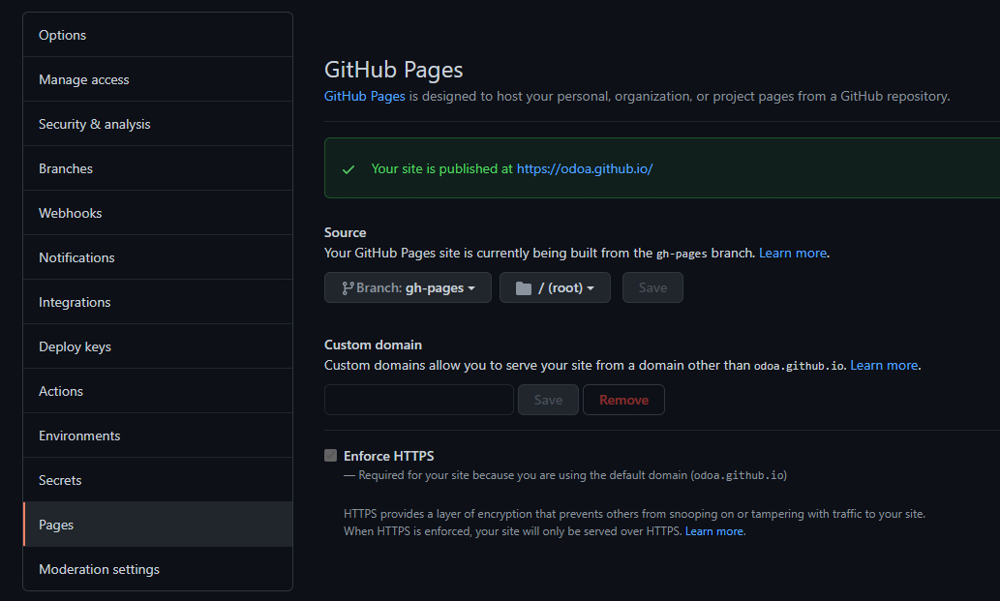

# [教學] 用hugo在github上面架設自己的部落格 

## 前言

最近想說

是時候把手邊專案的介紹網站換成深色主題

之前是用老老的`jekyll`

正好是時候換換看`hugo`了

.

然後怕自己哪天又忘記

所以先科普一下幾種把`markdown`轉換成網頁(blog)

的工具好了

- `jekyll`: 用ruby寫的，在github page上對新手小白有不錯的支援度
- `hexo`: 差不多的東西，但是用nodejs寫的
- `hugo`: 差不多的東西，但是是用go寫的，所以理論上速度最快

## 正文

https://github.com/ODOa/ODOa.github.io

在正式專案轉移到hugo之前，先開一個空專案試試看，方便給大家參考

首先要建立一個github帳號

然後建立一個專案，專案要命名為[username].github.io

.

https://gohugo.io/getting-started/quick-start/

先建立一個新的hugo page

https://github.com/ODOa/ODOa.github.io/pull/1

可以參考上面提交的格式

.

https://gohugo.io/getting-started/configuration/

另外建議config.toml放到`config/_default/config.toml`底下會比較好

雖然不知道為什麼預設產出來的template會把`config.toml`放到根目錄...

.

https://github.com/ODOa/ODOa.github.io/blob/main/.github/workflows/gh-pages.yml

然後建立github action

建立在`.github/workflows/gh-pages.yml`內

保險起見不建議換檔名，因為不太確定`gh-pages`這個檔名有沒有特殊用途

```yaml
name: github pages

on:
  push:
    branches:
      - main  # 如果有東西push到這隻branch時會觸發github action，如果你的主branch是master或是其他名稱，就自己換過去
  pull_request: # 再提交PR時會觸發github action(但只會用來測試編譯有沒有過，不會正式部屬)

jobs:
  deploy:
    runs-on: ubuntu-18.04
    steps:
      - uses: actions/checkout@v2
        with:
          submodules: true  # Fetch Hugo themes (true OR recursive)
          fetch-depth: 0    # Fetch all history for .GitInfo and .Lastmod

      - name: Setup Hugo
        uses: peaceiris/actions-hugo@v2
        with:
          hugo-version: '0.83.1'
          extended: true # 建議加上去，不然有可能會收到scss編譯錯誤

      - name: Build
        run: hugo --minify # 編譯

      - name: Deploy
        uses: peaceiris/actions-gh-pages@v3
        if: github.ref == 'refs/heads/main' #如果有新的commit合併或是推送到main branch上，就執行deploy(如果你的主branch是master或是其他名稱，就自己換過去)
        with:
          github_token: ${{ secrets.GITHUB_TOKEN }}
          publish_dir: ./public

```

.

github action 是從[這邊](https://github.com/marketplace/actions/github-pages-action)參考過來的

然後`secrets.GITHUB_TOKEN`不需要設定，github會自動設定好權限

.





如果把PR合併到主branch(main)，然後進去github action確認有跑成功後

.



會多出一個`gh-pages`的branch

那個`branch`

簡單來說，是`github action`編譯完東西後，會產生一個新的commit

然後硬塞進那個branch中

.



接著在到setting中

把branch換成`gh-pages`

如果需套用自己的domain也可以在這邊輸入(會另外產生一個commit存進`.github/workflows/gh-pages.yml`內)

然後save

.

https://odoa.github.io/

過一小段時間，去[username].github.io中

就能看到頁面了

以上

.

## 心得

最後再說一下心得吧

這東西有點強大，佈景主題也很多

有多國語言，會自動產生sitemap

有tag，搜尋功能很多template預設都是做好的

如果要留言板也能自己裝

完整程度不輸正規的部落格網站

.

使用submodule來管理template

可以手動確認新版本沒問題後再update submodule commit id

不會因為作者更新有問題的版本

就把自己的部落格炸了

.

如果直接撿個主題直接套來用

沒遇到坑可以用的很爽

.

但也是有不少缺點，尤其是打算自己客製化時: 

1. 如果檔名不是`index.md`，抓相對路徑的圖片會有跑板問題
2. 在jekyll會把`readme.md`當作`index.md`，但hugo沒辦法設定把某些檔案當作main page    
   如果是從jekyll轉移過來，需要把所有`readme.md`重新命名
3. 同一層目錄上可以直接用不同檔案名稱當作多國語言    
   例如`index.md`，`index.jp.md`    
   但如果某篇文章沒有日文版時，不會自動使用`index.md`的內容代替
   - [https://github.com/gohugoio/hugo/issues/4463](https://github.com/gohugoio/hugo/issues/4463)
   - [https://github.com/gohugoio/hugo/issues/5612](https://github.com/gohugoio/hugo/issues/5612)
   
   有些人有反應，但目前感覺作者沒想出好解法(主要是因為會產生大量重複檔案)
4. 如果`content`目錄內有`index.md`，會造成其他檔案不會被編譯到(被這雷了好幾個小時...)
5. 有很多樣板可以用，但每個樣板都有自己的document，如果哪天換樣板又需要重新讀document
6. 如果遇到雷，很難判對到底是`hugo`的問題還是`樣板`的問題

以上