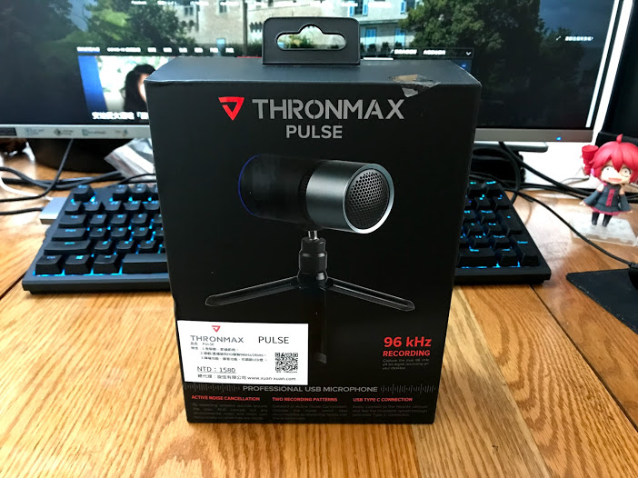
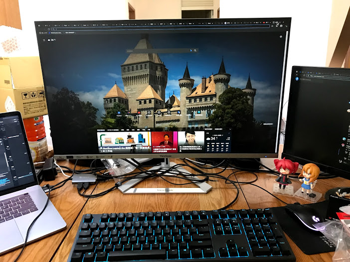

# [開箱] Thronmax M8 Pulse USB麥克風開箱 + 心得分享

## 前言

working form home (簡稱WFH，後面不會用到) 已經一段時間了

雖然在家裡工作可以把手邊落後進度的side project補一補

但在客廳工作冷氣又壞了

實在有夠哭

.

然後剛好最近公司有發working form home的補助

想說之前和朋友玩遊戲時說聲音斷斷續續

乾脆把錢拿去買個好一點的麥克風好了

剛好公司開會時也可以用上

一舉兩得

.

## 正文

下訂後幾天收到包裹了

在蝦皮買

有送東西

折抵券

還有免運

不錯

這東西毛利肯定很高(X

.

總共有不知道以後有沒有機會用上的口水房噴網

不知道效果的麥克風和

不知道會不會中獎的發票

.

先看本體

正面

.

側面

.

背面

另外一個側面就懶得貼了

.

開箱

裡面有

一本說明書和麥克風本體

.

說明書基本上就是簡單的操作

還有附上兩張意義不明的貼紙

.

接著看本體

.

支架

金屬的

質感摸起來不錯

.

麥克風

摸起來應該也是全金屬的

.

正面

.

背面

.

順帶一提，那個麥克風的支架

和相機腳位的孔是同一種

好處是如果未來要買支架

應該會比較好找

.

裝上去後的樣子

感覺相當不錯

.

高度也可以調整

.

另外是一條1.5m的線

type-c好評

.

這是沒有麥克風的桌子

.

這是有麥克風的桌子

加上麥克風後整個高大上了起來(並沒有

.

接上電源後會發光，相當潮

.

開箱部分就到這邊了

接下來說說測試

.

## 測試

https://webcammictest.com/check-mic.html

先抱怨一下，能夠聽到自己聲音的麥克風測試網站真TM狗幹少

然後這個算是找過幾個後稍微比較好的

.

再不然就是用`Discord`的麥克風設定來測試吧

(更新: 不知道為什麼Discord上聲音會斷斷續續，用osx，chrome os和windows，調了設定都會這樣

(更新: 後來測試不是原本webcam的鍋，東西白買了Orz

.

目前總共用五種麥克風進行測試

分別是: 
- macbook pro 2019 內建的麥克風
- Thronmax M8 Pulse
- 小米遊戲耳機
- earpods
- microsoft lifecam hd5000

.

如果是人聲的話(也就是聊天聲音): 

大概是 `Thronmax M8 Pulse` 最清楚

`小米遊戲耳機` 感覺也就稍差點

然後接下來是 `earpods` (聲音聽起來有點悶)

後面是 `macbook pro 2019 內建的麥克風` (考量到風扇聲，還有麥克風位置離嘴巴總是會比其他三個遠一些)

最後是 `microsoft lifecam hd5000` (畢竟有點年紀了)

.

但說真的，`Thronmax M8 Pulse` 的效果不算特別優秀，一個小米耳機附帶的麥克風也有八成以上的效果

.

聲音大小部分有在osx, chrome os 和 windows 上面測試

都把麥克風聲音拉到最大

.

音量部分: 

最大聲的是`小米遊戲耳機`， `earpods`(畢竟離嘴巴最近)

再來 `microsoft lifecam hd5000` (webcam收音距離比較遠，聲音本來就會大聲點)

接著是 `macbook pro 2019 內建的麥克風`

最後是 `Thronmax M8 Pulse`

.

如果是普通模式，建議麥克風距離嘴巴40公分內

到60公分後就會變得很小聲

.

如果是降噪模式

雖然效果算是不錯

要距離嘴巴5公分內

說會還需要有點大聲才行

如果是沒有麥克風支架

這個功能幾乎沒辦法派上用場

.

## 優缺點和結論

最後總結一下優點和缺點好了

優點:
- 顏值高
- type-c
- 有燈
- 監聽耳機孔可以用來輸出電腦的聲音(看說明書才發現)
- 監聽耳機孔的麥克風聲音是由電腦傳過來，可以關掉(看說明書才發現)
- 相對於其他麥克風來說，錄製人生以外的聲音(例如音樂)可以感覺到較大的差異
- 開箱時有開箱味

缺點:
- 聊天效果來說，不算特別好(對比其他耳機內建的麥克風來說)
- 不好放置
- 占空間
- 些微發熱
- 監聽耳機的孔聲音特別大聲(相比接電腦上的耳機孔)
- 後面那個音量調節旋鈕，不是調節麥克風聲音，而是調整電腦音量(誰會用這個旋鈕調整電腦音量....)
- 斷開電源後不會記住上次是`普通模式`還是`抗噪模式`，也就是說，直播用抗噪模式的人每次都要記得按按鈕，不然可能會噴到觀眾
- 沒辦法用燈號判斷麥克風有沒有被應用程式使用
- 聲音偏小，在windows用軟體可以強制把聲音拉大，其他作業系統沒研究
- 附上的線有夠硬
- 背後的按鈕有點鬆動
- 抗造模式需要靠嘴巴非常近
- 如果放在螢幕前面，反光會噴到螢幕

.

個人覺得

如過沒要直播

沒有為它準備專業麥克鳳支架

只是開會，聊天，找朋友打打遊戲

用普通麥克風就好了

或是攝影機上的麥克風就夠用了

用這個可能還會帶來不必要的麻煩

例如占空間(突然覺得攝影鏡頭直接掛在螢幕上就解決了，有夠香

需要專軟體把聲音拉大

.

錢省下來可以吃十幾頓消夜

.

另外聲音偏小部分(尤其是windows聲音特別小)

可以參考這邊的修正方式，強制把聲音拉大:

https://www.youtube.com/watch?v=lsoa9AghUUk

記得重開機

.

把原本聲音加上14db(原本不知道為什麼是負的)

效果就好多了

以上