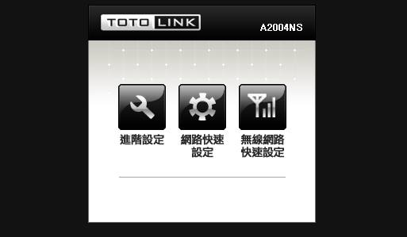
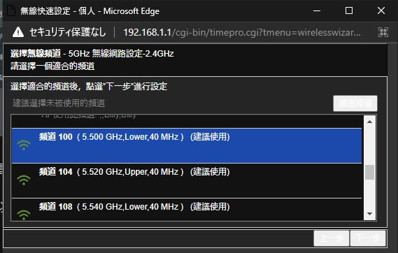
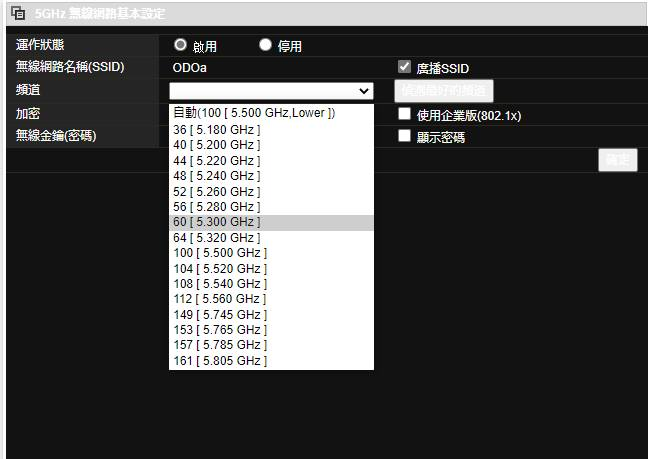

# [教學] 如何讓totolink解鎖全部5G頻段

## 前言

最近為了玩健身環

把小台的switch換成大台的

不換還好

換了才發現那個wifi訊號有夠破

所有設備在房間都收得到wifi

就switch不行

爛東西

.

https://www.kocpc.com.tw/archives/138973

後來想說改一下手邊AP的5G頻寬

不知道讓switch連上5G訊號會不會好一點

但很不巧的，totolink的AP就是找不到switch可以接受的頻道區間

Orz

.

最後皇天不付苦心了

終於找到方法了

.

## 正文

某些頻道會消失

主要的原因是國家法規

不同區域會限制不同頻段的wifi訊號

避免一些國家要用的特殊的頻段被干擾

.

對AP生產商來說

與其用硬體的方式限制頻段

用軟體閹割掉總是比較輕鬆

所以說不定把AP的設定換個國家

就能打開那些頻道了

.

https://www.tamio.com.tw/UploadFiles/FileStore/0000000075/totolink_router_QIG.pdf

最後終於找到一篇教學了

.

如果是用totolink的用戶

進到畫面後按下右邊的無線網路快速設定

裡面可以選擇國家(目前也就只有這邊能選擇國家了)

如果選擇美國或加拿大

.

把接下來設定跑過一圈

就能設定所有頻寬了

.

之後回到進階設定就會發現所有頻寬都解鎖了(原先只有四個可以選)

.

以上

.

## 結論

更換國家那麼好用的功能居然藏在這種地方

機掰

.