# [開箱] WP3000濾水壺開箱

## 前言

因為工作一直維持WFH

想說疫情好像也好轉了

所以最近搬到阿罵家工作看看

順便看看訊號好不好

能不能順利工作等等

.

然後順便抱怨一下`台灣之星`的續約方案

想續約只能續越來越貴的方案(提升的還只有價格而已)

然後再看雙11時各種大撒幣來搶新客戶

先幫自己QQ

.

之後可能試用看看亞太後再決定要不要先轉吧

.

## 開箱

抱怨完了

回來開箱

.

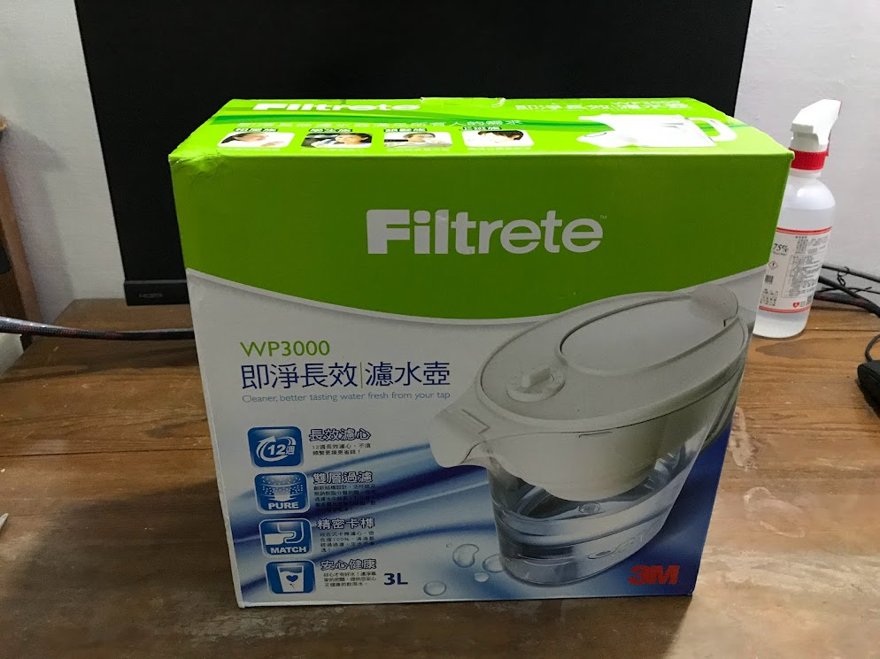

正面

.

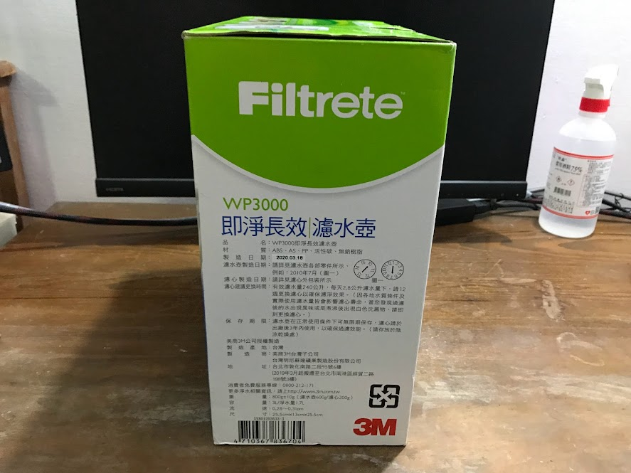

側面

.

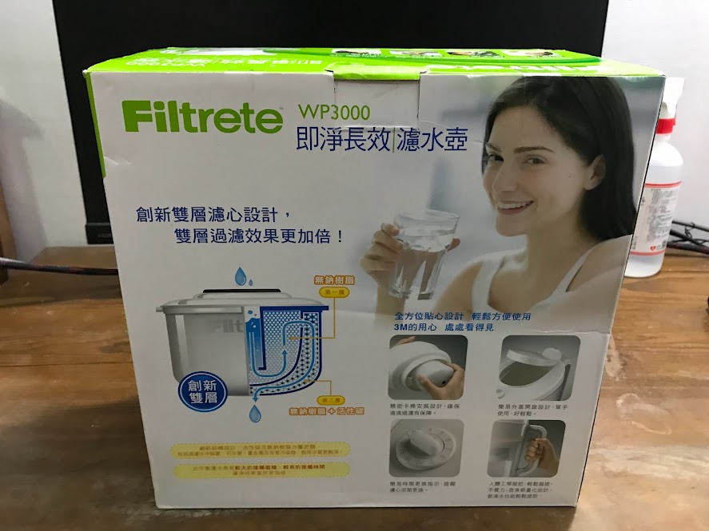

背面

.

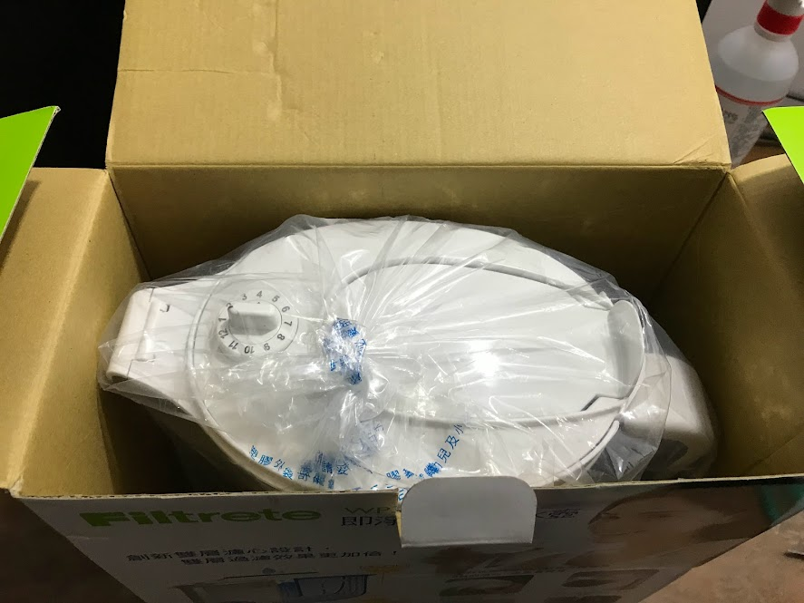

開箱

.

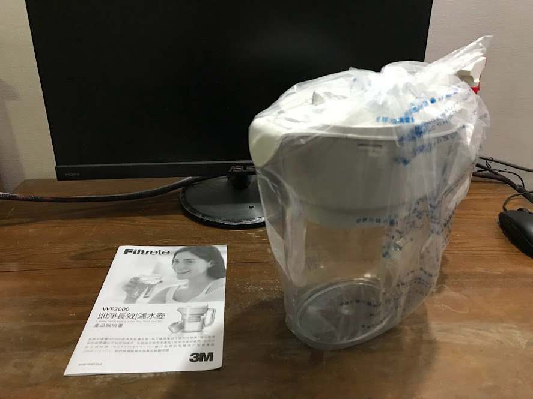

總共就一張說明書

一個杯子

.

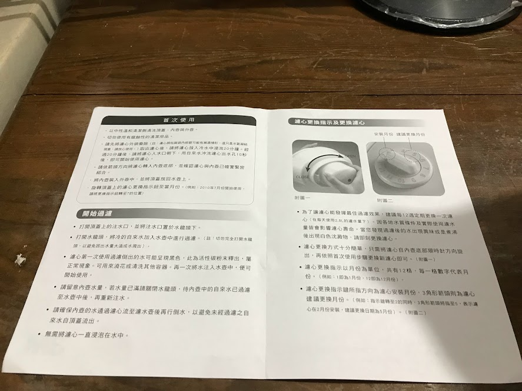

說明書

.

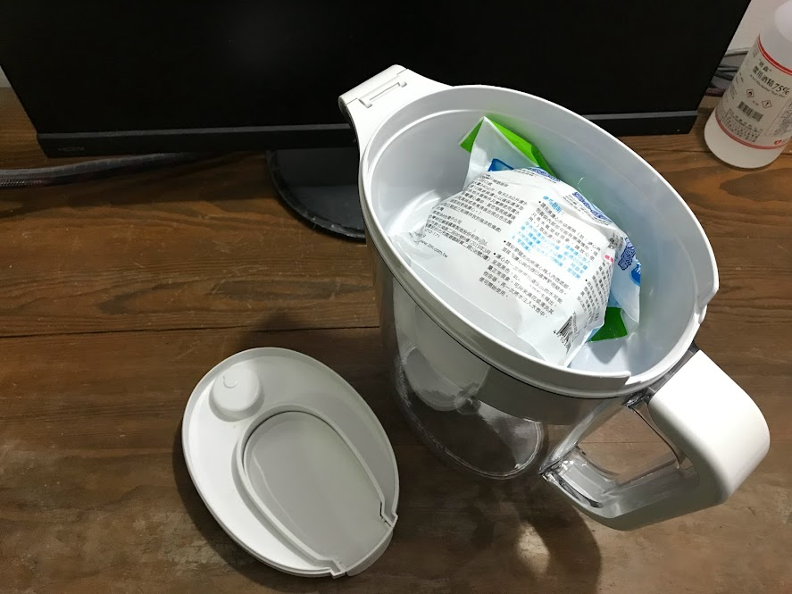

濾心藏在裡面

.

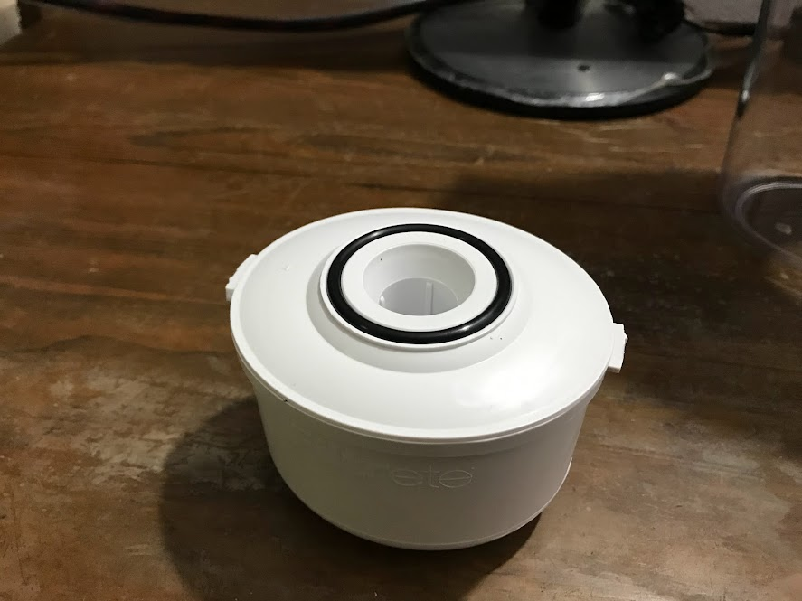

打開

.

中間有個神祕的洞洞

讓不才有大膽的想法

.

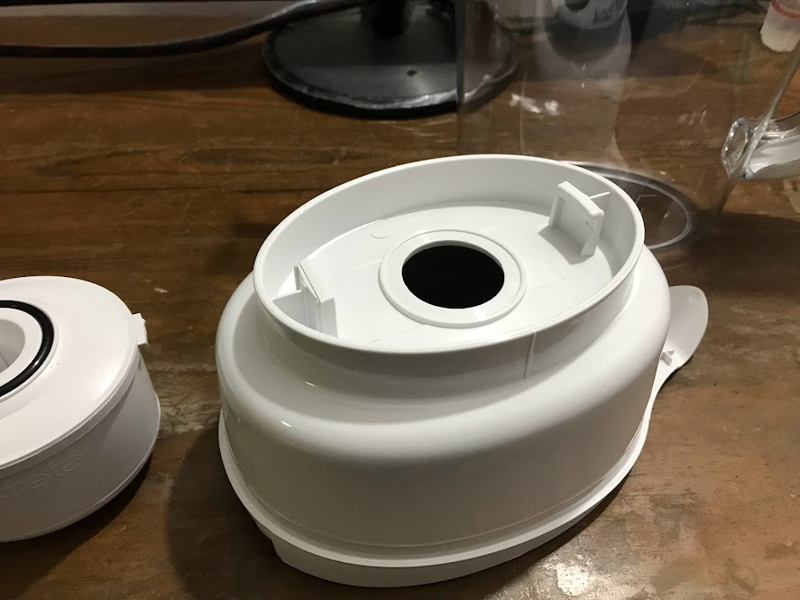

安裝方式也非常簡單

把濾心對著下方的孔孔

轉進去

.

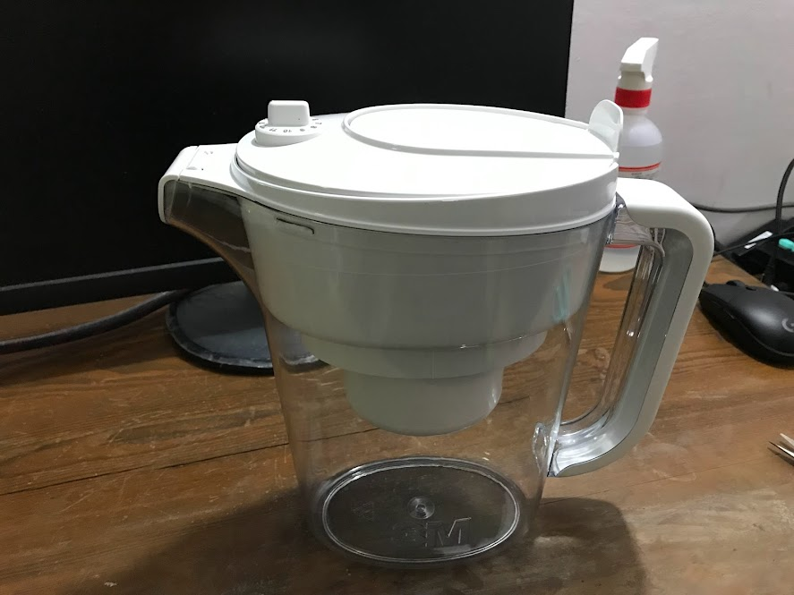

就大功告成了

.

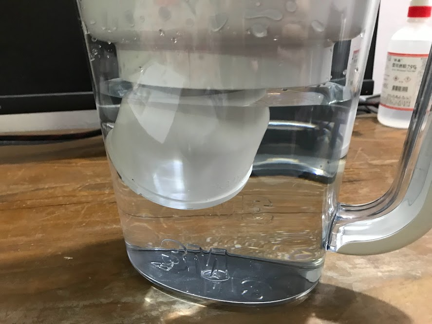

然後需要注意的

濾心使用前要先泡水20分鐘

.

然後建議過濾兩遍

.

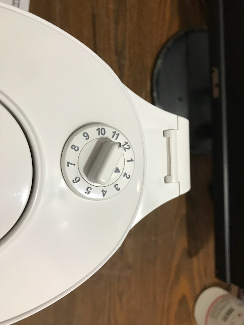

另外濾水壺上方有個旋鈕

能夠用來記錄幾月安裝

和大概幾月要換新(一顆可以用三個月)

.

濾水壺這種東西也沒啥好說的

最後說一下優缺點好了

.

優點:
- 能夠喝到品質更好的水
- 如果對鄉下的水龍頭有點怕怕的，建議配一個
- 上方有刻度，能夠用來記錄幾月安裝

缺點:
- 過濾一次水要6分鐘，狗幹久(不才最後乾脆拿去過濾燒好的水，反正倒進去後可以放進冰箱裡慢慢過濾)

.

以上

.