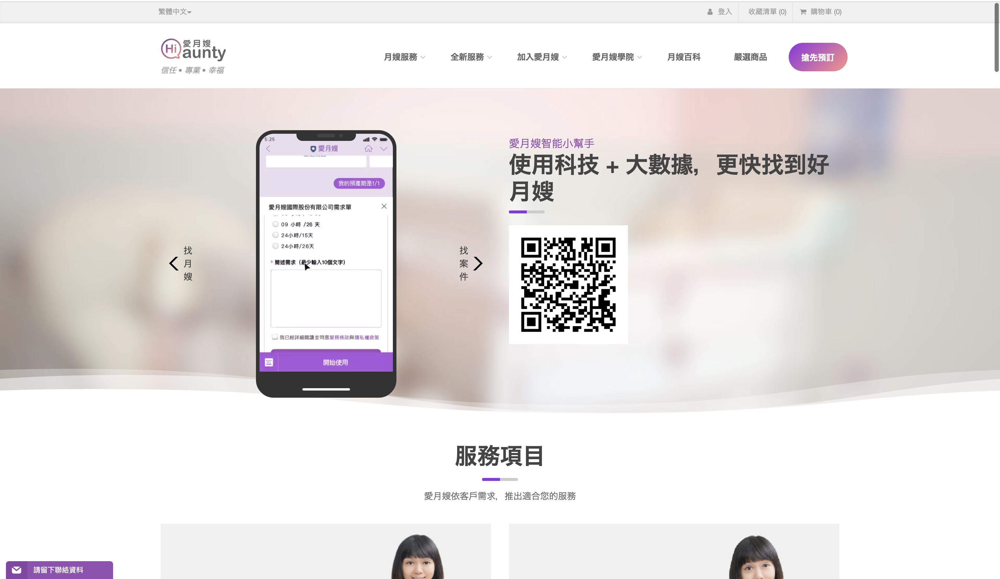
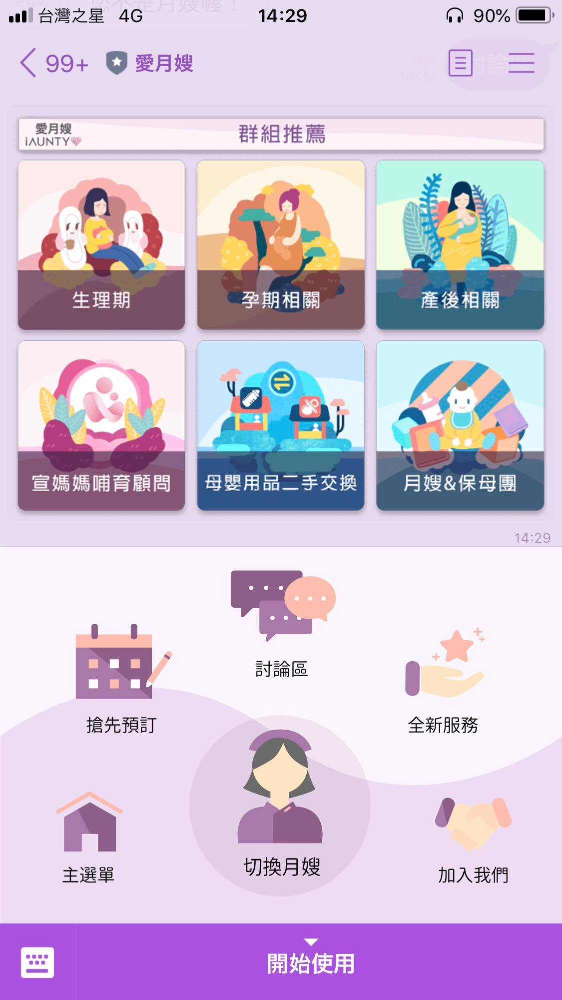
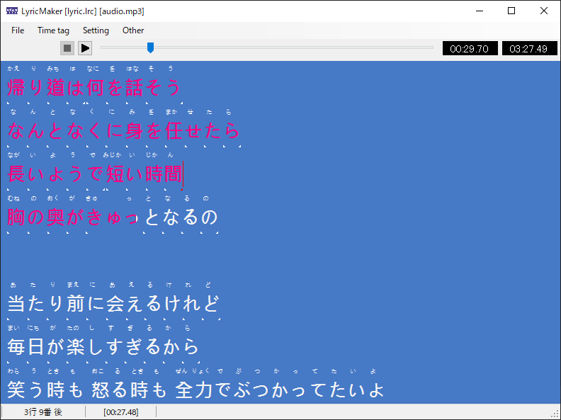
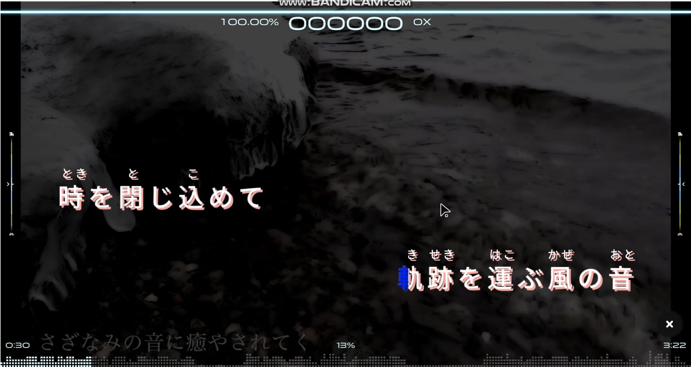
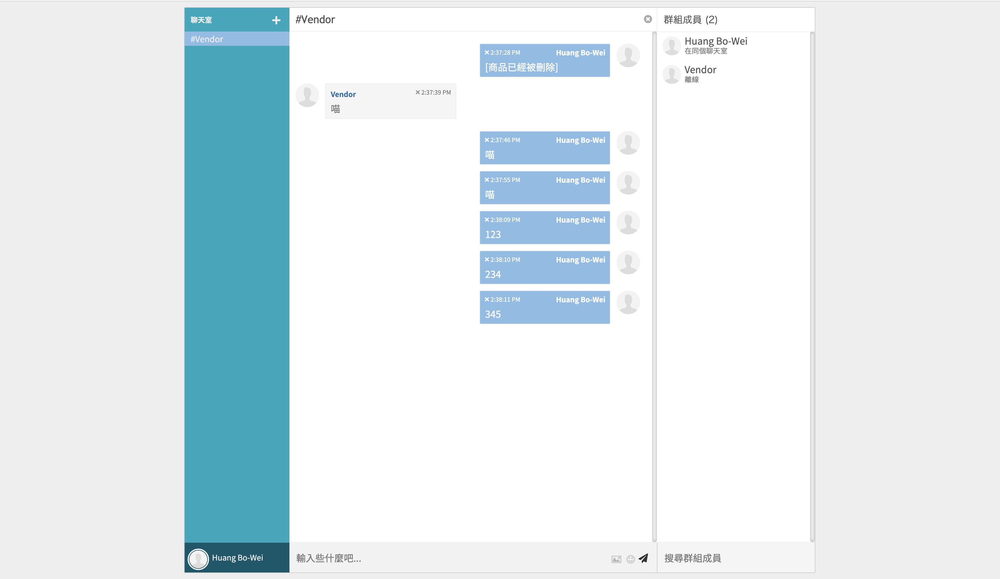

# 自己紹介

姓名：黃柏瑋（はく）

ふりがな：ハン　ポワイ

氏名のローマ字：Huang Bo-Wei

携帯電話：（＋８８６）０９７８ー９２１ー３３０

e-mail：andy840119@gmail.com

現住所：台北市

Skype：live:andy840119

Line：andy840119

.

# 学歴

- 台北科技大学（情報工学科）：（転校）２０１４年９月から２０１７年７月まで

- 台北教育大学（情報工学科）：２０１３年９月から２０１４年７月まで

- 西松高校：２０１０年９月から２０１３年７月まで

.

# 職歷

- 育辰國際株式会社：２０１９年３月から〜

- 愛月嫂國際株式会社：２０１７年９月から２０１９年３月まで

- 夠麻吉國際株式会社（研修）：２０１６年７月から２０１６年７月まで

- 與楊株式会社（研修）：２０１５年１月から２０１５年７月まで

- ファミリマート（アルバイト）：２０１４年から２０１５年まで

.

# 免許・資格

- （２０１７年５月）TOEIC 740点 取得

- （２０１８年7月）JLPT N2取得

.

# 自己紹介

私はワンさんと申します。

出身は`台湾`です。年生まれで、今年で`２４歳`になりました。

私の家は`台北`にあります。4人家族です。

出身大学は`台北科技大学`で、専攻は`情報工学科`でした。

2017年大学卒業後、新卒で入社をしました。

開発エンジニアとして、バックエンドの開発を中心にやっ
てきました。

フロントエンドとラインロボットの開発経験もあります。

ウェブサイトの制作・維持する 能力を身に付けました。

# 長所

- 技術の上達が早い。
- 色々な技術な勉強している。

# 短所

- 日本語はちょっと苦手です。

# 経験言語

`C#`

- アプリ（Xamarin）

- バックエンド（asp.net、asp.net Core）

- ゲーム作る（osu-karaoke）

`Vue.js`

- lineBot Web アプリ

`Angular`

- [ngx-admin](https://akveo.com/)に基づいて、バックグラウンド管理を作る

# クラウドサービス

`Azure`

- `Appservice`

`AWS`

- `EC2`、`RDS`、`Route53`、`CloudFront`等

.

# 作品

## [愛月嫂國際株式会社](https://iaunty.com)：

生産後もし照顧者が必要なら、ウェブサイトに様々な照顧者を探しでいます！

.

私はこの会社働きのときに

lineアプリを開発、ウェブサイトを管理、アップグレードします。

## [Erratic Creation](https://erraticcreation.com)：

モデルが買う、売りできるの`Eコマース`ウェブサイトです。

.

これは私育辰國際株式会社入り始めでのプロジェクトです。

.

## [オープンソースチャットアプリ](https://signal.org/) :

カスタマイズ委託を受け取った、バックグラウンド管理を作る。

.

# サイドプロジェクト

## [LyricMaker](https://github.com/osu-Karaoke/LyricMaker)（まだ済まない）：

カラオケ歌詞を作るのアプリ。

.

## [おす！カラオケ](https://github.com/osu-Karaoke/osu-Karaoke-dev)：

[この](https://github.com/ppy/osu)オープンソースゲームに基づいて

カラオケを歌う、練習ができるゲームモードです。

デモは[こちら](https://www.youtube.com/watch?v=1pyswtlp5jk)です。

.

## [Eコマースチャットプラグイン](https://github.com/andy840119/Grand.Plugin.Widgets.Chat)：

`Grandnode`Eコマースウェブサイトチャットできるため作るのチャットプラグイン。

.

# プルリクエスト(貢献)

## [osu-framework](https://github.com/ppy/osu-framework)

このゲームフレームワーク（osu-framework）を`Markdown`フォーマットサポートしでいます。

デモは[こちら](https://www.youtube.com/watch?v=ViHhYDTlacQ)です。

.

# 探すな仕事

## 特に給料

400万〜450万

.

## 希望勤務地

東京、大阪

.

## 希望職種

バックエンドとフロントエンド

.
