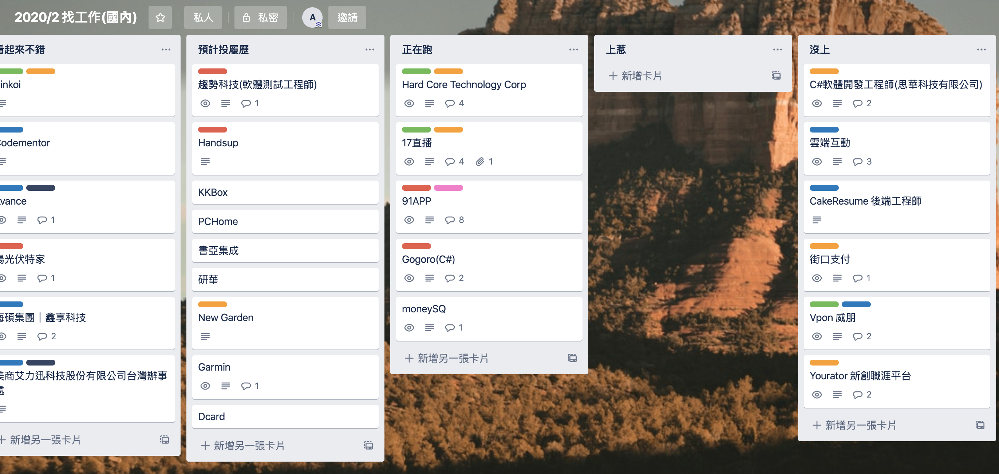
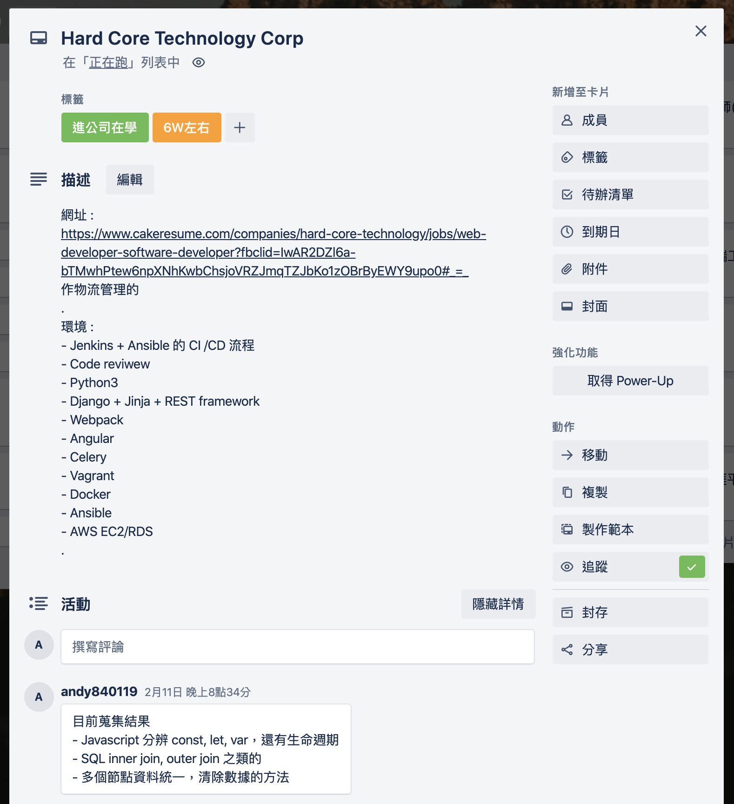

## 前言

最近工作了兩年多，想找間更好的公司

.

在這段時間，也想過不少事情

包含未來想做什麼(估計是`後端`，未來朝`Dev-ops`工程師邁進吧)

如果是後端想朝哪種領域邁進?多大流量?

要使用哪種語言

要新創還是大公司，哪邊學到的技術比較多

要不要考慮外商，或是去日本工作

想要薪水，還是挑戰?

還有工作一段時間後，薪水上不去等等...

.

想法開始發散後，就開始到了永無止盡的循環QAQ

目標也越來混亂

加上目前還沒有保底又變得更加棘手了

.

大概就是有一種

現在的努力

都是在為以前的不夠努力擦屁屁吧

現在想想以前對未來的規劃真D沒想法，像顆活著就好的細胞一樣

.

總之，經過這兩年亂走路

這邊分享一下心得吧

不才不會推薦未來要走什麼領域比較好，畢竟自己做開心比較重要

只是讓大家在做找工作的決定時可以少燒點腦

.

## 大綱

1. 決定目標，程式語言
2. 找哪種公司
3. 刷Leetcod有用嗎?
4. 如何找工作
5. 該用獵頭嗎?
6. 薪水該怎麼談
7. 找工作用的好工具

.

目前是以後端工程師的標準去評斷工作

其他類型工作可能不太適用

.

## 決定目標，語言

只能說能夠越早決定越好QAQ

如果認真來說

後端換個程式語言都是大事了

.

例如不才寫`C#`

但看到一堆用`Go`,`Ruby`,`Python`,`Node.js`,`Php`,`Java`

薪水爆幹高但會要求精通某某語言

的後端工作就只能說相見恨晚

.

然後不才又不可能為了面試某個工作去學某個語言

.

用`Side-project`學嘛...

架伺服器要花錢诶

寫好的服務沒人用寫辛酸的逆?

服務一堆人用薪水都拿來養伺服器就飽了。

更何況又想不到題目(後端題目真D難想，怎麼轉就那幾個，再不然就是太大一個人沒辦法完成)

.

然後很該死的不才手邊好玩的`Side project`通通都不是後端

那堆狗屎專案開發上又很佔時間，弄它們就飽了Orz

.

不過還是建議後端至少要會兩種語言，各一種框架以上

才不會相見恨晚

萬一某一個語言職缺越來越少時還有備胎

.

回頭看寫`Android`/`iOS`的真D爽

撇除跨平台框架，用一種語言就可以打天下，真棒

.

順帶一提

雖然`C#`不才認為是很棒的語言

但後端工作並不多(2019年微軟還沒完全擺脫掉什麼都要錢的印象，要買`Windows server`貴死人授權跟免費`PHP`你會選哪一個?)

多半只會有有規模的公司(畢竟出得起授權)

中的一部分會用(剩下可能跑去用java了)

例如91APP，接口支付

跟接案公司(為了接大公司的案件)

還有傳產，博弈

然後因為錢都拿去繳授權了，所以薪資天花板也變低了

.

所以如果只會`C#`

可以考慮在多點一種語言

例如`Python`或是`Go`

~~PHP根本拉基，學了變笨就不好了~~

一方面是分散風險，還有看看不同語言特性也不是壞事

.

領域就又差更多了

如果從`App`變成想做後端

好一點如果公司有相關部門，問說能不能換過去

硬一點就只能重找了

如果好不容易爬上`Senior`又得從`Junior`開始很虧的

.

## 找哪種公司

到底要是新創好?

還是外商好

大公司好，還是小公司好?

.

這邊就列出可能會和大家想的不一樣的點

剩下好壞得自己分析

.

### 新創

新創或許感覺很潮

但`不代表`所有新創的`技術能力`很強。

尤其是服務類型非IT服務相關的

.

例如新創是做`社交軟體`或許技術能力不錯

但新創是做`文創商品販賣`可能就不一定了

`IT`會用到的領域可能只有`Wordpress`架起來的小型的購物網站而已

進去可能也只是要維護網站就OK了。

.

還有不是每一家新創都會乖乖做`CI/CD`的，進去前最好問清楚公司有導入哪些框架和系統，還有工作流程等等。

.

### 大公司，小公司

也是跟上面一樣

看公司的產業性質

還有分工情況

.

另外，一些常聽過，技術出生的大公司

可以考慮看看，不管是滾大公司的技術，還是實力通通都有

缺點是不少職缺可能要碩士畢業

.

### 接案公司

因為不才有待過所以分享一下

接案類型通常就是交錢了事

程式碼品質...

只能說因公司而異了

.

還有通常不會負責營運部份

如果驗收過後

發現哪邊可以改善，也會`傾向不說`，而不是`提出來改善`

不像一般公司能夠持續優化自己的產品（當然不才實習的公司也是有自有產品，但為了配合檔期活動整天寫爛扣的）

.

整體來說，不才覺得可以注重的點

1. 你在的部門是不是公司主力
2. 公司的分工模式，是希望分工非常明確(相對來說能學到的東西會比較集中在某個領域，公司資產是公司服務，也或是工作本身就複雜)，還是都會碰到(通常在新創會比較多，公司資產是員工，分工太明確要是哪個跑掉就GG了)。
3. 以後端為例，在面試時可以問公司用的語言，或是有沒有用到`Container`，`CI/CD`，有沒有寫`Test case`，甚至是流量變高時能不能`Auto scaling`等等
4. 讀書會多不多
5. 薪水不要太低

.

不才覺得第三點是最重要的

會注重這些東西的

代表公司不會盲目亂開發

你的時間不會用在增加，清理技術債(為了檔期活動加班產出拉基是很沒意義的)

還有公司不允許網站隨便掛掉

.

第二點因人/公司而異

只是丟出想法而已

.

## 刷Leetcod有用嗎

簡單來說，公司有分兩種

1. 看履歷問的，可能有白板提，也可能純聊天
2. 要刷`Leetcode`才有入場門票

第一種可能會偏向

找即戰力

工作難度不太高，或是邊工作邊教就能學會

或是偏實作，要求你本身就要會那種語言居多

.

第二種公司，大概就那些

PPT上面前四大大學或碩士面試的公司才會遇到

公司不外乎就是`17直播`，`KKBox`，`趨勢`，`群輝`，`Qnap`那幾家

少部分新創也會這樣搞

這類會偏向

1. 底子(資料結構，演算法)不夠強的傢伙刷掉
2. 面試人數太多，總之先把不會寫程式的刷掉
3. 除了解決完外，會偷看你使用的時間複雜度

.

第一種有些公司真的需要比較複雜的演算法，沒辦法

難度可能在`Medium`以上

.

第二種的問題會比較偏向生活上的問題，難度會偏在`Easy`~`Medium`

如果用自己熟悉的語言把問題解決掉

公司可以給你時間學公司在用的另外一種語言

.

通常這兩種刷題語言都不限制

.

還有可以看公司用哪一種線上測驗軟體

和`考試時間/題數`來猜考試難度

例如`120分鐘/五題`的基本上難度不會多難，頂多`Medium`這樣，但可能會在意時間複雜度

.

另外不管有沒有上機考的

有些考能可能都是需要準備一下的

- [常被問到的問題](https://www.cakeresume.com/resources/top-10-developer-programmer-job-interview-questions-2018)，可以想幾套說法，不同公司採用最接近的說法
- 啃一下`SQL`語法，尤其是`ORM`用得有夠爽的工程師，至少要熟悉關聯資料庫，[Join關係](https://stackoverflow.com/questions/5706437/whats-the-difference-between-inner-join-left-join-right-join-and-full-join)，[基本語法](https://www.1keydata.com/tw/sql/sqlhaving.html)，[T-SQL](https://ithelp.ithome.com.tw/articles/10190252)等等，不熟的話可以刷一下[leetcode](https://leetcode.com/problemset/database/)
- `MVC`是啥，一個`request`到後端，最後回傳`reponse`的流程(程式怎麼跑)
- 目前工作在做啥（整理後好好分享）

完整的[技術型考題](https://www.twblogs.net/a/5c650a70bd9eee06ee22c866)可以參考這篇，但不才覺得要全部準備完有點難度就是了(汗)

.

## 如何找工作

找職缺

目前就只針對後端工程師做分享

雖然不才覺得其他軟體領域應該也差不多

.

普通一點的`104`，職缺好壞參半，但最近感覺好職缺稍微變多(把`低於某個薪水`過濾掉後)

.

或是可以考慮`CakeResume`

~~這邊薪水不錯~~

更正:薪水也有`下降`的趨勢，簡單來說就只是編輯履歷比較好用，有標薪水的104

如果是新鮮人可以嘗試看看，但相對要自己能力要強一些。

.

還有有線上製作履歷功能

可以製作出漂亮的履歷

能匯出履歷變成`PDF`方便投遞。

.

`Yourator`，新創比較多

但感覺最近的新創學壞了，開始開拉基薪水。

.

`Meetjob`，外商比較多，薪水也比較好看

但需要一點底子

.

`linkedIn`外商就更多了

用英文面試機率又更大了

.

然後不才覺得找工作最好用的

是朋友吧，`比自己大個幾歲更好`

跟他問工作可以少走一些冤枉路，給的經驗也不至於落差到自己無法理解

~~尤其是常常在找工作的找工作高手~~

或是內推，但前提是要有可以拉內推的朋友QAQ

.

另外找工作

可以幫工作分成

`想不想去`，`和應徵能不能上`（保底）的規劃。

.

不才建議先列出幾家覺得可以上的公司，先去面試

先弄出`保底`

.

然後再開始挑戰薪水比較高的工作

.

一方面已經有個底了，知道自己大概值多少

在下一家公司比較敢開薪水

.

另外一方面如果你在比較想去的公司

表現不是特別突出到可以馬上決定錄取你的程度

可能會把你你放在備取名單中

等到這一坡人面試完後

才從順位慢慢一個一個通知

.

如果你剛好在`備取1`，手邊又沒有錄取通知的

他們當然可以慢慢的等到前面幾個都有回應了再通知你

.

你也知道的，前面幾個可能又是一拖就2個星期以上

如果手邊有錄取通知，可以用這個方法~~催~~詢問他們

他們或許就會根據前幾個報到的機率

優先決定要不要給你發`offer`

.

還有一點，非常重要的

104上面的履歷記得弄成"公開"

雖然可能會有無關的職缺會有點討厭

但也會有不錯的工作找上門

.

## 該用獵頭嗎?

主要有兩種

一種是自己去找獵頭

一種是獵頭自己跑過來問你要找啥工作

.

像不才把履歷在`CakeResume`寫好後公開出來，把目前狀態設定成積極求職後

過了一個星期每天就有獵頭跑過來問

是不是正在找工作

.

簡單說一下獵頭的賺錢方式好了

通常把`人`成功推薦給`公司`後

公司就會`付一筆錢`給`獵頭`(通常是那個職缺一個月的薪水)

對公司來說好處是獵頭(應該會)先把不適合的人選過濾掉，相對對公司來說是節省時間

對一些公司來說，反正付薪水也是花錢，花錢買人也沒啥不好

.

一個月的薪水看起來或許很多

但一個求職者可能會和不只一個獵頭合作

獵頭也可能推薦了好幾個工作，最後求職者跑了

做白工的機率還是很大的

.

至於要不要和獵頭合作

可能是因為不才目前經歷不夠，所以合作的獵頭`好壞參半`

.

沒辦法，沒經驗的獵頭就只能處理沒經驗的求職者

沒經驗的求職者薪水就那樣，也談不高，為了談高那幾千塊沒意義啊

有時候對他們來說，拿到錢才是首要任務

不過倒是可以用獵頭打聽公司的狀況，還有有時候推薦的職缺，是之前在求職時沒想到的。

.

然後可能是因為業績，通常獵頭會找到求職者最容易上的職缺(畢竟能最快拿到錢)

像是不才希望能夠轉換後端語言

這個需求就被放置了QAQ

如果獵頭覺得難，可能就懶得做(畢竟有可能做白工)

但不才就是覺得難才需要獵頭幫忙RRRRR

.

2/21補充

看起來遇到了一個還不錯的獵頭，問問題還挺專業的

.

3/12補充

把`104`履歷打開還比較實際

`CakeResume`過來的獵頭，多半是問問，說要幫你投但最後沒下文...

而且他說要幫你投就代表自己不能投了

.

## 薪水該怎麼談

開太多會被對方嫌不知米價

開太少如果進去發現還有加班會哭哭

.

基本上，如果是國立中間大學畢業

對自己有點期望的話

假設24歲大學畢業，程度中間

可以把目標訂在`40K~50K`（台北開價，其他區域請自己評估QAQ）

每一年增加`5K`左右邁進

30歲大概`75K~80K`左右

接近年薪百萬（`Senior`左右程度）

算是一個有心就可以達到的目標

.

還有剛畢業建議多面試幾家，在從中決定

花到一個月找工作都是OK的

.

可以給自己設定稍微比較高的目標

能的話，找一點人數上有點規模的公司，至少進去後不要單獨作業

單獨作業做久了會開始不清楚自己的實力

也很難清楚自己在市場上是真的有進步

還是只是做原地踏步的碼農工作

.

另外有導入`CI/CD`會是一個不錯的方向

.

不要像剛畢業的不才那樣

覺得投履歷百發百中比較厲害

只面試一兩家公司就隨便決定了(汗)

.

真心建議

工作是人生中一個很重大的決定

是一天會待上八的小時的環境

會直接影響你下一份工作談判的籌碼

.

待在不夠好的公司，要找下一份"好"工作的難度又升高了(因為工作不夠有挑戰，拿不出好看的經歷，除非你願意低頭重頭開始)

這樣工作轉幾輪，就會發現工作難度越來越無法上升了

薪水卡在那邊上不去

.

可以試試看把薪資/年齡畫成圖表模擬看看

30歲爬到年薪100，跟30歲年薪70萬

長期累積的差距是很可觀的

.

人生是很現實的QAQ

不才也覺得人生很難

但還是建議多看看世面

寧可現在面對現實也不要未來才面對（汗

.

## 找工作用的好工具

另外很推薦用[Trillo](https://trello.com/)紀錄工作狀況

劃分出很多`階段`

把`不同工作`都設定成一張張`卡片`

可以根據不同工作的`面試情況`

把卡片拖曳到`不同階段`上

.

每張卡片裡面可以留言目前的`面試進度`

還有`ptt的面試過程分享`等等

.

另外可以設計出不同的`Tag`

幫工作加上額外屬性

例如`薪水區間`，工作是要`即戰力`還是能`進去學`

等等

.

## 收尾

只能說希望大家早點有想法

或是沒想法但不小心看到這一篇

.

找工作有時候看的不只`能力`

還有`運氣`，`策略規劃`

投越多就跟買更多樂透一樣

中的張數也會更多

在投履歷，面試的時候也會更認識自己

.

還有學歷無用論基本上是豪洨

讀四大出來基本上先贏一半

還有出社會在好的公司，長久下來和在普通公司的人能力差距又更大了

這時候雖然面試的時候面試官可能不太看學歷了

但就用結果不看之前的差距累加，就說學歷無用

不才覺得有點說不過去

.

另外，如果學校排名還OK，`學校`應該都會有`求職展`

拜託在那時候好好準備

不才北科，學校普通但求職展意外的不錯（可能是看在這群學生~~奴性~~潛力不錯吧）

現在仔細評估

學校求職展的職缺

好像比外面還要好...

.

雖然薪水可能會有點奴(後來想想好像還是比外面找好一點)

但公司程度都是不錯的

.

總之，就這樣吧

打完文章後內心稍微不慌了

先繼續找工作了

.

2/22更正 ：

過沒幾天心又慌了

接下來的3月求職旺季不才還要處理公司的交接啊...

然後中間時間也被卡死沒辦法出去玩

有夠幹...

.

3/12補充 : 

拿到Offer了

不慌不慌