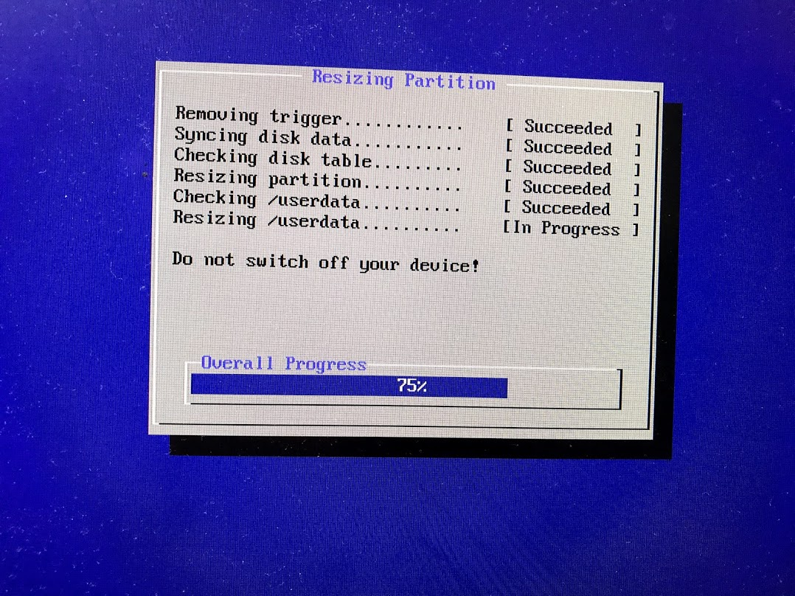
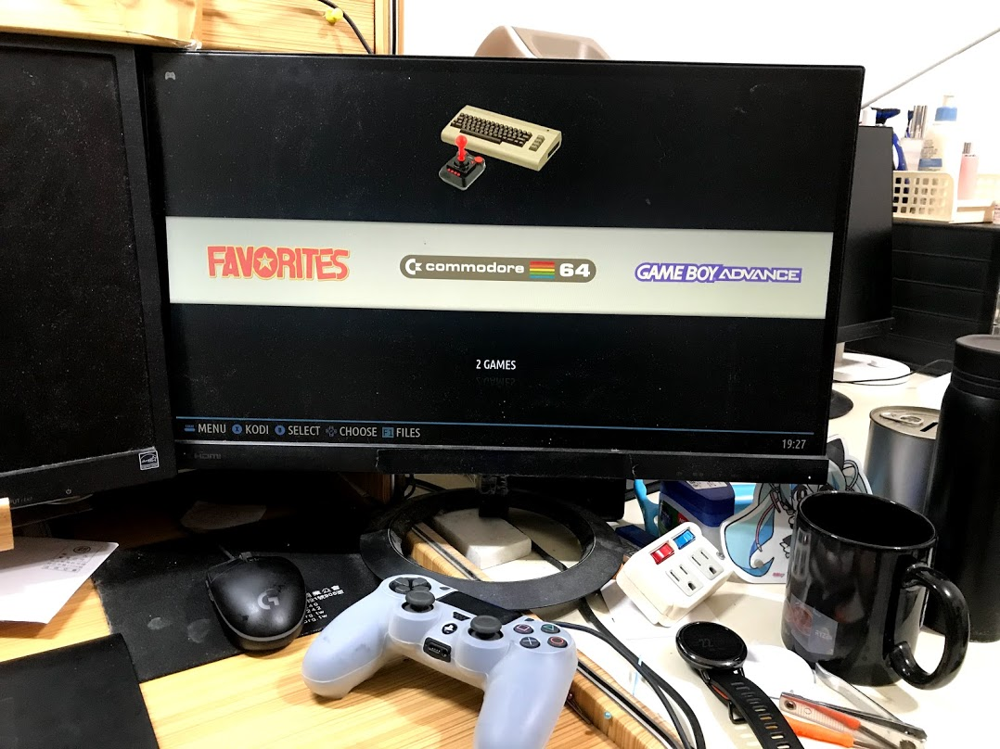
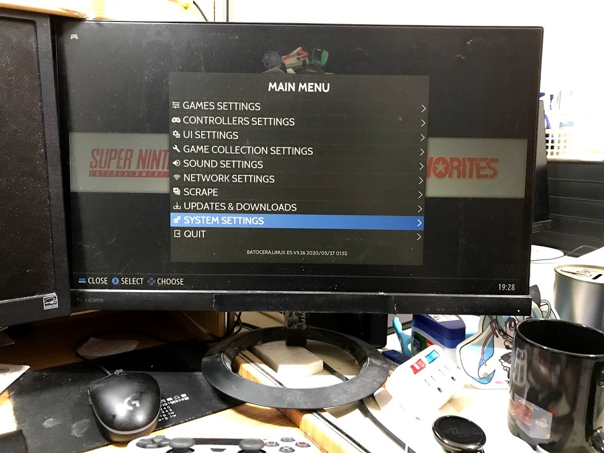
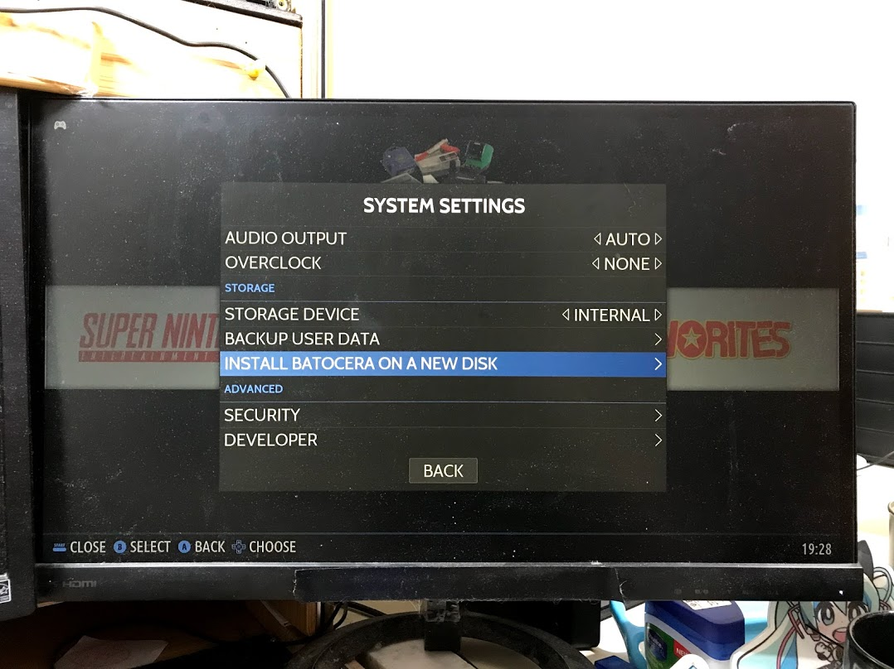
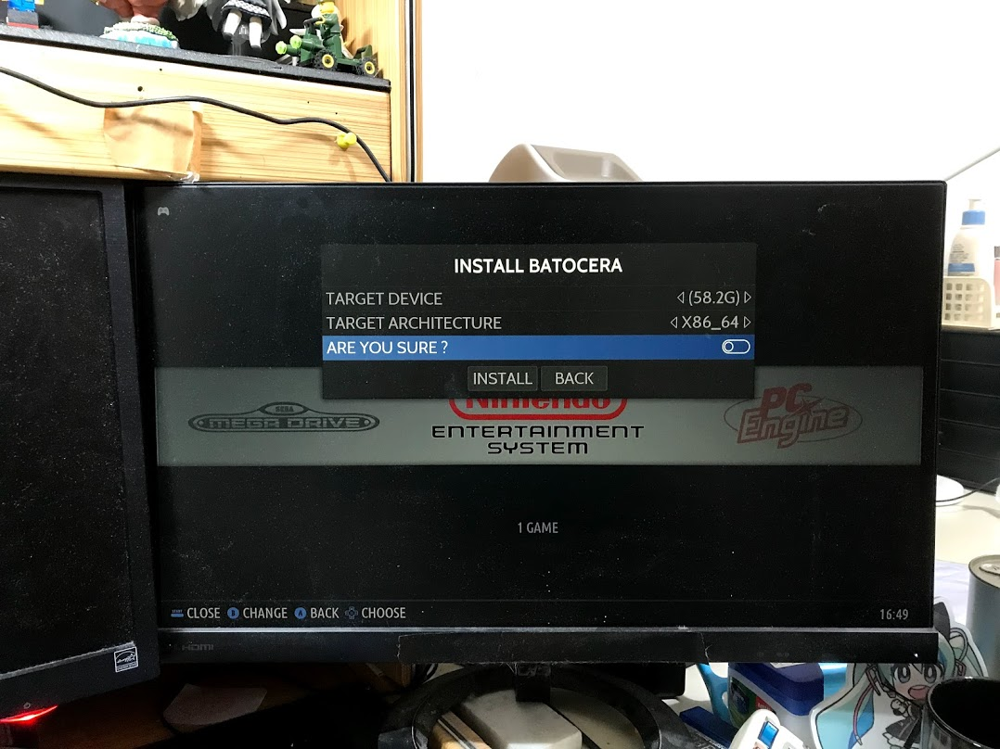
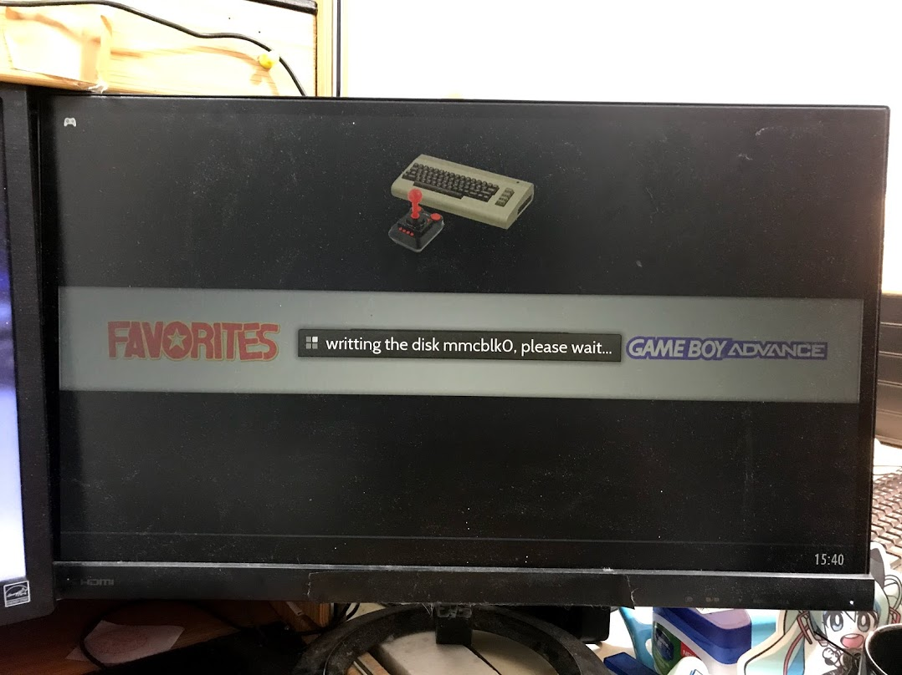
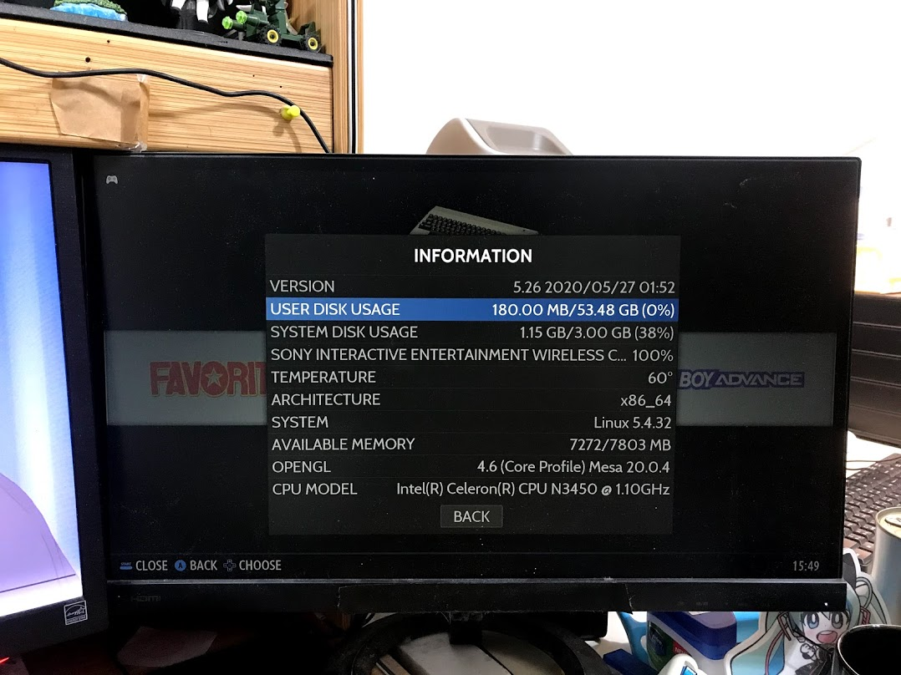

## 前言

趁著剛好有點空閒

把沒寫完的文章補一下

繼[上一篇](../aac-install-freenas/README.md)把其中一台安裝FreeNas後

這次把剩下的主機安裝`Batocera`

.

## 正文

如果大家以前有爬過文，應該會對一些名詞有點混亂

先簡單介紹一下各個名詞

`RetroArch`，`EmulationStation`，`RetroPie`之間的關係是什麼，可以看[這篇文章](https://3q.9527.tw/83)，講得挺清楚的

.

然後[RetroPie](https://retropie.org.uk/)是把`RetroArch`，`EmulationStation`打包成做作業系統

開機時直接進入畫面就能馬上玩這樣

讚讚讚

.

然而除了[RetroPie](https://retropie.org.uk/)外

也有很其他人做出把模擬器直接打包成作業系統，像是

- [RecalBox](https://www.recalbox.com/)
- [Lakka](http://www.lakka.tv/)
- [Batocera](https://batocera.org/)

.

大概簡單說一下這幾家的差異 :

- RetroPie : 只能安裝在樹莓派
- RecalBox : 能安裝在`x86`的機器上，開機畫面比較漂亮，有[web管理介面](https://www.recalbox.com/blog/post/blog-2017-03-06-manager2/)    
            缺點是不支援`macbook`和目前的`aac`主機，感覺`uefi`支援度不夠好
- Lakka : 沒有使用上`EmulationStation`，介面沒那麼好看
- Batocera : 和`RecalBox`差不多，但作業系統更肥大，換來的是支援度更好    
            缺點是開機畫面和主界面不搭，還有沒有web管理介面

.

一開始測試`RecalBox`沒辦法在這次的`AAC`主機上跑

只能換成`Batocera`

.

過程很簡單

下載，使用用[Rufus](https://rufus.ie/)把作業系統安裝到`USB`上，開機按`delete`修改成`USB開機`

.

然後第一次開機會跳出自動配置畫面

.

跑完後就能進入到系統了

.

如果要安裝在內部的`SSD`的話

進入`System setting`

.

`Install Batocera on a new disk`

記得連上網，有線wifi都可以

.

選擇內部那個SSD(58.2G)

`X86_64`

`Are you sure`打開

按下install就會開始安裝了

.

然後下載速度有點慢，要等一下

最後等它跑完後重新開機(記得把隨身碟拔掉)

就可以順利進入安裝的系統了

.

顯示一下系統狀態

.

然後說一下相容性: 

- PS4: `新版`手把接USB可以正常使用，會自動配置
- wifi: 正常
- 藍芽: 抓不到PS4的手把，但沒辦法確定是不是因為驅動沒有打上
- 顯卡: 畫面順暢，看起來應該是沒問題
- 聲音: 沒問題，但記得要去`System setting`調整輸處裝置，看是要用`HDMI`還是`PS4`的耳機孔。預設是主機上的`耳機孔`。

.

最後大概分享一下幾個雷點:
- 開機後要記得設定聲音輸出，預設是主機上的`耳機孔`，有點不人性化。
- 要跳出模擬器，是要按`HotKey + Start`，不是只按`Hotkey`。更多快速鍵可以參考[這邊](https://raspberrypi.stackexchange.com/a/82024)
- 不同模擬器hotkey的操作方式可能不太一樣
- 有種功能是可以把多餘的設定通通藏起來，只留下最基本的，建議不要設定，解開的方式是按當初設定的奇怪的組合鍵，很難解又很容易忘。
- 如果聲音輸出正確，在首頁畫面可以聽到超好聽的`BGM`，如果沒聽到試著重開機，或是進聲音選項把一些設定都打開。
- 設定的聲音輸出可能會跑掉。
- ~~預設的模擬器不多~~如果沒有遊戲模擬器就不會顯示出來，還有有些模擬器的`bios`檔案有版權問題，需要自己抓
- `[注意]` `[注意]` `[注意]` batocera 沒有網頁介面可以輸入IP後放遊戲，要放遊戲的話請參考[官方教學](https://wiki.batocera.org/add_games#from_a_different_computer_through_the_network)。然後我自己測試windows登入需要設定(如果遇到錯誤碼0x80004005請服用[這篇](https://dotblogs.com.tw/pinsblog/2018/01/30/200357))，iphone(或是mac)可以用SMB登入

.

然後如果原生的介面不喜歡可以換主提

.

## 結論

機子都用完了

QQ

.
