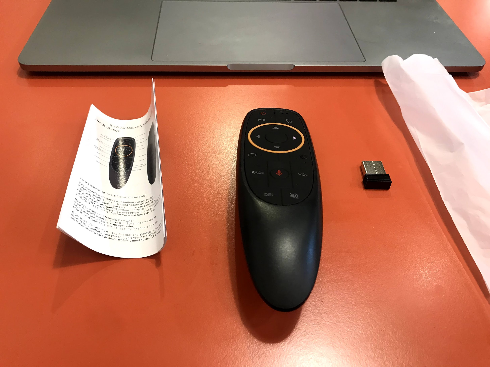

## 前言

最近為了開發新的`Side project`， 想要找個能夠感應雙手的擺動，但又不能太貴的東西

從原本想說用`Arduino`自幹(但感覺實在有夠麻煩

到寫`app`抓手機陀螺題(但需要兩隻手機有點不切實際

.

但最後靈光一閃，突然想到不是有一種滑鼠可以透過揮動來控制鼠標

雖然只有 X 和 Y 軸，但也夠用了

.

最後突然想到空中飛鼠(Air-mouse)

上露天查，發現狗幹便宜

更便宜的甚至一兩百塊就有了

.

剛好找到賣家在台北可以面交的

反正就算被騙至少也沒虧到運費，就先買一隻看看ㄅ 

.

## 開箱

最後選擇`G10S`

因為看起來應該很好握

還有和不才需要的需求最接近

還有價格也不錯

.

東西收到了

看起來小小的

.

正面

.

背面

.

打開後

有本體，接收器和說明書

.

正面

.

背面，有陀螺儀貼紙

.

[影片](https://photos.app.goo.gl/2J5Hape3vrfpuqUm9)

延遲表現

可以從影片看到整體表現出乎不才的意外，非常的快速

延遲大概在100ms內

.

終於可以拿空中飛鼠玩阿屎了(#

.

然後還有紅外線錄製功能，但感覺狗幹複雜，也不再專案需求內

不才就懶得測試了

.

## 心得

整理一下優缺點好了

優點 : 

- 便宜
- 輕
- 該有的功能不多也不少，剛剛好
- 按鈕很好按
- 姑且還算有質感，以這價位不錯了
- 鼠標移動非常靈敏，反應快速
- 電腦也可以用，免驅動(電腦會辨識成一隻鍵盤，一隻滑鼠和一隻麥克風)
- 可以充當簡報筆

缺點 :

- 好像有多家工廠在生產同一個型號，兩款表現上有一些不同(雖然用起來都沒問題就是了)
- 要裝電池
- `USB`接收器沒辦法收納在滑鼠內(除非把電池拔掉)，會比較容易搞丟
- 有一顆關機鍵，對安卓盒子來說很好用，但在windows下簡報到一半按到就尷尬了
- 一直用力上下甩動，可能會辨識成左右移動，不過正常人不會這樣用就是了

.

以上

.

然後對`Side project`有興趣可以到[這邊](https://discord.com/invite/ga2xZXk)看看問問，是做音樂遊戲的喔 <3