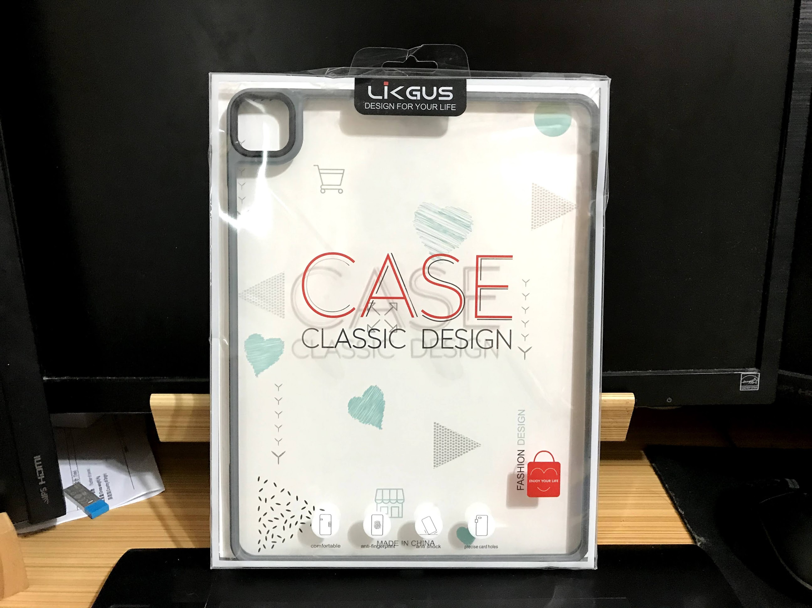
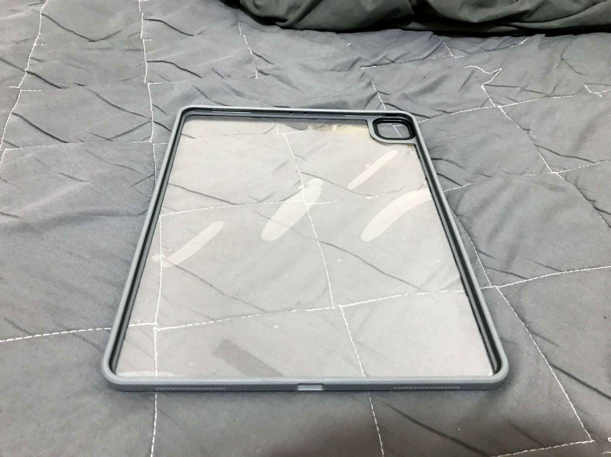
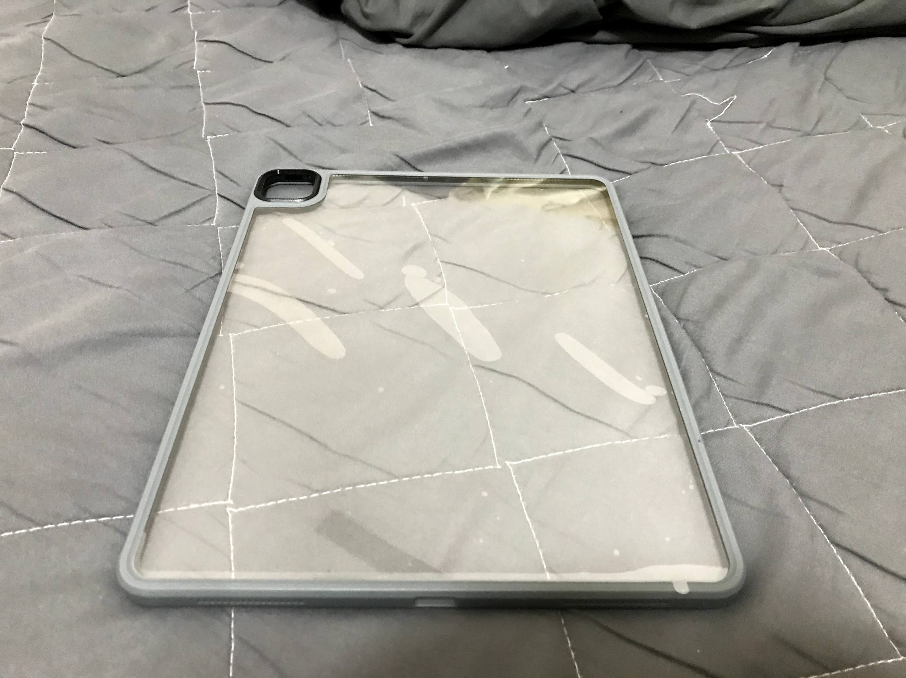
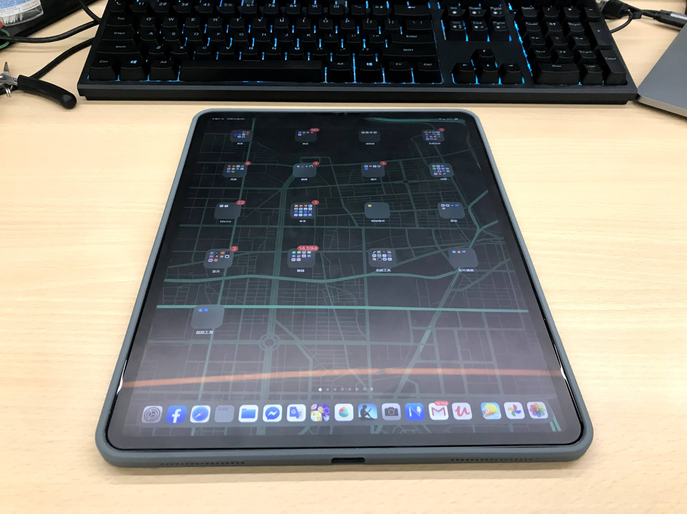
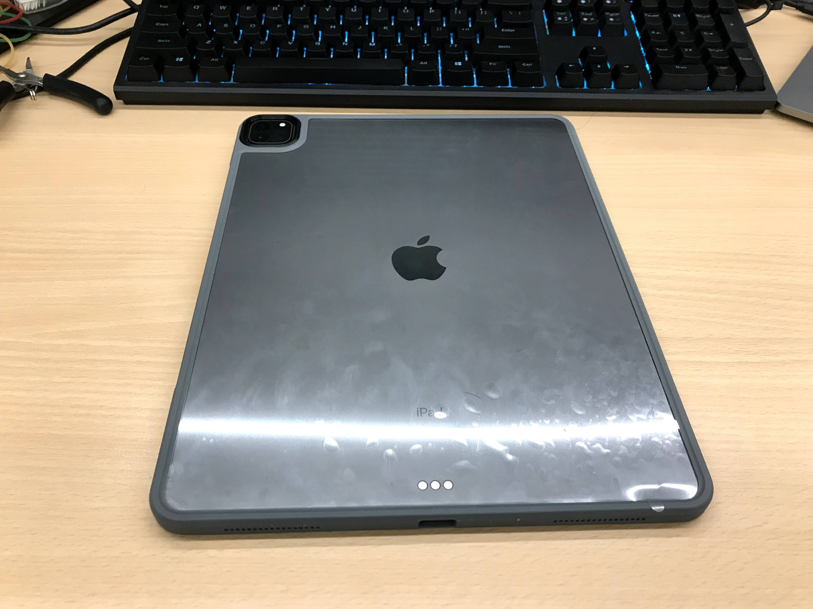
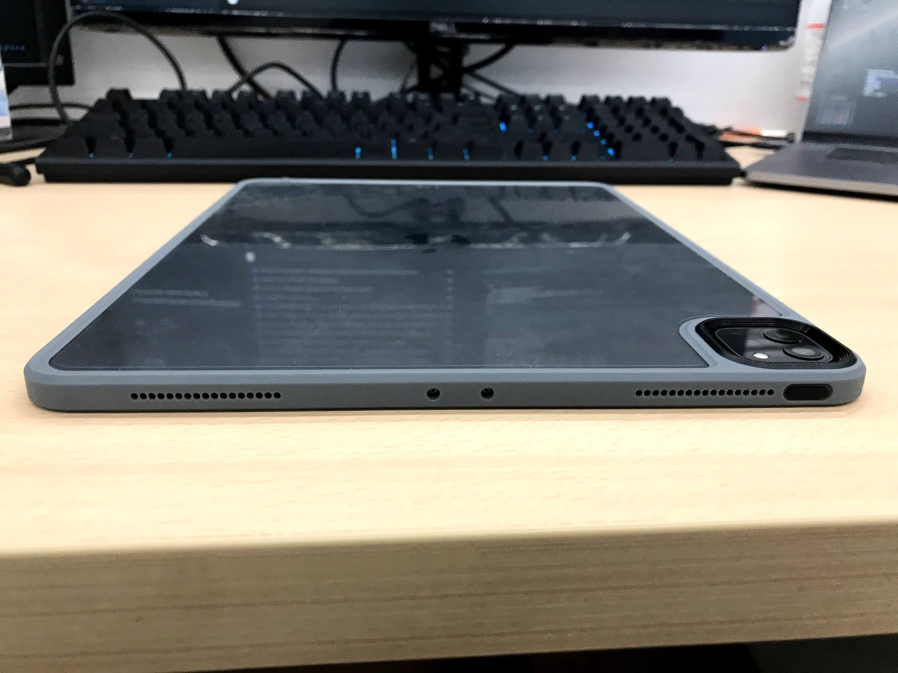
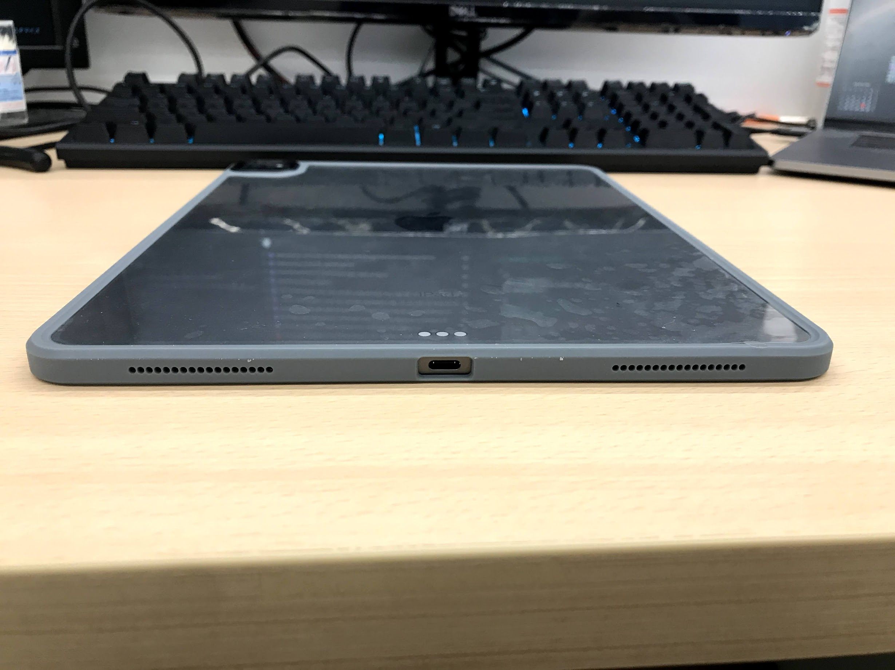
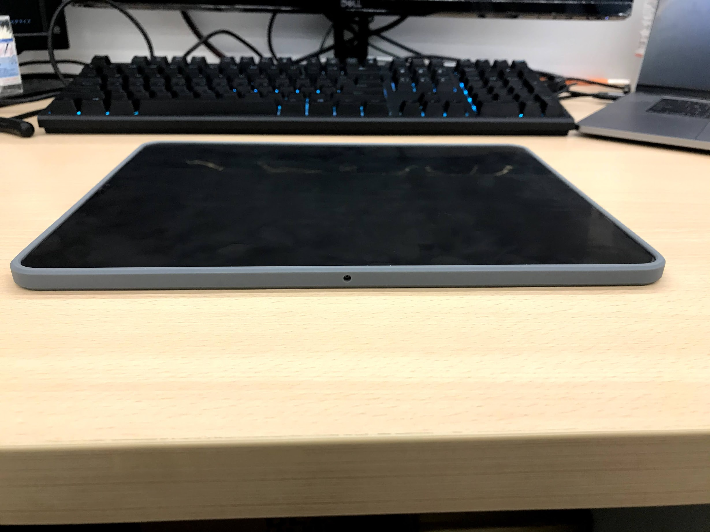
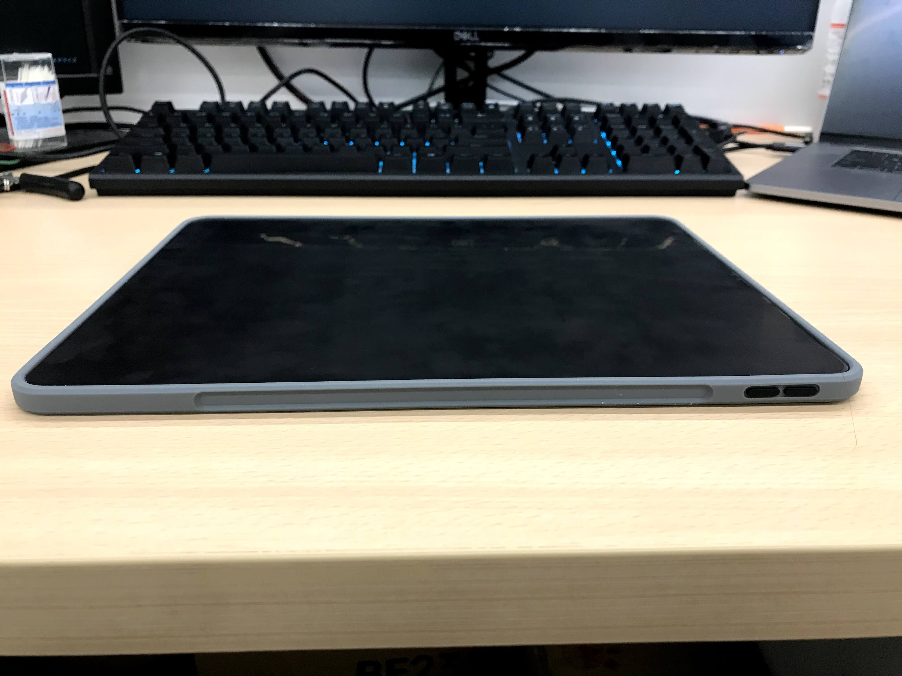

## 前言

上班時iPad又掛逼了

所以只好又去買一台

.

結果隔天iPad自己掉電，然後充個電，又可以用了

雞掰

.

有種白花錢的感覺

不說了不說了

越說越心痛

.

## 正文

下標幾天後終於收到了

沒保護殼這幾天用iPad真是用得心驚膽顫

.

開箱

.

正面

外包裝裂開了

不過算了

.

沒裝上去前的正面

.

沒裝上去前的背面

有一層塑膠膜

不才很客家，想等膜刮花了後在拆下來

.

裝上去

正面

.

背面(那個膜還是沒拆下來)

.

上方

.

下方

.

左方

.

右方

.

以上

.

## 結論

好吧，就一個保護殼實在不知道能打什麼

簡單說一下優缺點好了

.

優點 :
- 穩，緊，貼合
- 高大上的感覺，不才很喜歡
- 保護殼摸起來不會有廉價感
- 麥克風，揚聲器開孔都有對上
- 有留下`Apple Pencil`的磁吸位置，而且有`貼齊`
- 相對品質來說，這價格算挺便宜的

.

缺點 : 
- 有點難裝，裝上去後估計不太好拆QQ
- 雖然還是可以固定上去，但apple pencil變得沒那麼緊緊吸著`iPad`了。鬆緊程度差不多是在室內不用擔心，但在路上拿著到處晃會怕筆不見的程度。
- `Switch`的充電口塞不進去了QQ，估計接下來只能用原廠充電線了
- 殼四個角有點硬。是直接貼到`iPad`上，不知道有沒有辦法防摔。

整體來說不才挺推薦的

一個不到`300`，加個免運活動美滋滋。

避免工商，就不貼網址了，反正露天蝦皮有賣的就那幾家

.