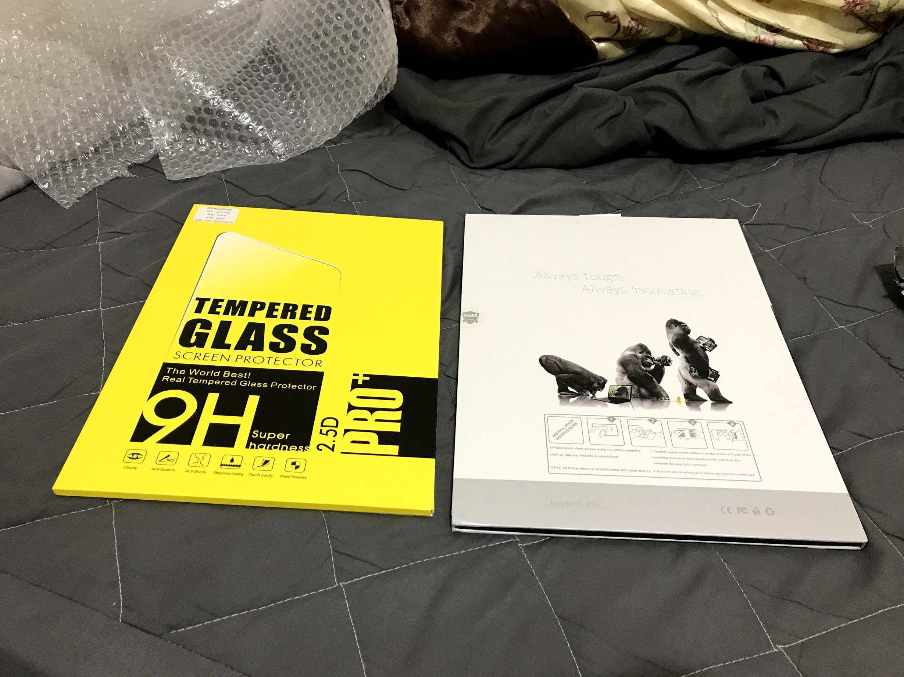
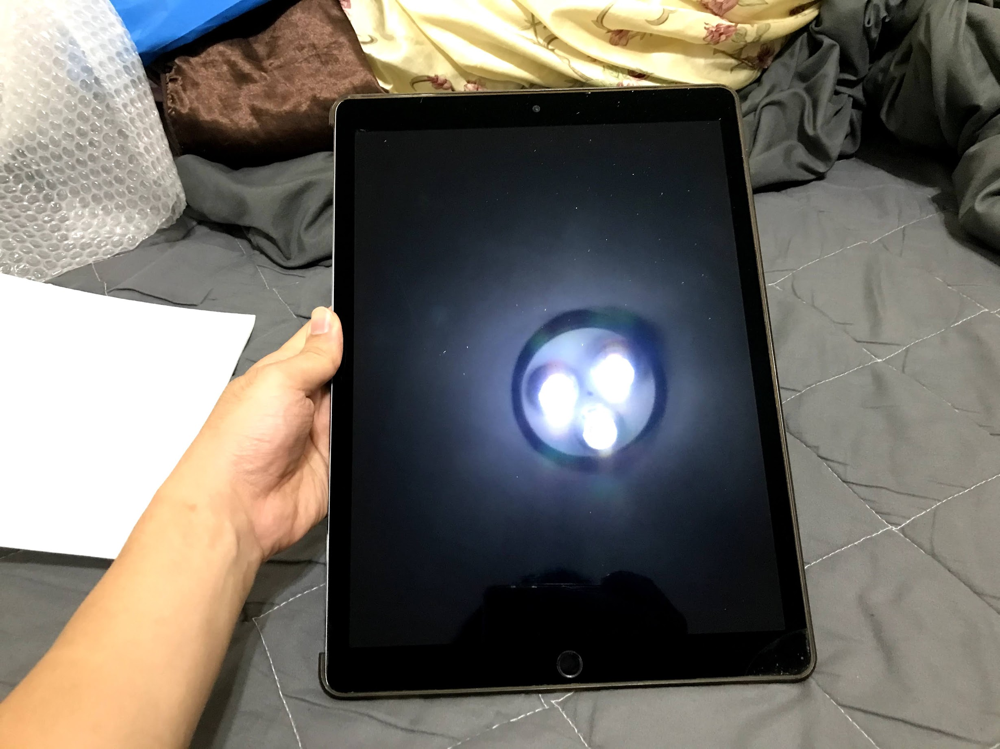
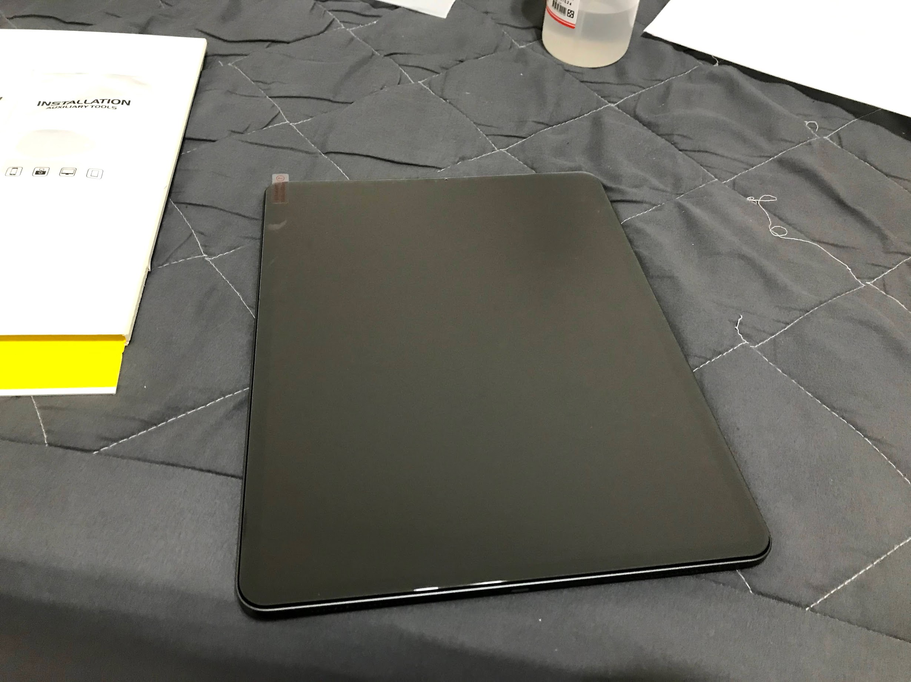
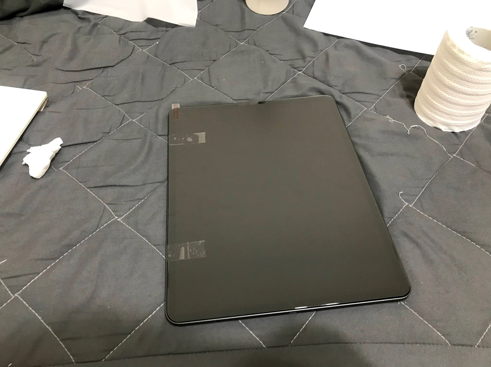
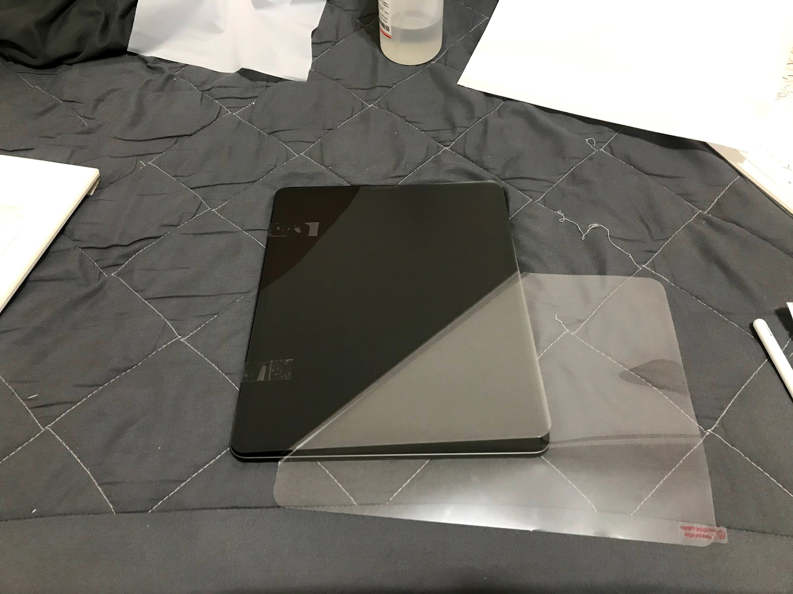
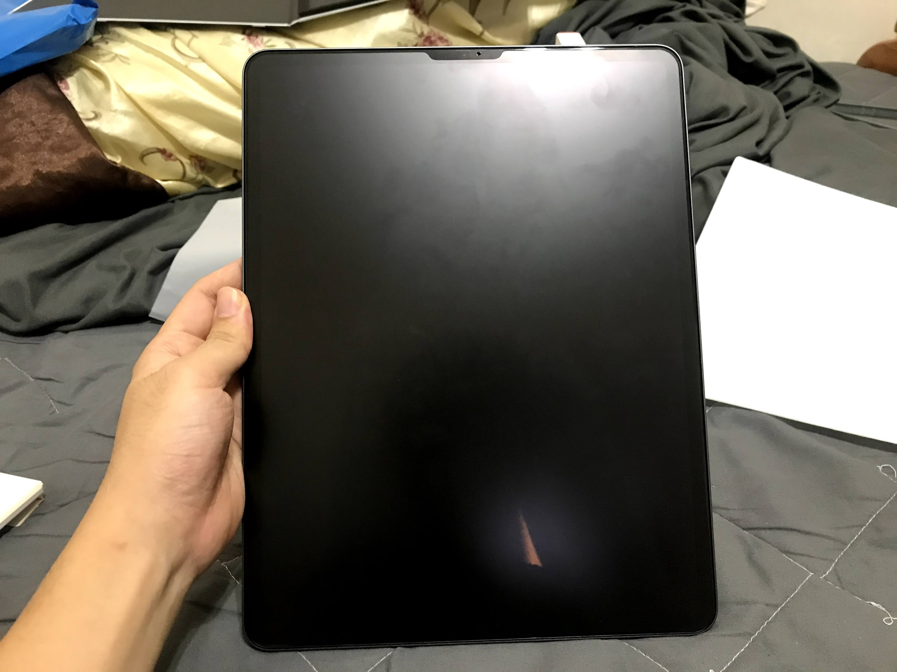
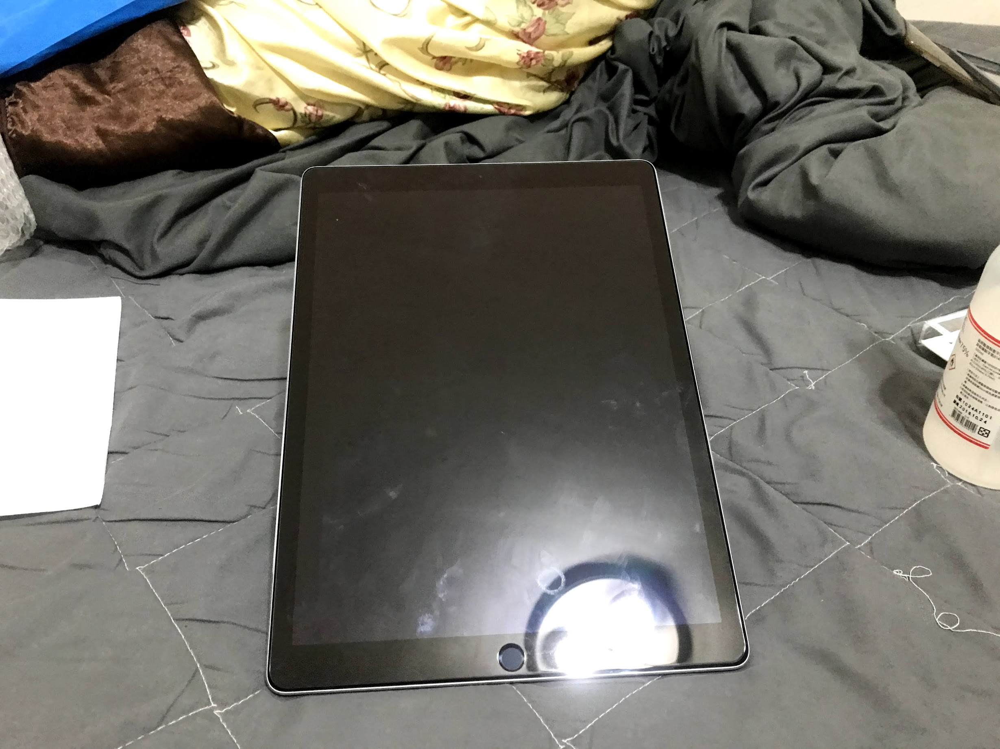

## 前言

最近買了新的阿帕得後，就開始物色保護貼和保護殼

沒錯，不才就是不想用裸機

.

也不是擔心愛的iPad被刮上

要是掉到地上螢幕破掉了

不才可修不起

.

反正iPad的質感也就那樣

摸到鋁合金機身，還是塑膠殼

都無所謂了啦

.

回到正題

星期五買到新iPad後

就開始思考到底要請外面貼還是自己買來貼

.

在台北請人貼好貴，隨便都要破千QQ

自己貼又怕貼壞

.

最後決定還是自己貼

畢竟請外面貼的錢自己都能買三片了

.

然後又要開始思考要貼便宜的還是貴的

頭好痛...

.

## 正文

最後買了兩片

一台給舊的`iPad`用，~~希望之後能賣個好價錢~~

比較貴的那片(霧面)貼新的iPad貼

.

這邊就先分享一下如何100%不會貼歪的教學吧

.

首先先用酒精把iPad擦乾淨，超級乾淨那種

如果是已經貼過膜的iPad，小心點擦，不然可能會被上一張膜的玻璃屑刺到手QQ

.

確定完全擦乾淨後

先拿要貼的膜對在`iPad`上

.

確定真完全對上後，拿膠帶

如果你的保護貼撕開標籤是在左邊(上圖)，就用膠帶貼左邊，右邊就貼右邊

固定住`保護貼`和`iPad`的`相對位置`

.

不才測試用細膠帶比較好調整位置，強度也算是夠了

.

然後把標籤撕開

拉出來

如果膠帶有貼好，位置就不會跑掉了

可以在這段時間做細微調整(`0.5mm`上下)，位置沒問題後在壓一下貼上去

.

最後把保護貼抽開

把剩餘空氣擠掉

\就完成了/

.

整個過程非常簡單

膠帶有把位置固定住根本不會有貼歪的可能

手也不會碰到螢幕貼內部造成遺憾

.

花最多的時間應該是對齊後用膠帶貼著那邊吧

因為兩片膜都不是滿版的

側邊大概會有`1mm`的縫隙(不知道是不是為了幫保護殼預留)

對高度近視的不才來說要四個角剛剛好都間距`1mm`簡直比寫css還困難

.

不過至少最後兩片都沒貼失敗

不才眼睛爛也看不出有進灰塵

可喜可賀

.

## 霧面，亮面保護貼心得

這次買了兩片GLASIN保護貼，一片霧面和亮面的

.

這次的膜不代表所有的`霧面`/`亮面膜`，只是說一下心得

.

先說亮面那張好了

優點 : 
- 終於把之前那張破掉的膜換上去了
- 不算完全沒指紋，但沒那麼沾，還有沾上了也不太影響視線

缺點 :
- 滴到水沒有那種水滴感，不過算了，就算一開始有水滴感，鍍膜掉了後也不會有了。

.

然後霧面膜，感覺不太好就優缺點做說明

針對幾個面向講好了

.

視覺 :

- 會讓iPad色彩鮮豔度下降一個檔次(算有感)，畫面從亮麗變成比較柔和(?)
- 會影響視角，從原本哪個角度看都很亮，變成有些角度反光，霧霧感變重

保護貼質感 : 

- 霧面質感真的不錯
- 跟另外一張亮片保護貼比又更不沾指紋了，應該說就算沾了也不太在意
- 賣場圖片上面有開口，但實際收到是滿版，只有上方Face ID部分沒有做霧面處理，好評
- 不影響`Face ID`辨識，好評

反光 : 

- 降低直接反射
- 但會把周圍也變得白白霧霧的

觸感 : 

- 只能用滑順來形容，滑起來挺舒服的，不會有摸玻璃時的黏手摩擦力感

繪圖 : 

- 比亮面保護貼好，止滑程度跟沒貼膜差不多
- 如果想要更接近紙質，建議弄肯尼指或是其他紙質保護貼

.

## 心得

說真的保護貼水真的很深

牌子多，每個牌子保護貼又有不同種類

用料，鍍膜和其他會影響品質的細節永遠是個迷

廠商商店的話術

還有`iPad`的保護貼生產數量又比`iPhone`更少，面積又更大(當然`12.9`寸又更貴了)

就又更難知`道到底多少錢的保護貼`應該會`帶來多少效果`

.

不過就結論來說

至少不才覺得，雖然沒貼過也覺得應該不能和一千多塊的膜比

以沒花太多錢的角度來說，這兩片保護膜還算配得上不才的`iPad`吧

.

另外膜這種東西有很大的個人主觀，相機也不一定能拍出實際上的感覺

如果好奇可以私訊不才

但避免工商不會提供連結
