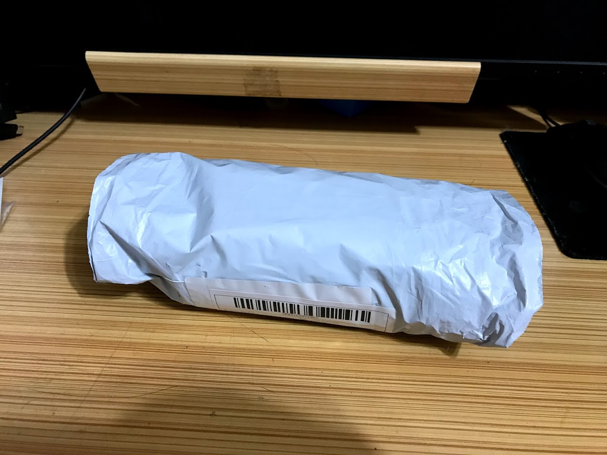
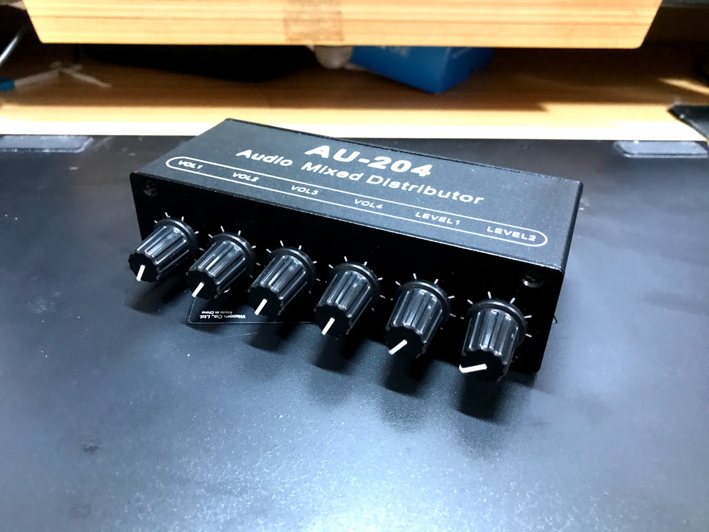
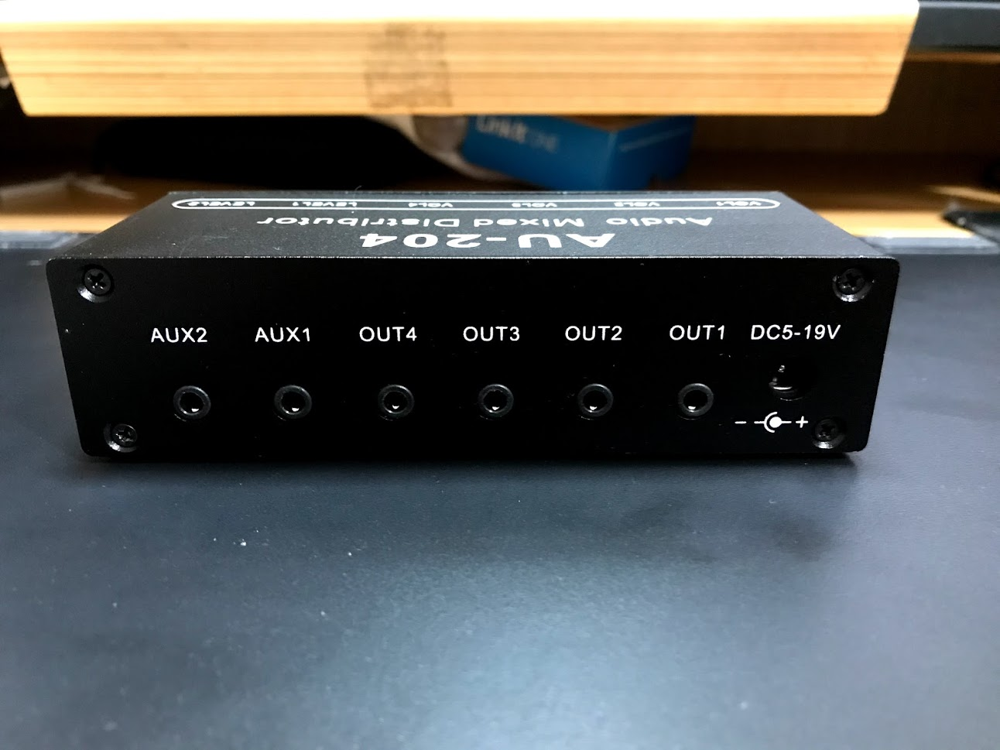
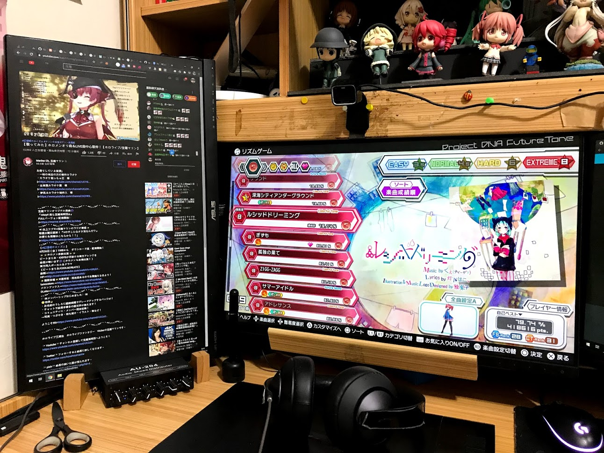

## 前言

不知道在座的各位有沒有

明明用電腦和朋友聊天，但好死不死的在玩PS4上面的遊戲

然後很該死的因為要聊天又要聽到PS4上面的聲音所以得帶兩副耳機

.

又或者想快速的切換輸出的裝置

例如可以選擇用耳機輸出

還是要用喇叭把聲音放出來

.

第二個需求不才是沒有啦(當然如果可以的話不才全都要

但第一個需求困擾了不才相當長的時間

問一個有在玩耳機的朋友還被說這個需求很奇耙

...

邊聊天邊玩遊戲很正常吧

為啥感覺周圍有這樣需求的朋友不多呢

先幫不才自己QQ

.

## 正文

反正終於最後這個東西被不才找到了

型號是`AU-204`

賣場就自己找吧，也沒接業配就不貼上來了

.

東西是從大陸運過來的

雖然說理論上應該要很便宜(?

但感覺可能需求不大一直沒辦法把成本壓下來

.

正面

.

背面

總共有六個洞洞

兩個進去

四個出來

每個輸出和輸入都可以調聲音大小

.

也有四個進兩個出的版本

型號應該叫`AU-402`

但後來查了一下發現之前的那個賣場收了

QQ

.

然後這個東西要吃電

好處是電壓廣泛，5到15V都吃

最後不才找了一個3.5寸外接硬碟盒的變壓器(12V)

剛好可以插進去

.

開箱大致到這邊

接下來簡單測試下效果

.

不才買這個主要是為了把電腦和PS4的聲音合併在一起，方便用同一隻耳機聽

所以其中一邊的輸入孔接電腦耳機孔

另外一邊接上螢幕的耳機孔

這樣螢幕的聲音就會改用耳機孔輸出

.

但也要看自己手上的螢幕有沒有3.5mm輸出

沒有的話就只能幫QQ了

.

然後是輸出

不才接了一個耳機

和一個外接喇叭

.

用起來效果

不才覺得它完美的達到了不才的需求

立體聲(很多賣場賣的都是單聲道，因為是給麥克風用的

每一個音源都可以獨立控制(PS4沒辦法控制輸出音量，用這個終於能夠調整聲音大小了

沒有底躁(至少不才沒聽出來

轉的時候沒有沙沙的聲音

.

不才是覺得挺方便的

可以在輸出時把PS4和PC調成一樣大聲

或是和朋友聊天時把PC聲音條大

.

輸出時也同樣可以決定要輸出多大聲

或是把耳機的聲音關掉，把喇叭打開

又或是耳罩式耳機戴久悶了，轉一下旋鈕又可以把耳道式耳機的聲音轉開...

.

如果硬要說缺點嗎...

大概就是沒付變壓器，對小白可能有點不友善

還有比起耳機直接接電腦或是螢幕，中間又多了一條線

如果那條線品質不好，聲音聽器來可能會稍微悶一點(但也還在能接受的範圍，沒有比較，沒有傷害

.

對了還有，如果有底噪的話

可能是螢幕或是主機板的電流造成的

偶爾會遇到，有點討厭

.

以上

.