## 前言

因為工作一直維持WFH

想說疫情好像也好轉了

所以最近搬到阿罵家工作看看

順便看看訊號好不好

能不能順利工作等等

.

下去阿罵家前把一個滑鼠也帶下去

想說之後就放在那邊

結果忘記先把滾輪會卡卡的問題處理掉

現在越用用難受

只好買一個螺絲起子來修滑鼠

順便把五倍券消耗掉

.

但很不巧的

五倍券綁在街口

然後鄉下可以接受街口支付的電

比日本的壓縮機還稀少

所以最後只能在PChome上面買QQ

.

既然都要買了

這次就買一個稍微貴一點的好了

不然之前買的那幾組用一用

不是裡面的替換頭不見

不然就是生鏽QQ

.

## 開箱

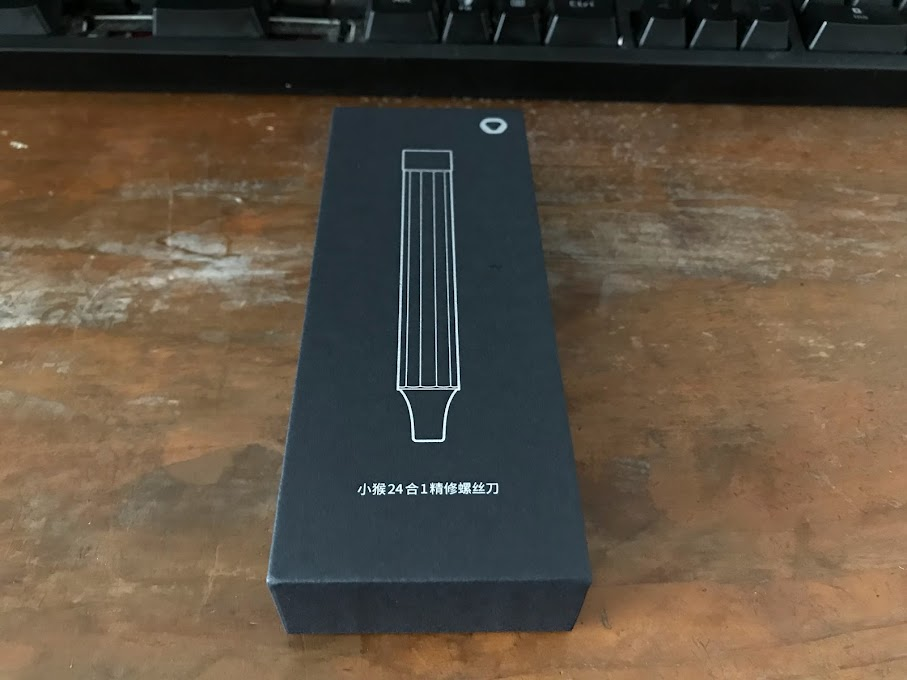

正面

.

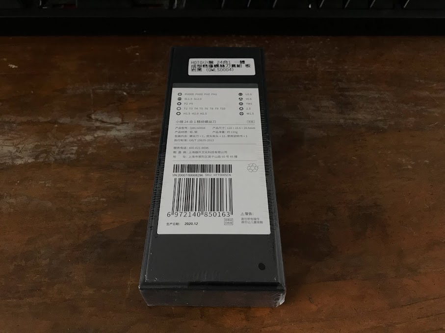

背面

.

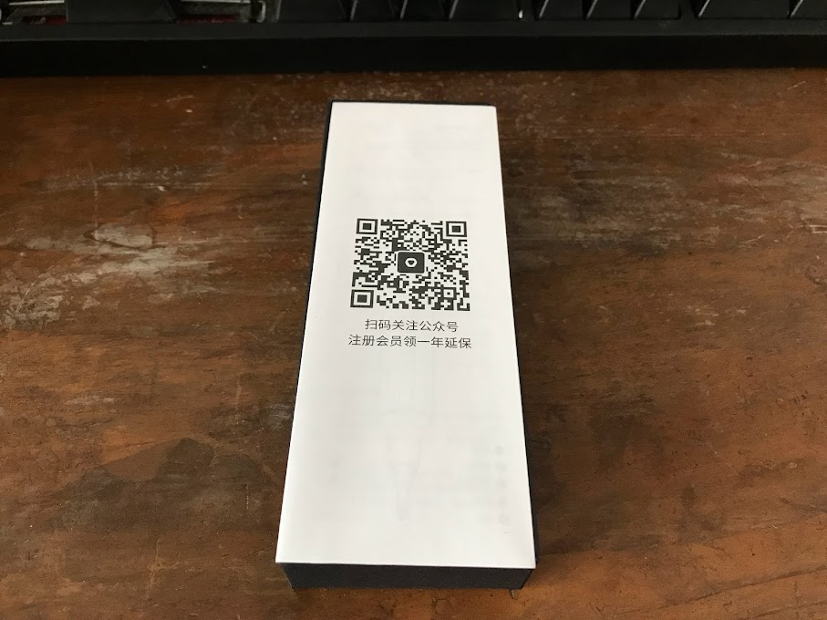

打開後立馬有個關注公眾號

不才還以為自己在看`無聊的開箱`

.

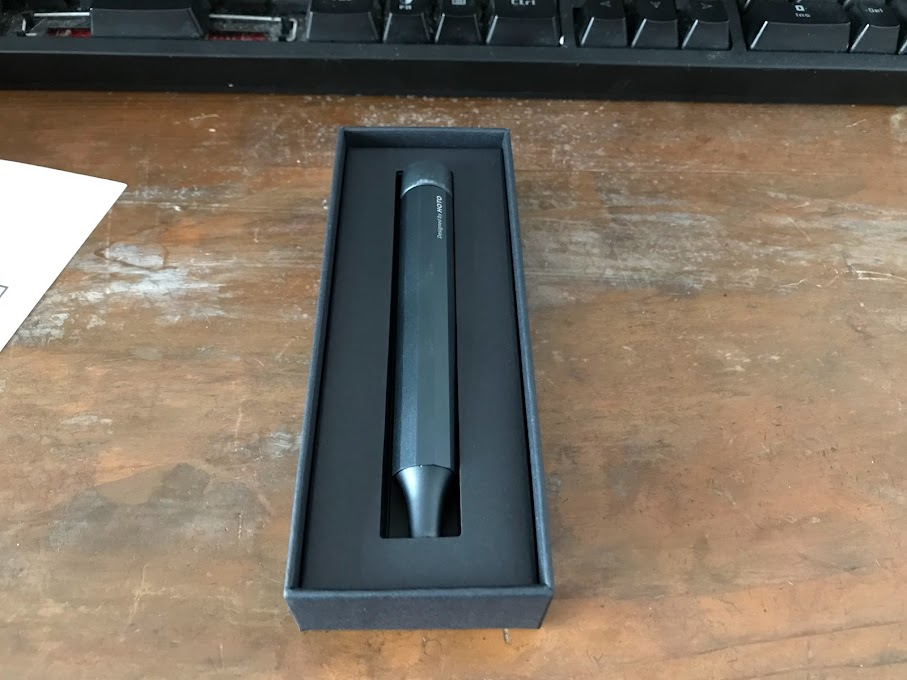

打開，整隻是鋁製的

摸起來手感還不錯

.

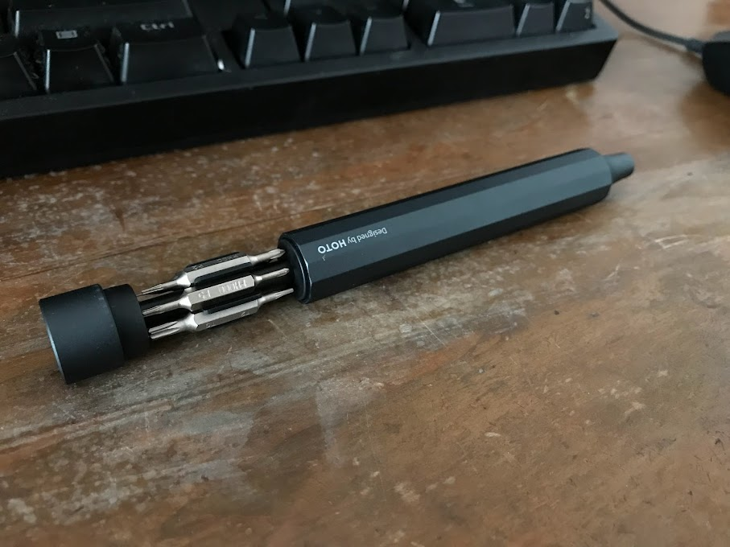

所有螺絲都是藏在螺絲起子裡面

好處是不會像工具包那樣如果打翻了

裡面的替換頭就少了好幾個QQ

.

缺點麻...

裡面不能放太多替換頭

.

另外打開的方式不是旋轉

而是用力拉

固定方式是用磁鐵

.

然後抽出來的手感不才覺得不算太好

感覺裡面的替換頭很容易跟外面的殼摩擦到

.

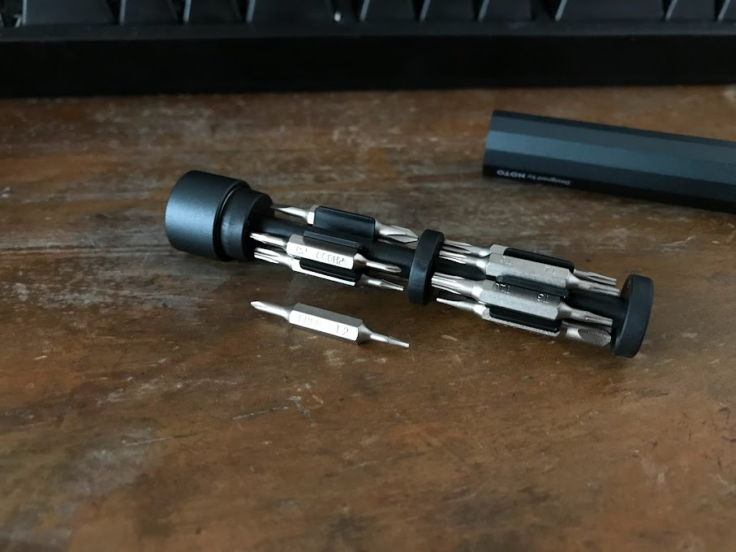

裡面的固定方式也是用磁鐵

優點是把替換頭取下來時的手感比較好

缺點是吸力似乎不太夠

.

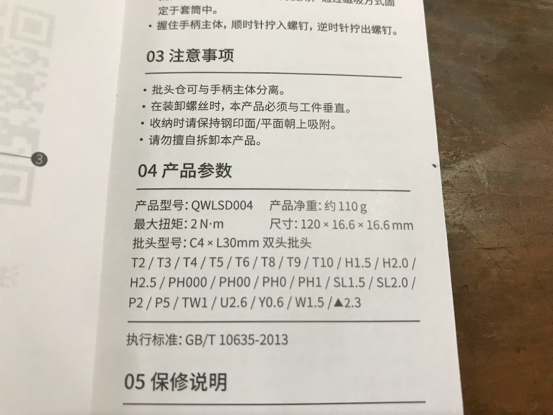

說明書

可以拆哪些螺絲

這邊不才就懶得打了

常用的孔位應該都有

.

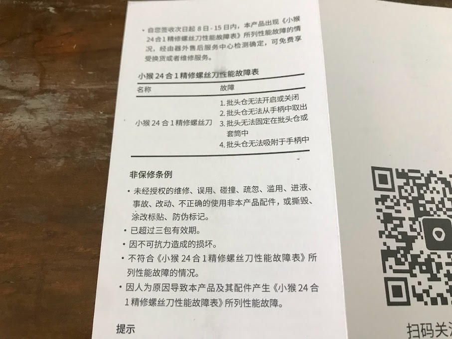

故障範圍

很迷的正常來說

故障表上面的故障都不太可能發生

除非你把整隻螺絲起子拿去消磁

.

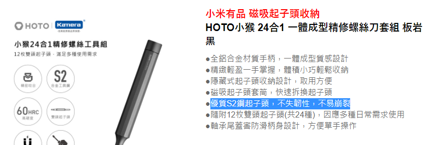

然後不知道生鏽到底有沒有保，因為PCHome上面寫著`優質S2鋼起子頭，不失韌性，不易崩裂`

一隻快五百塊的螺絲起子

如果正常使用還會生鏽的話感覺有點鳥

.

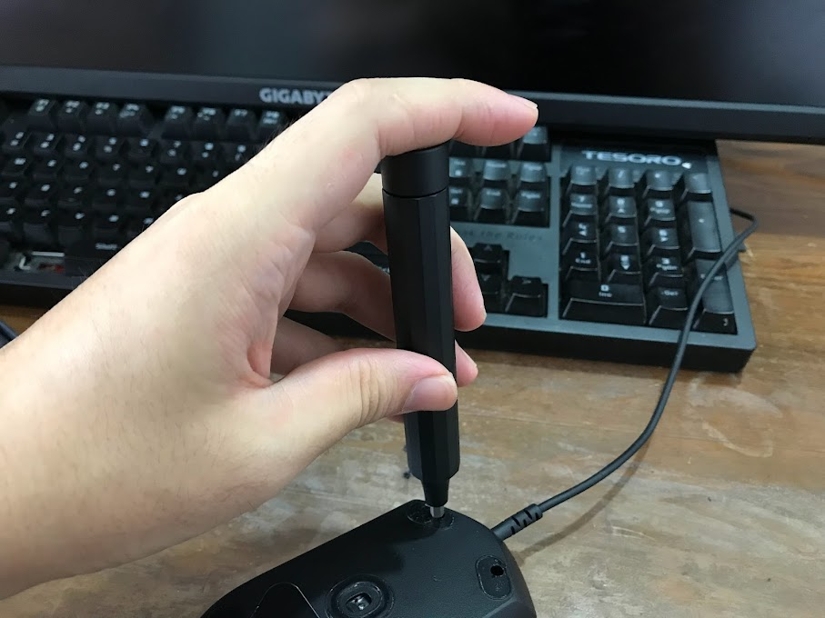

接下來測試拆一隻滑鼠試試看

.

值得一提的

上方的頭部那一段是可以旋轉的

而且轉起來很順

所以能像這樣一隻手指頭撐著

其他手指頭來轉

拆起來感覺就很舒服

.

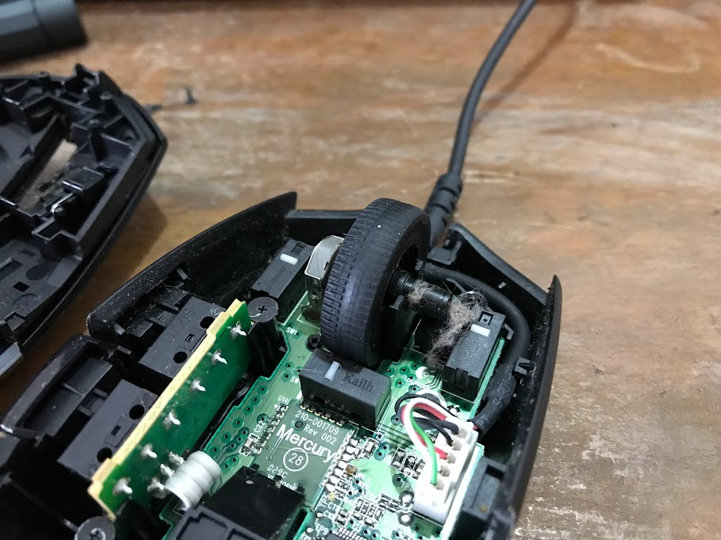

最後那隻滑鼠滾輪不順的原因找到了

裡面卡了一些寵物毛

把毛清一清就可以繼續用了

.

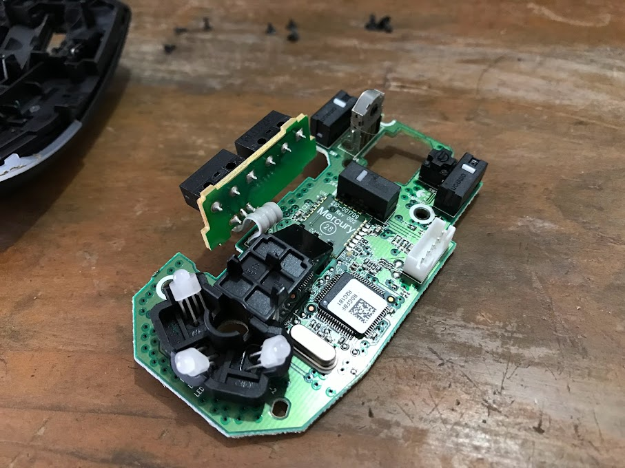

然後無聊提一下

G102這支入門到不行的滑鼠

裡面晶片居然比預期的還好

怕

.

以後不才都繼續買入門滑鼠好了(#

.

## 結論

等等，那支螺絲起子是不是比不才要修的滑鼠還貴...

.