## 前言

不知道哪根筋不對，自從WFH後就一直想著要去阿罵家(鄉下)遠端工作

如果能領台北的薪水

在鄉下的房子吸新鮮空氣

還是挺不錯的

.

但問題來了，不才除了公司的專案用osx外

自己也要用windows寫其他專案

要把主機帶去鄉下是一件大工程(突然後悔當初為啥要挑超級重的機殼)

最後在所有想得出的方案中

選擇了在mac上灌windows

.

但macbook磁區之前都切好了

現在要硬塞一個windows進去總覺得有點懶

最後就誕生出把系統灌在外接硬碟這個方案了

.

## 正文

因為是拔手中(強迫)退役的256g m.2 sata ssd下來

所以外接盒不想找太貴的

原本是想選`M2PV-C3`(只支援sata那款)

但想想另外一條NVMe可能也會退役

最後就買了兩種都支援的

.

在蝦皮買只要500初

有折價券

免運，算下來還行

.

另外注意一下賣場有好幾個型號，但外型都長得一樣(可能為了省模具吧)

印象中有遇到同個型號但在賣場中不同的商品區，價格好像也不一樣(?)

逛的時候可以注意一下

.

然後下標後到寄過來大概要一個星期，畢竟是從中國寄過來會久一點

.

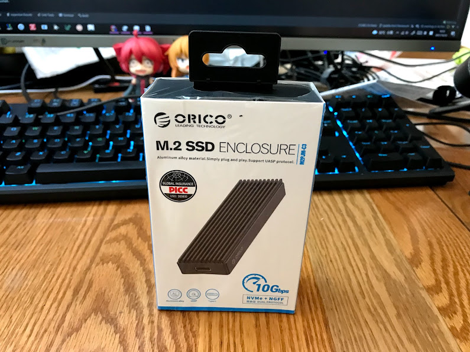

開箱

外層有廉價塑膠套套著

.

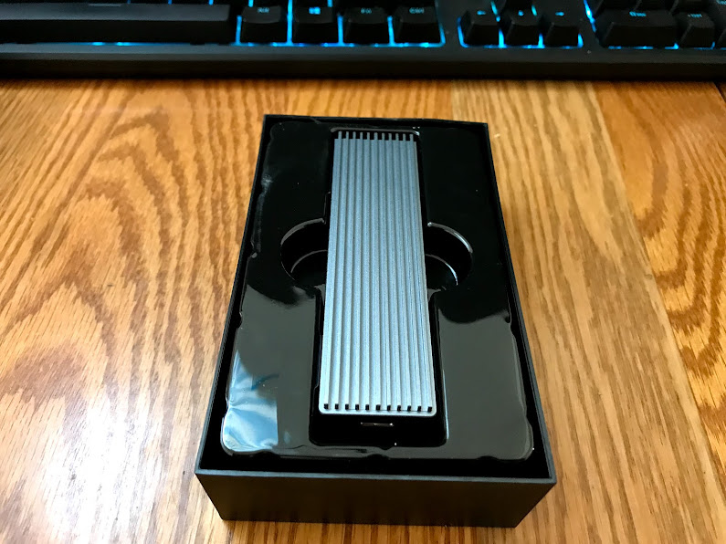

打開

裡面有廉價塑膠殼

和本體

.

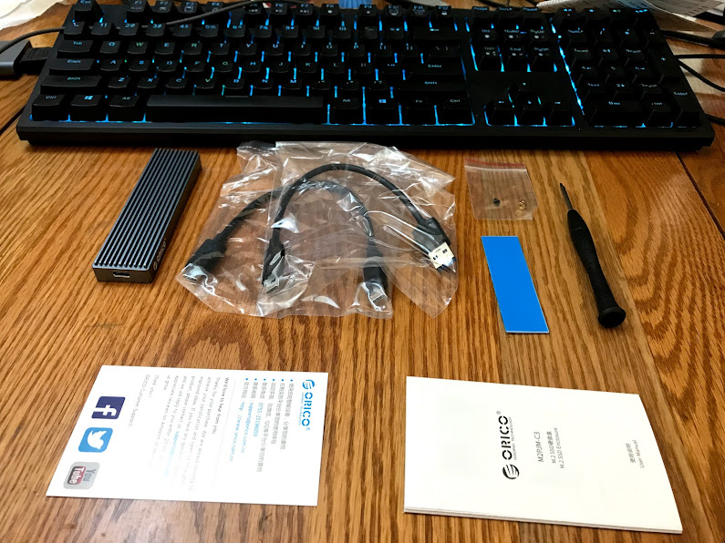

東西種共就:
- 本體
- 兩條線(type-c to 普通USB頭 / type-c to c)
- 一包螺絲
- 一個散熱條
- 螺絲起子(星型)
- 兩個說明書

.

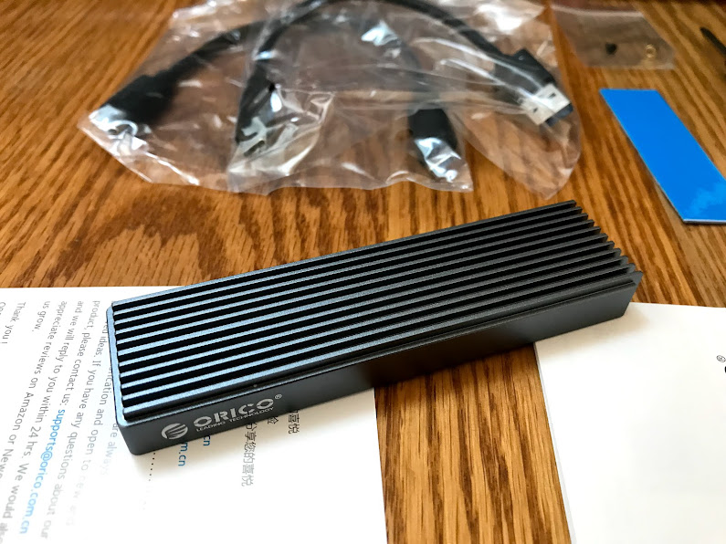

殼子鋁做的

大小個人覺得比賣場的圖片感覺還小一點(畢竟M.2也就那個大小)

顏色偏灰，賣場給人的感覺像是全黑的

也是挺好看的

.

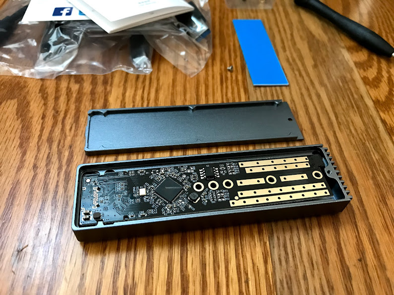

拆開來

裡面是主控

.

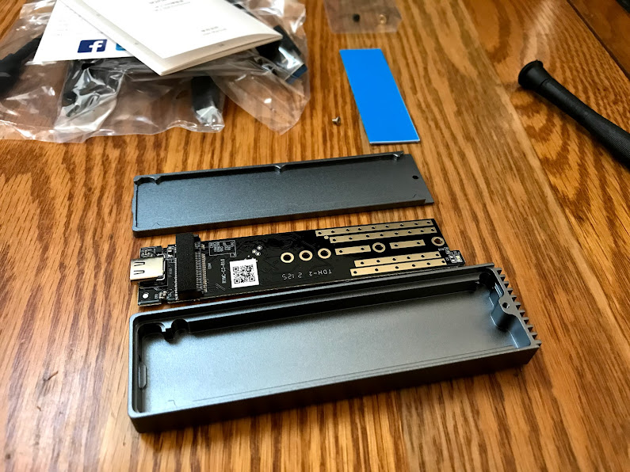

翻過來，裡面才是放M.2的地方

這個設計還是挺不錯的

能有效利用殼子內空間

.

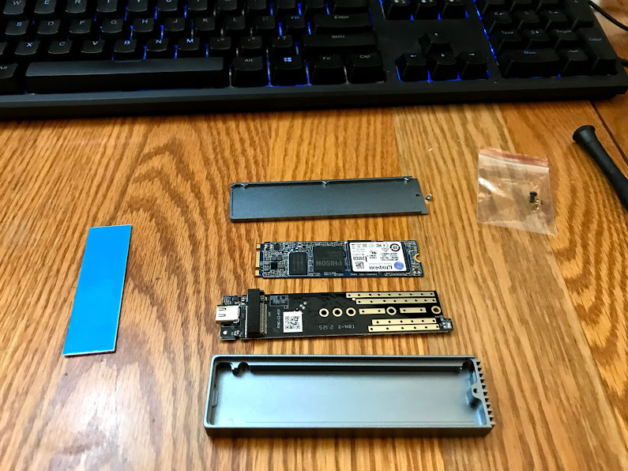

接著準備退役下來的M.2

螺絲延後面鎖上去

.

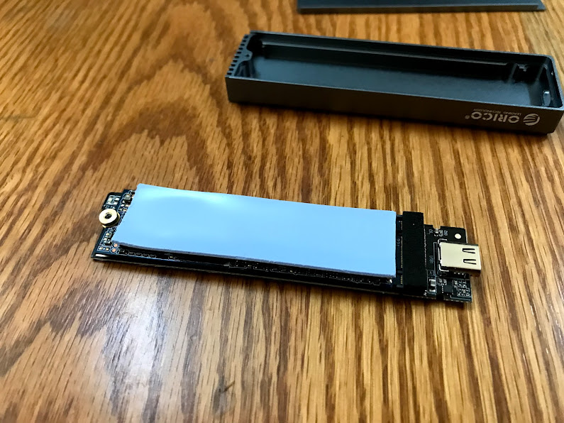

然後那個散熱條

其中一面是黏的

最後研究出來的方法是黏的那面放在M.2上面

然後裝回去

.

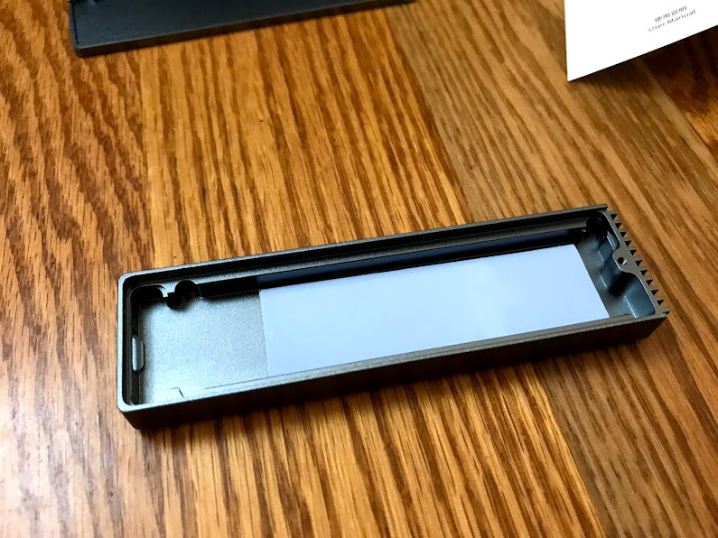

這樣散熱條就會固定在殼上

下次換SSD後就不用重買散熱條了

.

## 灌 windows to go

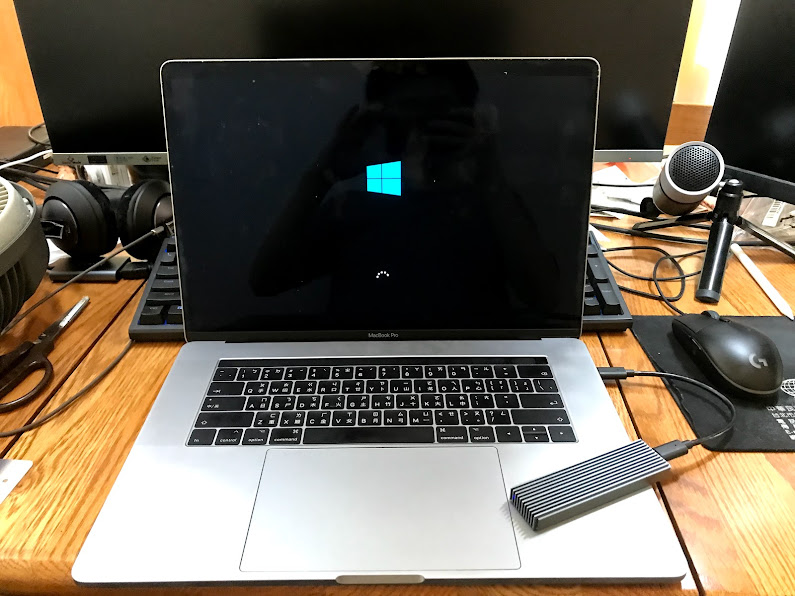

https://youtu.be/imEA-JQKXvk

灌windows 10 to go 的過程可以參考這篇

.

然後中間有些心得或建議可以搭配服用:
1. `windows 10 pro` 有內建 `windows to go` 隨身碟製作工具，但在新的版本中被拿掉了QQ
2. 製作`windows to go`的工具可以用`rufus`，個人覺得比較乾淨好懂: https://briian.com/30860/
3. 如果要取得`macbook`的`driver`，目前試下來還是照影片的方式抓比較好，google搜尋到的那個driver是舊版的
4. 如果你做出來的`windows to go`有整個磁區加密的功能，要安裝`windows 10 pro`版的
5. 如果啟用`bitlocker`遇到沒有TPM模組的問題(例如在macbook上)，可以參考[這篇文章](https://www.windowscentral.com/how-use-bitlocker-encryption-windows-10)把TPM硬體需求關掉
6. 如果你的電腦有TMP模組，可能要花點時間確認一下這樣綁上去，你的那顆windows to go隨身碟會不會只認你那台有TPM模組的電腦了(或是乾脆找台沒TPM模組的電腦弄)
7. 如果順利套用`bitlocker`，在開機前會要求你輸入密碼，如果把外接硬碟插到電腦上，也會要求輸入密碼

以上

.

## 結論

遮騰了一段時間

windows to go 終於裝好了

可喜可賀可喜可賀

.

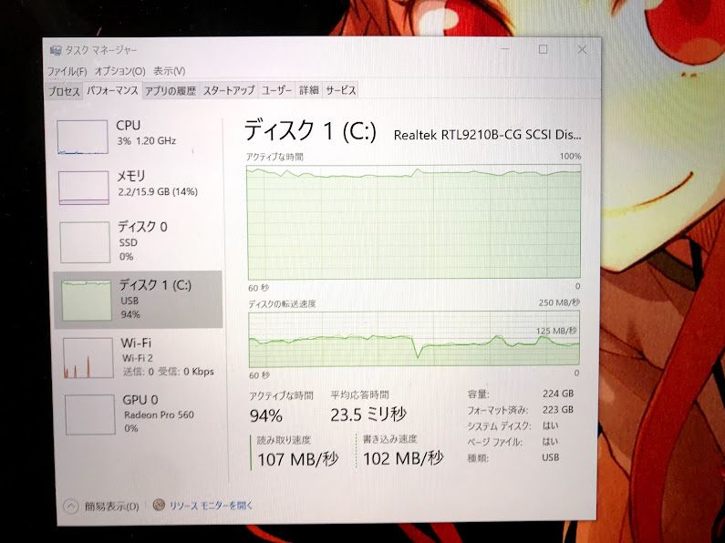

中間測試了一下

待機，閒置，或是bitlocker加密磁碟時(圖時讀寫可能會慢一點我猜)

沒遇到掉速或是掛掉的情況

意外的還行

.

溫度就摸起來溫溫的

可能是因為裡面那顆SSD發熱量不算太大

不知道下一顆退役的PM961壓不壓得住

應該壓得住吧

大概?

.

產品優點的話

大概就體積小，質感不錯，還有有type-c to c 的線

對macbook來說簡直是福音

.

硬要挑缺點的話，能幫忙把散熱貼預先貼好或許不錯

還有螺絲數量都剛剛好，弄丟就GG了

.

然後windows to go那麼好用的功能居然要被拿掉了

先幫QQ

.

以上