## 前言

之前一直是用五孔的延長線

但隨著插頭數量越來越多

用起來實在有些蛋疼

.

最後在買 [Orico 外接硬碟盒](../orico-m2pjm-c3-unbixing/README.md) 時，順便添購湊折抵券金額

.

賣場有賣有兩個USB版本，多100

但不才心理上一直無法接受內建USB充電的裝置(USB充電器除外)

最後就選擇了便宜的版本

.

## 正文

也是一樣，因為從中國出貨

下標後過了一個星期才到

等得有些蛋疼

.

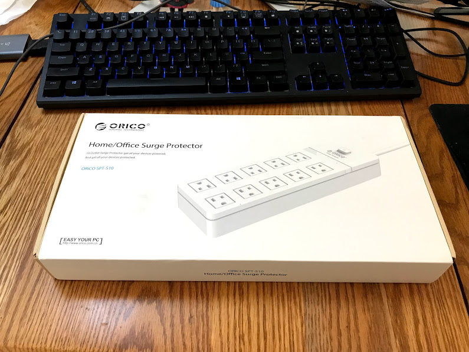

就外包裝來說，質感還算不錯

.

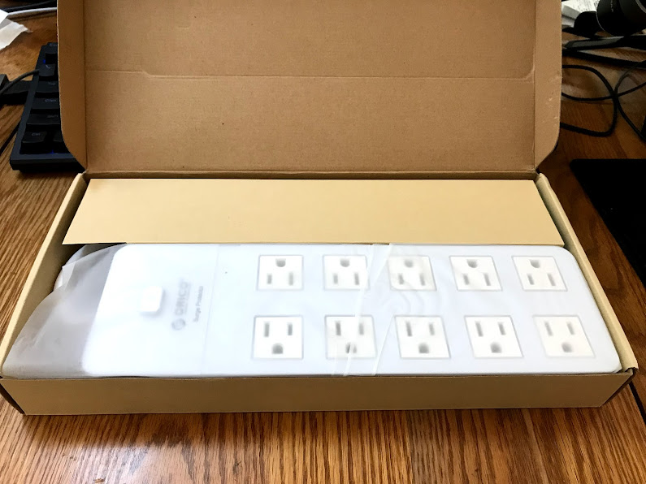

裡面質感也不錯

.

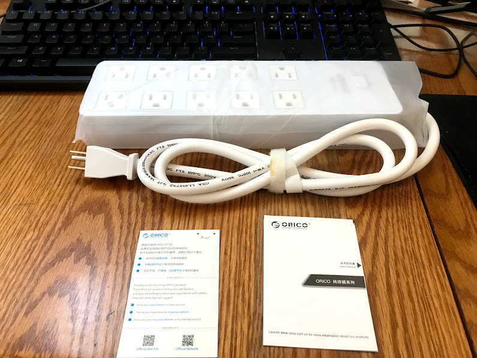

東西就一個本體

還有兩張說明書

.

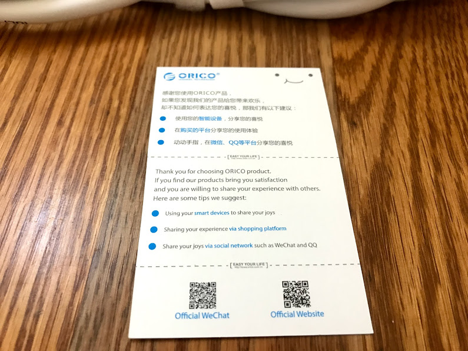

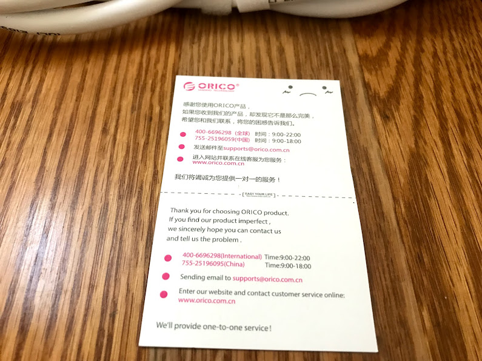

很有意思的是

說明書正反面顏色不一樣

看起來有用心到

.

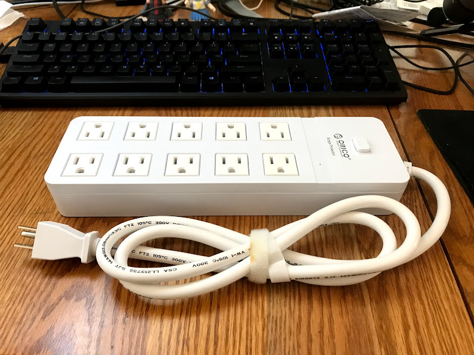

接著回到本體

不知對為啥開箱時線束線帶黃黃的

不過有線束線總比沒有好

就懶得管了

.

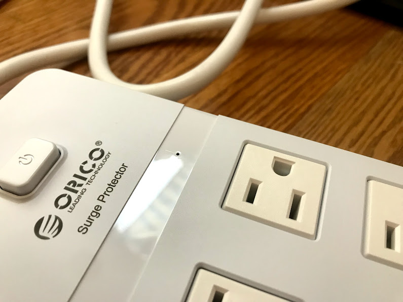

按鈕是彈壓式的

習慣開關後，按起來不太習慣

.

然後上面那個孔是LED

有電時會亮質感藍光

.

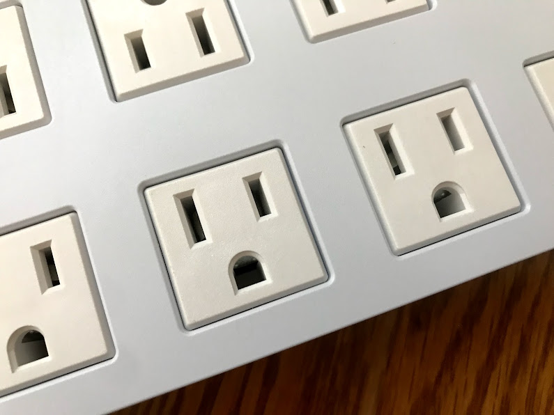

然後有一點值得提一下

裡面的蓋子有做防塵設計

寬度也弄得很寬，提升插拔體驗

.

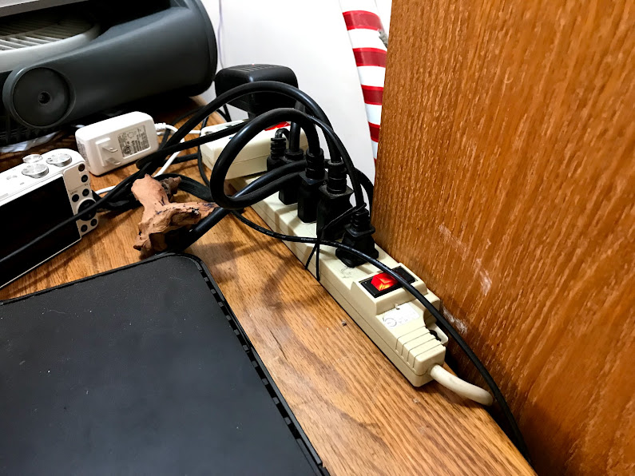

不才目前用的延長線

加上擴充後也就六孔

有大屁屁的變壓器插不插得上去

還要看旁邊是不是也是大屁屁變壓器

.

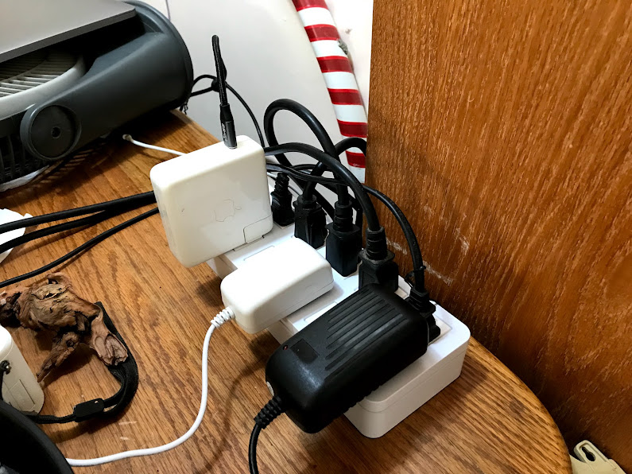

換成新的後舒服多了

上面至少能插上五個大屁屁變壓器

.

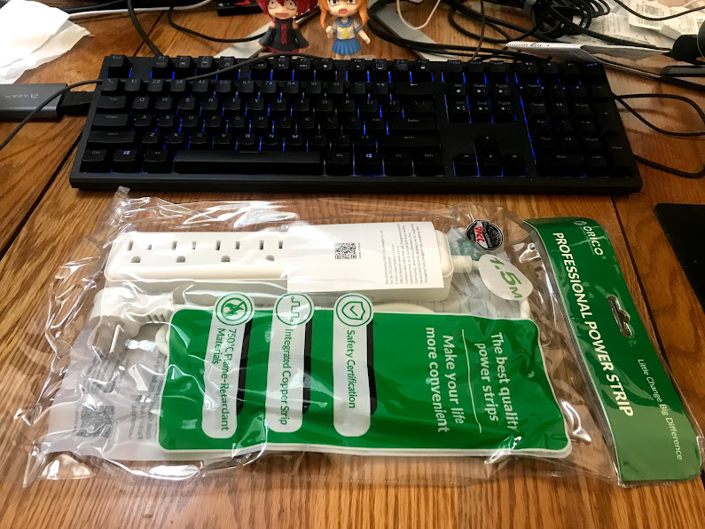

然後另外一個為了湊運費買的延長線

用的是防退貨包裝

.

質感和做工來說就相對普通

畢竟分到的經費只有隔壁棚不到一半吧

.

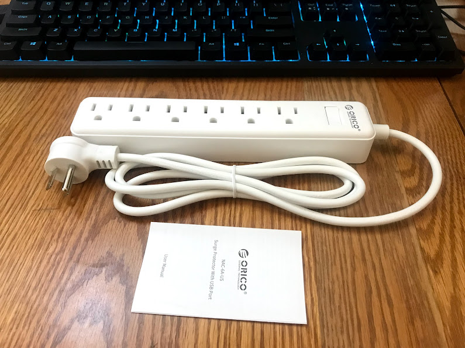

最高支援到1250W，也是隔壁棚的一半

.

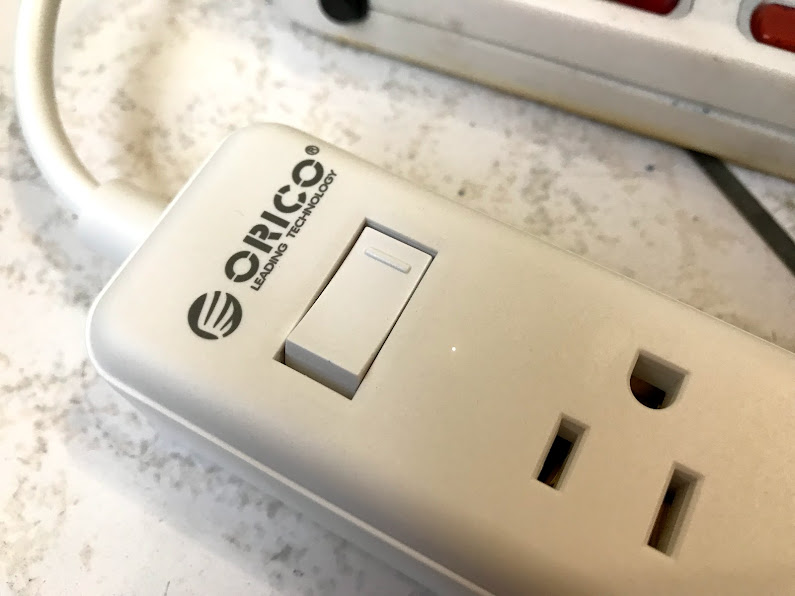

然後如果打開開關

只會亮奈米白，還沒有抗閃爍

有夠爛wwwwwww

.

## 結論

先說大顆的優缺點好了:

優點:
- 精美包裝
- 做工不錯
- 防塵蓋
- 插頭位置是衡的，間距很大，能夠容納大量大屁屁變壓器
- 2500W (但某種程度上根本用不到QQ)

缺點:
- 燈有點暗
- 2500W帶來的問題就是線有夠粗
- 1.5M 有點短，希望能出2M或是3M的選項

.

接著說小顆的優缺點

優點:
- 還算行的做工
- 插頭位置是衡的(但因為間距太短所以沒帶來太多優點)

缺點:
- 那個有跟沒有一樣的電源指示燈
- ~~對比雙面延長線性價比不是特別突出~~ (更正，剛查了一下，連吃粗飽的雙面延長線都從不才有印象的100漲到180了QQ)
- 不環保包裝

.

以上