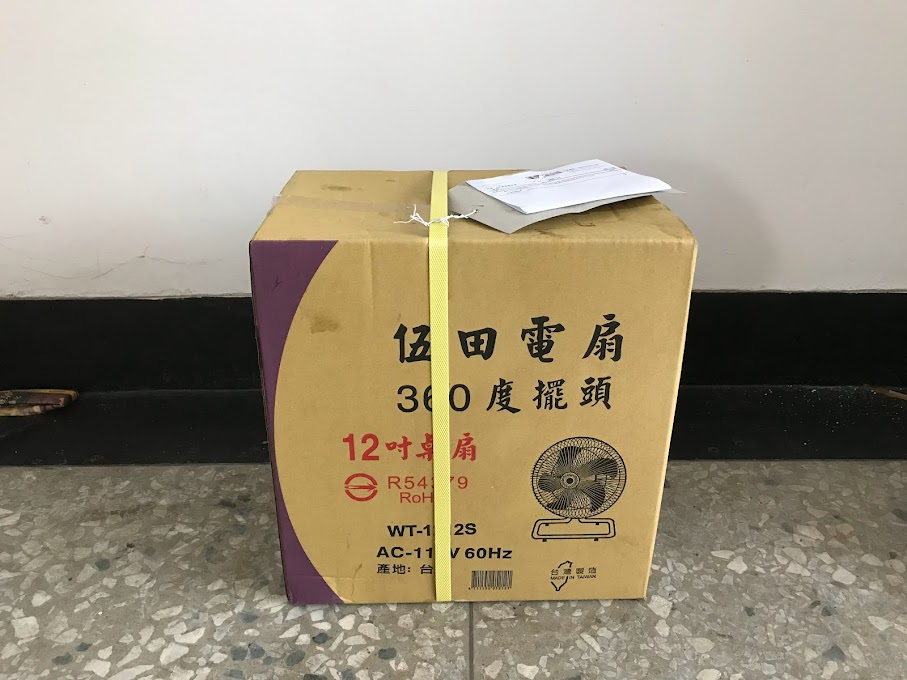
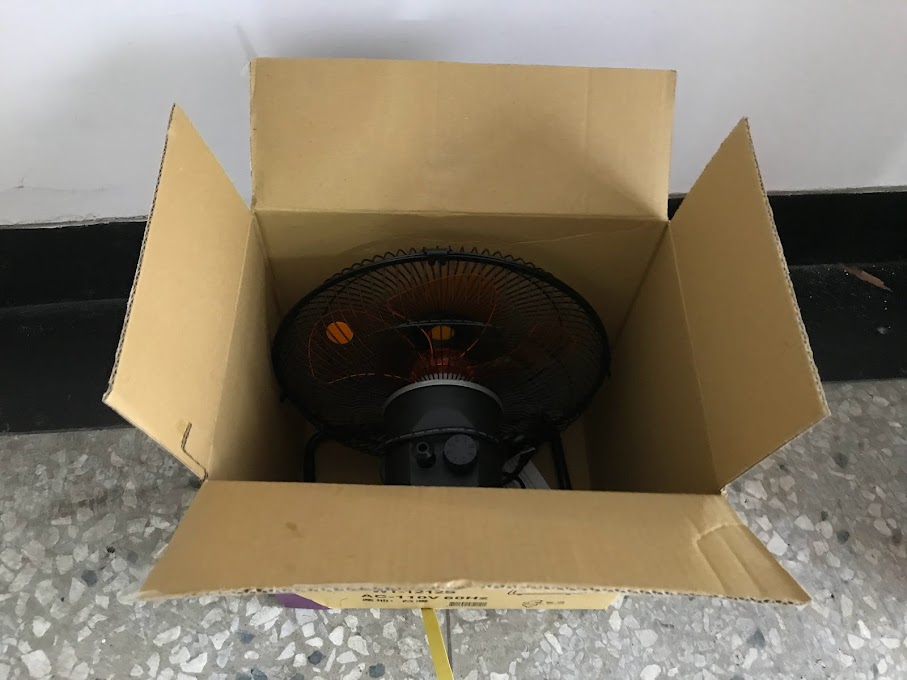
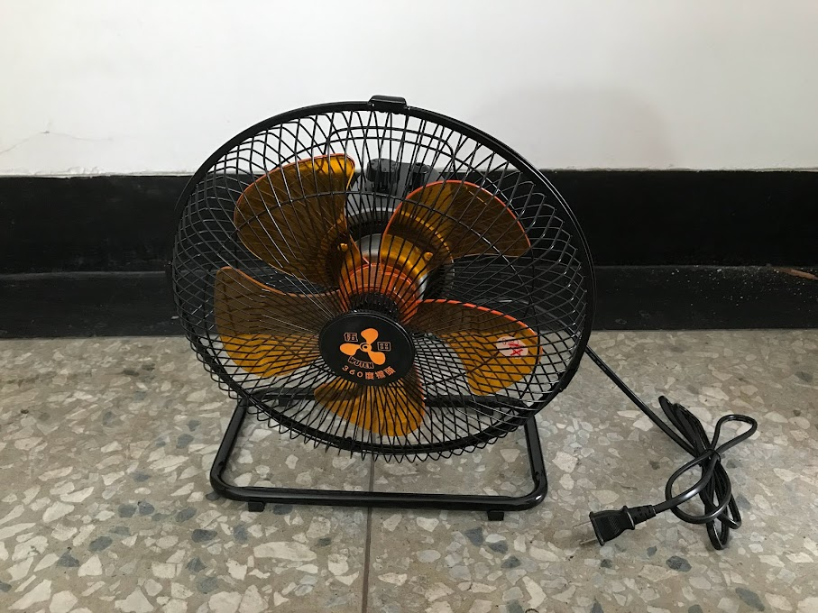
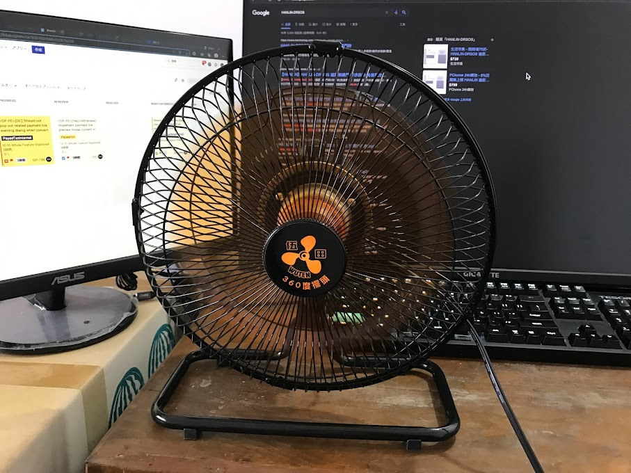
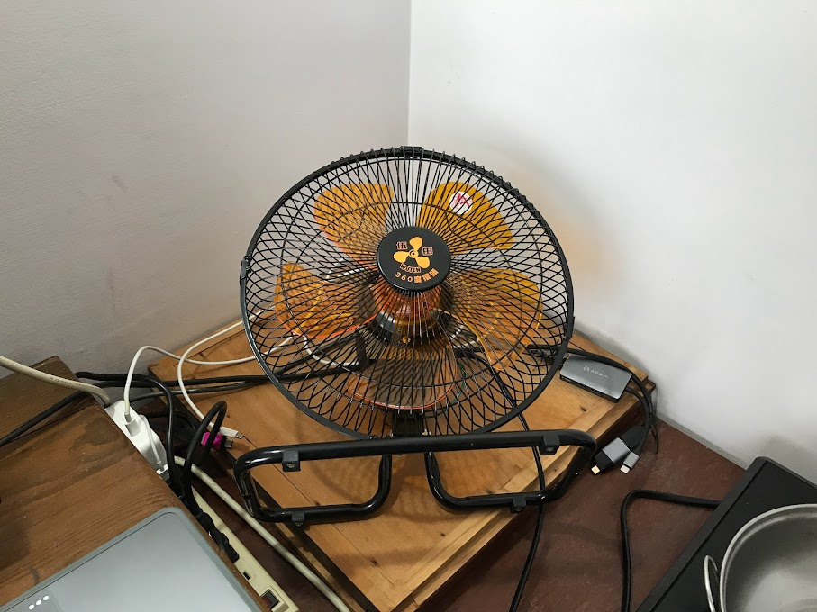
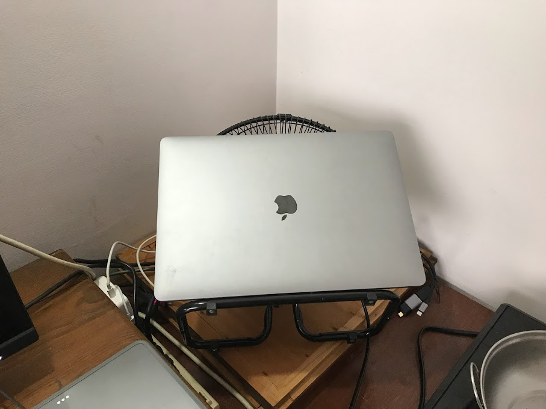
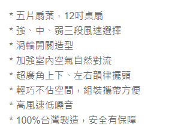
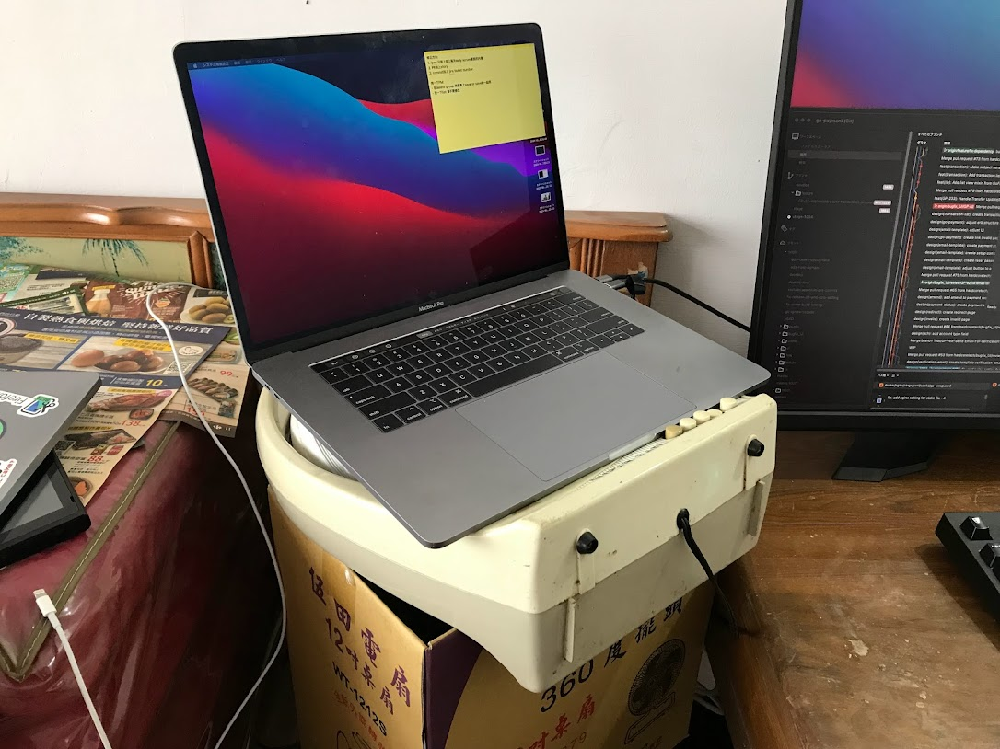

## 前言

因為工作一直維持WFH

想說疫情好像也好轉了

所以最近搬到阿罵家工作看看

順便看看訊號好不好

能不能順利工作等等

.

但公司的電腦嬌生慣養

工作時不吹吹電風扇

可能會變的狗幹卡

所以只好添購電風扇

順便消耗五倍券

.

## 開箱

PCHome出貨速度還是挺快的

前天晚上購買

今天中午前就到了

.

第一個拿到箱子的感覺

比預期的還小還輕

.

開箱

裡面就一個電扇

一張說明書就沒了

優點是退貨的話很方便，不會有破壞包裝的問題(?)

.

本體

也是比想像中小

畢竟只有12吋

線大概1.8M

.

放在桌上的大小

.

原本是想把風扇這樣用

放平

.

然後上面放上一台至尊嬌貴intel火烤燒窯版macbook

.

https://photos.app.goo.gl/4hQ15Muu6ynCKvfL7

但很悲催的，打開電風扇後發現聲音狗幹大

噪音可以參考這支影片

.

https://24h.pchome.com.tw/prod/DMABB9-A9008Z3RU

再回頭看看PXHome的簡介

這電扇吵得跟鬼一樣

哪裡低噪音了wwwwww

.

吵的程度大概是

如果是想把電風扇放在窗邊讓外面的空氣進來

大概是覺得狗幹吵

所以不好意思放窗邊吵鄰居的程度

因為聲音大到在另外一間房間也聽得很清楚

.

然後如果放床邊的話

需要戴耳塞的程度

不才是平常都會戴耳塞所以沒差

.

最後總結一下優缺點好了

優點:
- 小
- 風力相當大

缺點:
- 吵
- 風力轉到最小還是吵
- 風扇雖然能擺動，但高度是鎖死的，想要調整的話要用螺絲起子，而且鎖很緊

以上

.

最後改用另外一個風扇當散熱器

新買的也懶得退了

就當普通風扇吧

.

噪音小什麼的聽聽就好，某種程度上他也算是工業風扇(嗎?)

家用不建議買這個

除非你想要附加噪音功能

.