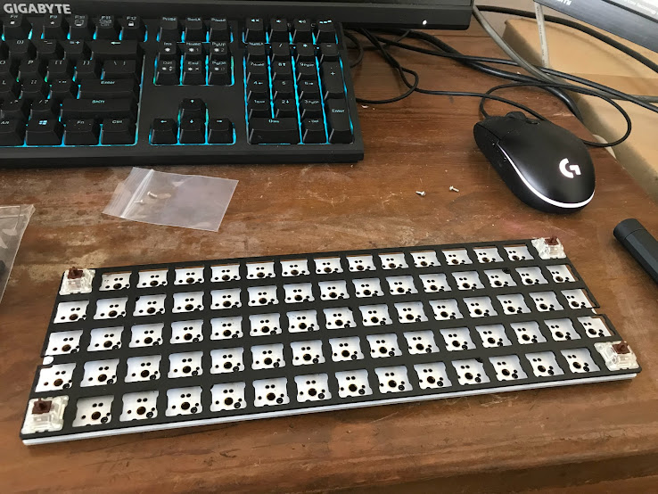
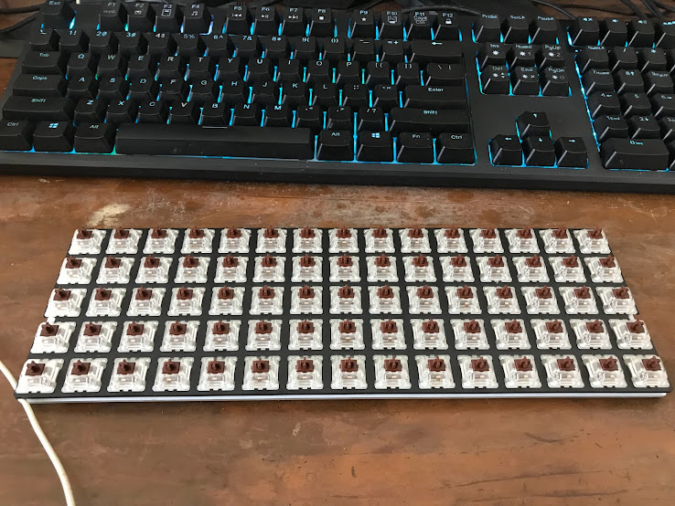

## 前言

最近發了年終，想說是時候該弄點什麼玩玩看了

.

最後想說之後回到辦公室，可能會需要一把鍵盤

然後不知道哪根筋不對，突然想要克制化鍵盤

最好長得很奇怪那種

.

最後這個鬼東西就跑來不才這邊了

.

## 正文

下單過後大概一個星期左右就記過來了，開心

.

因為鍵帽和鍵盤是同時買的，所以一起寄過來了

.

首先是本體的部分

.

有腳墊和幾個螺絲

.

電路板

.

電路板

.

鋁殼

選咖啡色的，實際拿到的感覺比掏寶上面的還要淺一些

.

背面

.

定位用的鋁片

.

另外一盒是裝件帽和茶軸

.

買鍵盤時會附上拔鍵器和一條type-c的線

.

雖然賣場是說茶軸RGB，但應該是指可以透光的軸

不是指軸本身有帶LED

買之前還想說怎麼會那麼便宜

.

開始組裝

先把背面的墊高的鎖上去

.

然後把定位版,電路板和軸這樣固定

.

逐一裝上去

.

套上去的樣子

.

接著把鍵帽逐一裝上去,就大功告成了

.

差點忘了,還需要把墊片貼上去

抱歉咖啡色桌子不太好把拍照拍好

.

## 使用體驗

首先，這把鍵盤的鍵高度比一班鍵盤高一些，所以有一個手拖的會比較好一點

.

再來，因為鍵盤的排列和正常鍵盤不一樣，光打字上手(尤其是注音)上手需要不少時間

如果以前指法不好的話，上手時間直接加倍起跳(尤其是注音)

.

一些指法或是慣用手全換了,習慣以前的快速打字速度後,需要重新習慣真的會想殺人

覺得花了4000出頭的自己像個智障一樣

.

例如不才中文打字指法就不怎麼標準

平常不太使用最後一根手指

有些在右手的鍵(e.g: 四聲和輕聲)會習慣用左手按(打完下半部後可以接著輸入，不用等右手移動)

偏偏那些不標準的指法還打很快

.

建議完全習慣之前,先使用之前的鍵帽

就算把英文位置全部背下來了也建議用之前的件帽先敲一陣子看看

對以前使用的鍵盤的肌肉記憶可是很可怕的

盡量不要以一次更換太多的情況下慢慢適應鍵盤

.

以上

．

## 總結

上面的字都是用那隻該死的鍵盤打出來的

因為以前到現在使用的都不是正常指法，所以速度只有以前的的20%不到

還瘋狂打錯

整個快氣死

先把劍鍵盤換回來，不然打不下去了

.

先說這個鍵盤的優點好了
- 潮
- 質感不錯
- 在上手時能順便矯正長期使用錯誤的指法
- 打英文時左右手有更明確的分工
- [不知道算不算優點]隨著時間慢慢做出自己覺得最好的鍵盤佈局

.

缺點也不少，但多半指得或許不是鍵盤本身
- 新鮮感過後開始覺得貴了(當初買下去差不多4000初)
- 建議需要手托
- 不會發光(X)
- 難以適應，尤其是功能鍵和注音
- 需要花很多時間想佈局，而且要能夠兼容英文和注音輸入
- 功能鍵位置不好安排(總共也才75顆鍵，打字用就佔掉87%了)
- 上下左右鍵不好安置
- PTSD經常發作(posttraumatic stress disorder)，尤其是打注音時
- 增加中風機率
- 就算習慣後，打字速度也不一定會變快
- 習慣後，使用原本的鍵盤會增加打錯機率，除非重新習慣舊的鍵盤

.

以上

至於如何調整這把鍵盤的按鍵，等有時間再寫吧

~~反正爛得要死的 google SEO 也不會把這篇文章排到搜尋引擎內~~