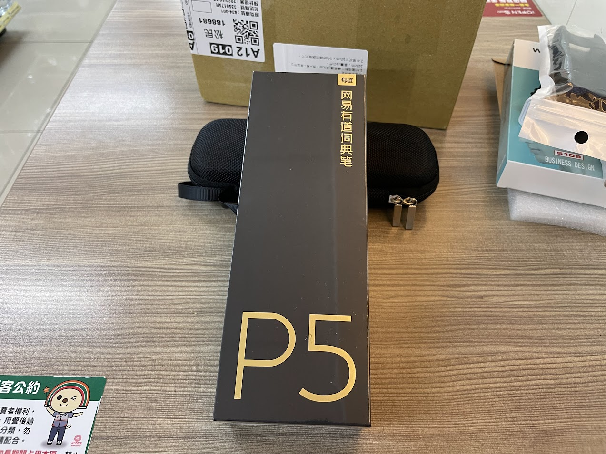
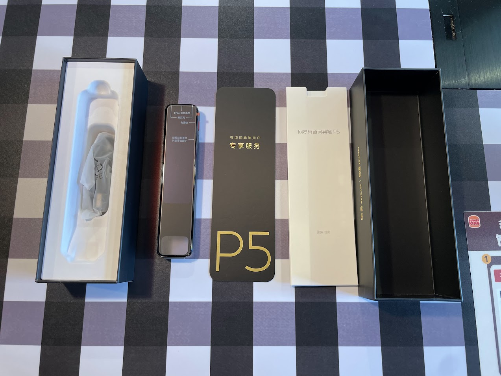
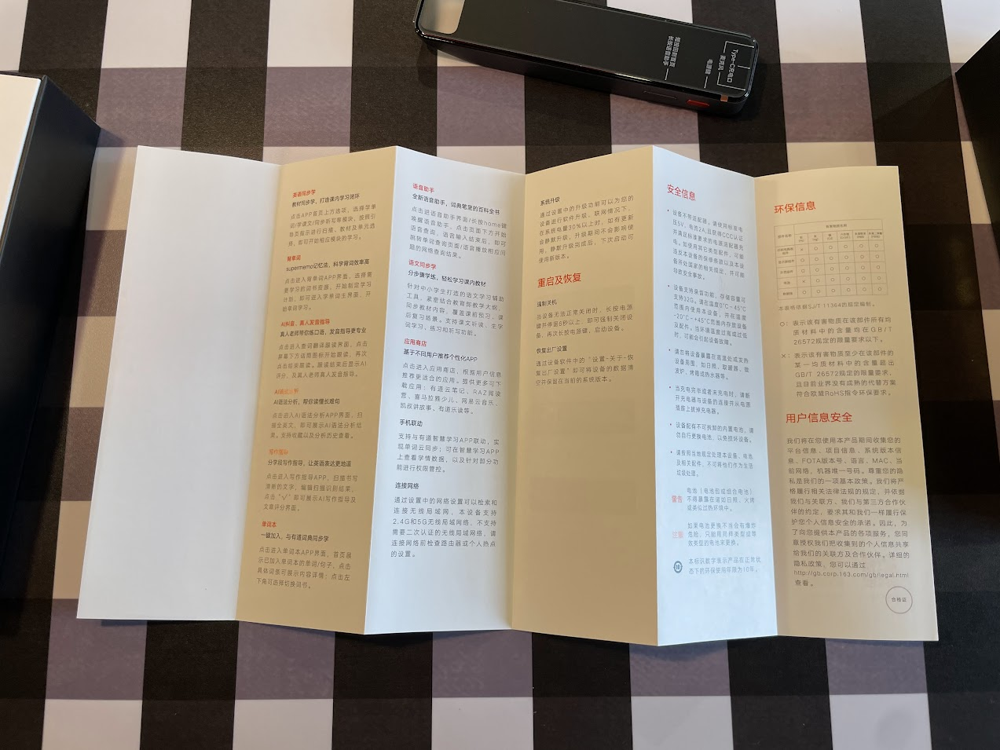
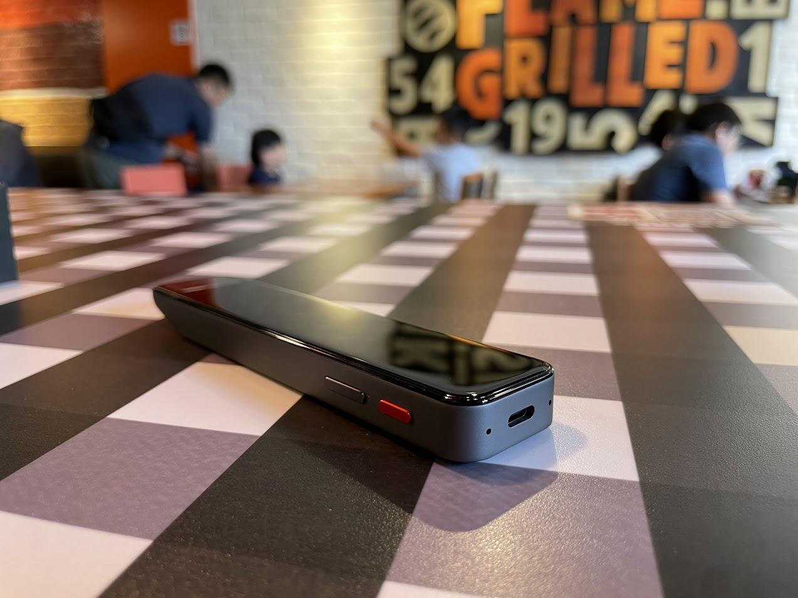

# [開箱] 有道翻譯筆 P5 開箱

## 前言

一轉眼已經一年多沒更新了

天啊

.

回到正題，最近在讀公司讀書會的書

剛好不太巧的(?)

那本書是原文

想想從大學到現在，已經有好一段時間沒有讀原文書了

以前很苦逼，遇到不會的單字要馬跳過，要馬只能乖乖在電腦前面查(用手機查每次要解鎖，又容易分心，你懂的)

.

為了撫平以前貧窮的幼小心靈，所以來試試看這個世代最新的產物 - 翻譯筆

上網看了一下便宜的，貴的都有

還有不到2000的筆居然還有拍照功能，有些怎麼長得有點像

現在筆都那麼捲的嗎

.

然後整個人就陷下去了 

.

## 需求

需求也不多，希望:
- 能整句翻譯，然後翻譯不要比 google 差
- 能翻日文，能掃描直式日文(現在看到日文的機率比較低了，以前看到日文經常被不會唸的漢字雷到。但不才就不會唸了要怎麼查Orz)
- 能翻片語(口語化的單詞)
- 能離線運作
- (Optional) 能唸出來就更好了，但因為平常都在圖書館看書所以也不太會用到這功能

.

## 預算

一開始預算只抓 `2-3000`

因為網路上的筆大多都賣這價格

.

後來更仔細下去查後，發現翻譯筆大概分成兩類:
1. 很便宜的(3000內)，有些牌子有聽過有些沒有
2. 貴的(5000-破萬都有)

.

到處翻翻後得出的心得大概是這樣，翻譯筆的翻譯流程不外乎是:
1. 把字掃進來，並且正確辨識
2. 辨識完成後，去字典找字
3. 除了找字外，需要一些黑魔法，去把正確的語意拼出來(包含需要能辨識出口語化的單字)

.

第一點身為翻譯筆理論上應該都能輕鬆做到

OCR 很成熟，大部分彩色螢幕的翻譯筆裡面跑的都是`小安卓系統`，記憶體也給到海量的1GB 了

沒理由做不到，頂多就是好和超級好的差別

.

二跟三就不一定了

第二點要看翻譯的字庫多不多(字典一多，版權費就上來了)

第三點更玄了，需要考驗翻譯筆對語意的分析。但這個東西是個玄學，不像電腦那樣有紙面參數可以無腦比較。

.

如果沒字庫或是字庫量不多，就像沒啥文化內涵的 chatGPT 給不了有建設性的答案。

印象很深刻前幾月公司辦了 AI week，自己搭建了一個聊天機器人

這個機器人只有聊天模型，並沒有知識庫

所以能夠說話，但基本上感覺不出啥文化內涵。

請它舉例有什麼種類的鳥類，回答紅鳥黑鳥藍鳥，活像時從實驗室關了十幾年的人類Orz。

.

另外在查的時候隱約感覺到有些沒聽過的牌子的操作介面怎麼和另外一個沒聽過的牌子一樣

感覺應該有廠商專門生產公版的翻譯筆給其他公司掛牌賣

仔細想想也是，一隻不到2000還內置安卓系統的筆，全自己弄沒賣出個幾十萬隻公司肯定垮

這種貼牌的翻譯能力全憑運氣

可能大家都一樣

也可能有優化，都是個謎也很難比較

線上翻譯的功能也不知道是怎麼提供的

會不會廠商倒了就沒了?

.

最後就鎖定在有比較多詞彙比較多，然後比較大(專門做翻譯相關)的牌子上:
- 哈電族
- 快譯通
- 有道

哈電族看起來大致能夠做到，但 UI 上好像看起來沒特別優化，也沒雲端功能

快譯通根本沒出辭典筆(不才沒查到)

然後看網路上推薦有道的整句翻譯比較好

最後就從有道開始下手了

.

## 有道辭典

從有道著手後發現又是一個坑

型號又多又亂

像個哀鳳那樣直接 `普通`/`Pro`/`Pro max` 那樣賣不好嗎QQ

或是至少也該要能從開頭(e.g. `P` 或是 `X` 系列)能讓人看出是賣學生還是商務路線之類的

.

簡單做個總結好了

除了 `P3專業版(記憶體是 32G)` 和 `P5` 支援中英日韓`離線翻譯`

還有如果是裝有道系統 os 的 (例如 `x5`)，可以支援多種語言聯網時能夠翻譯多種語言外，

其他都只支援中英翻譯

可以以這條界線下去切，自己要買哪一個

不才自己也需要日文翻譯，所以只考慮 `P3` 和 `P5`

.

在某賣場問 `P3專業版` 是 4000 多

`P5` 多 1000 多，但是有了自己的 `有道os`

之後可能有些更新只有 P5 吃得到(後來想想那些更新功能好像也用不到)

但秉持著我可以不用，但你不能不給我的想法

最後還是入手了 `P5`

.

### 開箱

開箱

買家照了不才的需求，少送了點東西(教材折價券和書本真的用不到)

剩下的就只有本體，質量異常輕的充電器，和藍芽耳機

type-c 的有線耳機他不香嗎? 藍芽耳機還要充電還是 micro-usb 簡直QQ

.

不過本體才是重點

.

換個場景好開箱

.

盒子側拍

.

開箱

打開後的第一印象還不錯

滿滿的果味

.

本體

滿滿的玻璃和金屬材質

妥妥的社畜收割器(X) 商務人士最愛(O)

.

說明書

.

撕掉保護膜

這顏值是真的不錯

.

開機

.

看起來激活要連網

.

然後下載個 app 進行綁定

.

過程還算順利

.

剩下就是跑完簡單的教學

.

之後就到主介面了(後來補拍，懶得回漢堡王了QQ)

功能不多

.

到商城來看

也沒啥有興趣的

把錢還我

.

### 掃描(英文)

這個機器最重要的功能就這個了

以英文來說，就是這本萬惡之書害不才買這隻筆，拿它做實驗好了

.

https://photos.app.goo.gl/321zPnZfYZ1yRcLj9

以掃這本書的 title 來說，

只需要零點幾秒就會出先掃好的結果，並且很快下面就會出現翻譯

.

然後後面試用了一個多小時，之前讀的時候是在書本面前會放一台筆電當字典

但如果有這台翻譯筆，就不需要電腦了

.

### 掃描(日文)

日文的話掃描速度我覺得和英文差不多，都很快

美中不足就是要先切換到 "小語種" 的 app

.

https://photos.app.goo.gl/9sRTkco2NWy2htnM6

橫式 demo

.

https://photos.app.goo.gl/io86dq8aoRAf1Wba9

直式 demo

.

### 優缺點

最後整理一下這隻筆的優缺點好了

最基本的事情都做得不錯，但缺點也不少 XD

.

優點:
- 質感真的不錯
- 掃描速度飛快
- 查英文字的話，在任何畫面都可以直接掃描，掃完後就會打開字典
- 確認至少能夠掃描`中文`，`日文`和`英文`。直式橫式都可以掃
- 辨識率算真的不錯
- 有 `手機板的 app` ，並且能夠透過 wifi 把翻譯筆同步到雲端的資料在抓下來
    - 能夠看到掃描過的字(能夠在手機內加到最愛變成生詞本)
    - 有統計查字數量(心理安慰功能，可以算算看查了每個生字的單位成本是多少)

.

缺點:
- 掃直式日文上面的數字有可能會掃錯
    - ~~另外日文的翻譯好像沒英文好~~(辭典可能沒英文多，後來覺得至少都算有翻對，就算了)
- 教材字典不知道是不是因為鎖區的關係，沒辦法下載
- 字體不能調大小，看英文還好，日文就小難受了
- 掃句子後，有時候想點進去看單字會很難點，但螢幕可以正常滑動，不確定是不是翻譯界面的問題。
- 掃描句子的播放按鈕會在左邊，比較小顆。同樣也很難點。
- 螢幕還是太窄
    - 如果只是看看句子或是生詞翻譯問題不大，但想操作就很難受。
      > 如果是這種小螢幕介面又要好操作，不是把圖示改大，就是讓比較小的圖標(e.g. 選擇單字) 變成拖拉後選取(按住，拖選到自己想看的單字後，放開)
    - 這個螢幕大小，基本上不會想在上面用翻譯以外的功能，例如生詞本
      > 所以，就把翻譯功能做好就行了
    - 螢幕由上往下撥動叫出狀態欄後才能調整音量，有點不順手。戴上套套後有時候要撥動好幾次才會成功
    - 套上保護套後螢幕滑起來有點鱉屈
- 耗電量總覺得有點小快
- 有不少給學生用的功能，商務功能反而偏少

.

手機 app:
- 有些翻譯筆上的 app 平常用不到想要藏起來，想用手機 app 藏起來，但會顯示裝置找不到的錯誤
  > 既便裝置就在不才旁邊開著，也連上網了。
- 手機 app 中有一個時實顯示的功能，能看到 app 上掃到了什麼字。但翻譯筆要配對的話就需要先進入到設定 > 我的帳號 > 時實顯示功能打開。還是挺麻煩的。

.

不知道算不算缺點(或是可以改善的地方):
- 字典有分兩塊，`主字典`，和`小語種`(英文以外的語言)。
    - 除非打開小語種的 app ，不然預設掃描後都會進入英文字典
    - 如果不才在主畫面掃了日文，就會進入到主字典，也能把日文字辨識出來，但字典會說找不到。對會有英文以外的翻譯需求的人。P3 只能翻譯中英日韓，但至少在識別的時候不用切換語言。
- 有道 os 目前好像也沒啥有用的 app。把錢還我。
- 螢幕刷新率只有 30hz(體感好像15 fps?)，聽說是為了省電。
  > 主介面下操作有點難受，可以感覺 icon 不太跟手。但在查字典上因為不太會滑動所以問題不大。
- 玻璃螢幕好像有點容易刮傷，但實感真的不錯，實在有點捨不得貼保護貼
  > 或是至少戴個套套
- 那幾個基本功能外，有不少功能都是要連網
- 以有自己的 os 又能聯網的筆來說，功能又過於單一
    - 沒有很潮的能夠在旅遊時聊天翻譯的功能，不過這種能充當翻譯機的 app 也夠多了，用手機頂其實也可以。
    - 沒辦法把掃描筆當作 PC 的輸入介面(蒙括可以)
    - 感覺掃瞄筆只能搭配目前使用的 app，功能過於單一(如果這隻筆都能聯網的話，應該有機會做到在有道翻譯網頁中直接使用這隻筆來掃描文字)
- 直向的字需要把翻譯筆轉90度後用由上往下拉的方式掃，總覺得有點不順手。不知道未來有沒有機會也能用握筆的方式往下滑，如果文字辨識的攝影機拍得清楚的話，理論上應該做得到。
- 左撇子好像會有問題，但不才沒看到有選項可以調左右手
- 掃描日文時不會顯示振り仮名(日文上方的小字，類似中文的注音，方便知道漢字的念法)
- 拿平板測試，不確定是不是用平板還是機器支援性問題，中文辨識度不錯，日文免強，但德文俄文只支援離線翻譯的辨識度就很差(不才生不出用紙印刷的德文和俄文能夠測試QQ)
  > 但說真的，如果只是出去玩需要翻譯，反正都要連網，為啥不用手機掃就好了

.

### 結論

後來腦波回來後，發現最近要看的原文書應該只有這本

之後應該有好幾個月又要回去啃之前買的二手書了

以這台機器來看，如果看一本願意花300去使用這隻筆

那不才至少也要看完20本才能打平

.

以現在身為上班族的不才，假設那隻筆能用五年，那一季至少要看完一本原文書

一季也只有13周，假設一周只有一天能看書，那大概得花一半的時間去看原文書了

在寫這篇文章的時候正在思考是不是應該半借半賣給正在準備唸博士的朋友比較不會浪費

妥妥的拿石頭砸自己的腳

.

如果需求不高，可以考慮先買便宜的二手試試看，機器規格通常不會差太多，OCR 現在也很成熟了，辨識率不會差到哪去(但需要注意可能沒辦法掃描直式日文字)

如果不適合，或是之後想升級賣出也不會虧多少

理性消費，勿創造需求QQ

.

如果對簡體反胃只接受繁體，然後又希望翻譯機不要太笨

可能只剩飛利浦(中/英 only)，哈電族了(聽說是中英日?)

和 486 那兩隻了，其實也是有道辭典2(只支援英/日) 跟 P3(中英日韓)的繁體版

.

在不然就要賭雜牌翻譯機的線上翻譯靠不靠譜了

或是說不想成為孤兒但又想省錢

用 x5 能省一千多(相對比 P5 還會少掉其他一些功能)，真的有需要時在聯網應該也行

有道短期內應該不會倒

.

或是考慮成為孤兒，買P3那台也能省1000多，還能一次識別多語言(是說有些最重要的功能像是聽力，P3 的 UI 按鈕還設計得比較大，比較好按)

就像前面提到的，支援太多語言其實也沒啥意義。

.

以上

.