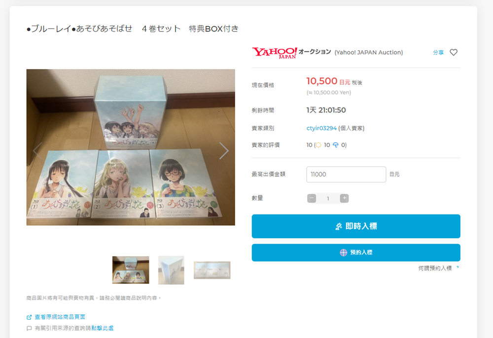

## 前言

最近去日本玩，順便買了一坨藍光碟

結果行李被塞爆了，拖起來好累，嗚嗚嗚嗚嗚

.

這個就算了，畢竟短期內不會去再去日本，不會被累到第二次

只是有些想要的東西還沒買到

聽到朋友建議要不要乾脆請他買完後，再寄回去

突然想到是不是可以在網路上找代購

.

不找還好，一找發現代購手續費好低

可惡好心動

.

最一開始選 buyee (因為剛好被廣告推薦)

但介面實在有點反人類，搜尋也不太好用，還有有時候商品會搜尋不到

註冊帳號後就一直沒使用

.

後來在找商品的時候發現 one map

原本以為只是個查價網站(可以一次看到不同平台的商品)

後來發現這鬼居然能買東西

.

好喔，就決定是你了

.

## 買買買

首先確認上面扣款的貨幣是日幣

預設是日幣， 建議就日幣扣款，其他貨幣的手續費可能會比較高

.

在網頁上找要買的東西

跟其他代購網站比，這邊的好處是會把不同來源的賣場混在一起

假如我想找比較難買的東西，不用一個一個上去查

.

點進去可以看到價格

是否要運費等等

.

可以按右下角的連結去看原商品頁，確定沒問題後在購買

還有如果有含稅這邊會顯示稅前，需要自己到商品

.

放入購物車的商品可以分別購買

然後發現一個 bug ，東西如果放到購物車好幾天，可能會遇到賣家降價但這邊不會更新

.

折完之後剩11,000

.

這東西從14,500 看他慢慢變成12,500

再加上打折後還是挺香的(人家還免運)

.

https://www.fromjapan.co.jp/lp/campaign/tw/?lang=tw&omp=karte_343_campaign

如果自認是個窮鬼的話，記得用優惠券，或是有時候全站打折他會自動幫你扣

優惠在搜尋頁面上方的小廣告就可以看到

不定期會有大大小小的優惠

Mercari 大概一周會有一天可以打到9折，平常有優惠的話大概95折

.

台灣的話能用信用卡或是 paypal 扣款

不能用金融卡，會沒辦法綁定(不知道未來有沒有辦法，但至少2024/1是不行)

.

能用信用卡或是能辦張就去辦，因為 paypal 雖然不收手續費但匯率不好看，google 匯率 `0.213` 會算到 `0.225` 給你

雖然日幣匯率現在很低感覺不出來，但實際上手續費就落在 5~6%

也就是買 `1萬台幣` 的東西，就會被抽個 `500~600` 走

.

付款中

.

下標完成，這次截圖時已經學乖了，改用信用卡

.

看信用卡那邊是扣款 2,319

算起來匯率大概是 0.2108

.

https://www.visa.com.tw/support/consumer/travel-support/exchange-rate-calculator.html

這是用 visa 計算機算出來的匯率

還比較低一些

好耶(?)

.

這是 google 日幣上面的匯率

.

之後到訂單總覽可以看到目前訂購的所有進度

另外，這次的扣款只會算商品本身的費用

手續費，運費，消費稅(如果有的話)，會到要寄出時才會收

.

## 競標

假設看到的商品要競標的話，會出現兩個按鈕
- 即時入標 
- 預約入標

.

即時入標就是自動加上一個金額，yahoo 拍賣的金額會馬上改變，然後你就會變成出價最高的人

這很好理解

.

預約入標是說一個你最多願意花的數目(e.g. 16,000)

假設每一標是500，截標前維持之前喊到的 10,500

那你就會用 10,500 + 500 得標

如果價格被增加到 14,000，那就會是 14,000 + 500 = 14,500 得標

如果喊到 16,000 以上，那就不會結標了

如果 10,500 是競標的起始價格，沒人競標，那你就會用 10,500 拿下

.

One map 對這個沒寫得很清楚，一開始不確定日本拍賣和台灣拍賣規則是不是一樣的。

.

然後進入結帳畫面

這邊沒優惠券可以輸入XD

另外小秘訣，如果輸入的結尾不是0，通常得標的機會會高一點

假設對方預算最高也是 13,000，13,123 就只多花 123 就可以拿下商品

.

入標前通確認

這邊提醒的是 `入標成功` 的情況下，會和商品購買一樣無法反悔

.

另外值得誇獎的是，如果是用預約入標，按下結帳不會真的扣款

會等到真的標到商品後才會扣款

及時入標沒用過不知道，怎麼想用及時入標都沒好處，只會把商品截標價格墊高(?)

.

確認完後，競標的商品就會列在這邊

.

在時間歸零前，可以隨時取消

.

## 寄東西

等東西都到了後，選擇所有的物品，然後填寫地址，下一步

選擇要寄送的商品

.

滑到下方填寫地址

.

選寄送包裹的公司

不才比較窮，也不急收，就選最便宜的。

.

一開始看到一堆費用時會讓人有點懷疑怎麼多出一堆分用，不過仔細算了下都是自己產生的:
- 2100: 買了七個東西，每個服務費300日幣
- 3230: 有幾個從 yahoo 拍賣過來的東西，通常要付運費。有兩個990日幣，一個500日圓，一個750日圓
- 0: 有些地方會收轉帳費(200 or 300 日圓)，這邊沒收
- 5,101: 國際運費，包含運到家的費用
- 681: 如果是從店家的 yahoo 拍賣下標，通常還會有消費稅

.

這邊的手續費，國內運費，消費稅是之前下標的時候產生的。

只有國際運費是要寄出去的時候才會算進去

不知道為什麼會等要寄送時才扣這些錢

不太確定是怕優惠券會扣到消費稅這種虧了就只能自己吞的費用

還是讓人一開始買買買的時候比較不會心動

總之有點神秘

.

https://www.fromjapan.co.jp/tw/estimate/calc

國際運費可以拿這邊來算

扣的錢和當初計算機試算的差不多

.

下一步忘記截圖QQ，總之就是確認是不是要完成這筆訂單

.

最後完成付款

付款後的成功畫面

.

## 拿到東西

如果收到行李時，又被收了一筆錢

那是關稅!

那是關稅!

那是關稅!

.

在報關時不會顯示

.

但等到你發現被收錢時，回去看 app 就發現多了一筆錢

機掰

.

不過算了，至少東西有到就好了

四周有貼上易碎品標籤，還不錯

.

但標籤怎麼是簡體的?

不確定是不是因為要運來台灣的關係?

.

打開

最上層有泡泡紙保護

.

裡面有被重新包過

不得不說包得還挺好的

.

可以看得出商品是被重新包裝過的

因為所有包裝上面都有條碼

在選商品後能馬上算出重量可能是他們在收到貨後就馬上換包裝，並且量過後重量歸檔了

.

有的有被包泡泡紙，有的是塑膠封膜

不確定會被包泡泡紙的依據是什麼? 單價比較高的嗎XD 還是比較小件的

不過反正最外面都有泡泡紙了，裡面只要不會磕碰怎麼包不才也不太在意

反正比放在行李箱好多了，放在行李箱邊邊弄出來的凹痕放個十年不才都認得出來

.

最後是看看有沒有灌水的環節

所有東西丟上去秤大概9.9公斤

.

加上包裝盒後大概10.9

.

回頭看一下當初上面顯示的重量，和實際量的差不多

但不才比較納悶的是，重量算得出來還可以理解

用什麼箱子難道他們在收到商品的時候也順便量了一下每個商品的尺寸?

~~又或是他在趁不才選好東西正在填寫地址的時候馬上把商品裝好趕快量一下~~

.

目測東西都對

東西拆了幾個沒發現問題，當初沒用 500 元拍照方案所以就算出問題了也欲哭無淚XD

.

然後這個是寄送進度

填完單後隔天 One map 就把貨寄出了

然後在機場卡了幾天

到桃園海關又卡了幾天

最後大概花了10天才到不才手上

.

## 心得

整體來說挺方便的

搜尋介面也做得相當不錯

可以一次搜尋到好幾個地方有沒有賣類似的東西

也能很方便看到 購買/目前競標的商品

.

還有如果遇到對想買的商品有問題(e.g. 想幫忙代問商品照片)

客服半天左右就有回應，還能用中文溝通

.

另外 `樂天` 或是 `mercari` 也經常打折或是發折價券 (`yahoo 拍賣` 只會有運費折抵)

折扣通常在 `9~95折` 之間，東西單價高一點就能把手續費抵銷掉了

有時候也有活動，買東西能抵運費之類的

可能算起來比拜託朋友買還便宜，還不用欠人情(如果還要加上關稅的話，可能要把折價券全用上XD)

.

mercari 印象中是跟賣家抽 10% 手續費，不才猜那個折價券應該也是 mercari 或是其他拍賣網站給的額度

薅個折價券羊毛應該也只是讓 mercari 少賺點

.

另外也不會像其他代購平台給出誘人的折扣，但從匯率，或是一些奇怪的手續費上動手腳賺回來

折價券通常是全站都可以用，有些代購平台的折價券折價趴數很高，但會限制商品種類

算是挺誠實的代購平台

如果沒遇到啥問題的話之後應該會繼續用下去吧(雖然有時候看到其他家的優惠還是有點心動XD)

.

要說缺點的話，在算寄送費用的時候沒把下標時產生的費用分開顯示

會讓人以為多出一些奇怪的費用

(如果在 Mercari 買的話通常不會有消費稅和運費，可以讓後面的費用好看點XD)

.

還有目前美中不足的地方就是不收金融卡(不確定這個方法能不能解決 https://www.ptt.cc/bbs/e-shopping/M.1486358090.A.53B.html)，第一次買的時候錢都被 
paypal 賺走了

哭啊

下次辦張信用卡好了

.

## 後續

[One map 買買買分享(客服)](../one-map-with-discussion/index.md)

原本以為事情到這邊就結束了，結果遇到賣家發錯貨的破事

最後受傷的都是不才

唉

.