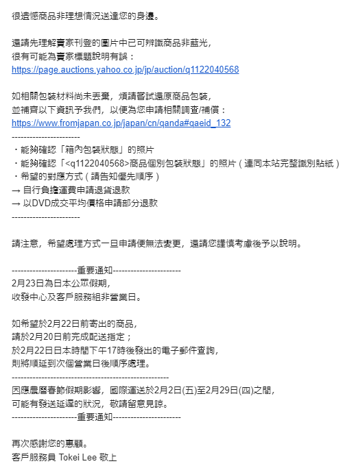
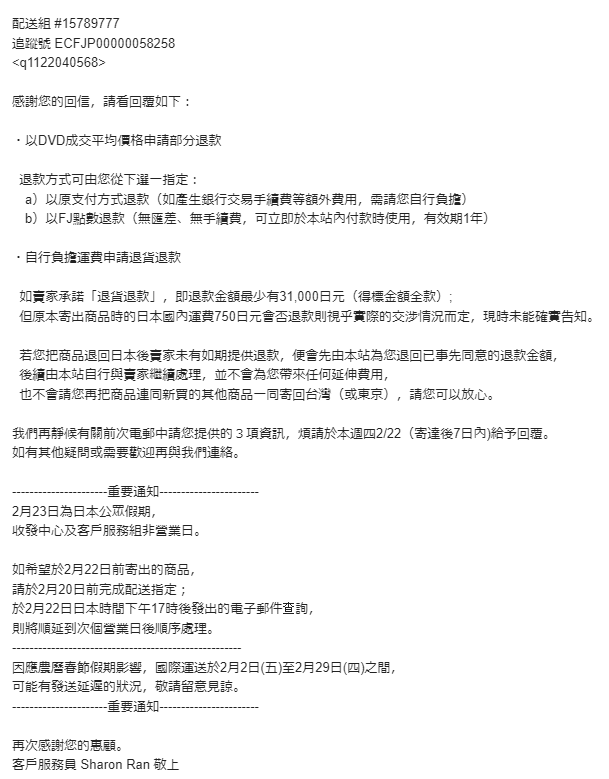
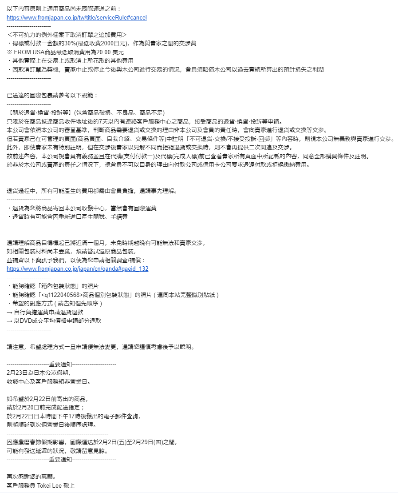
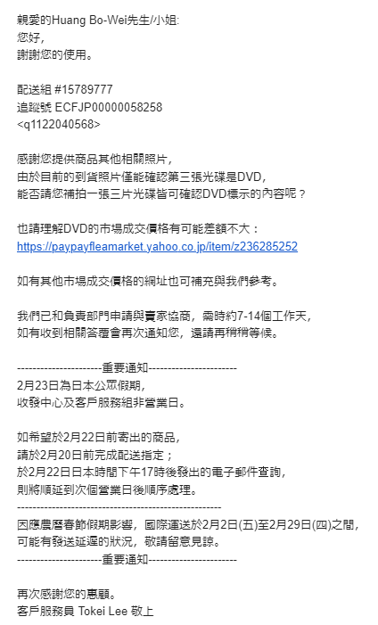
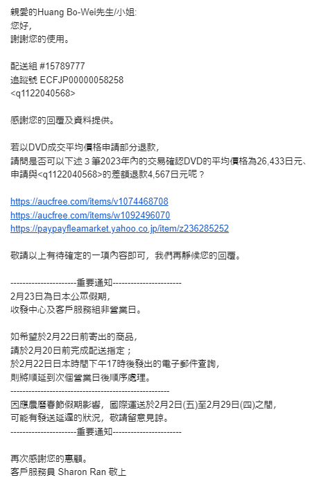
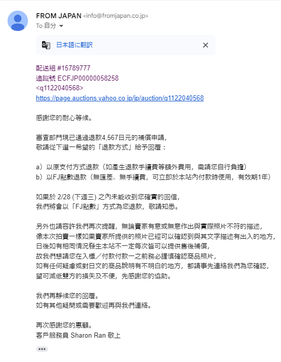
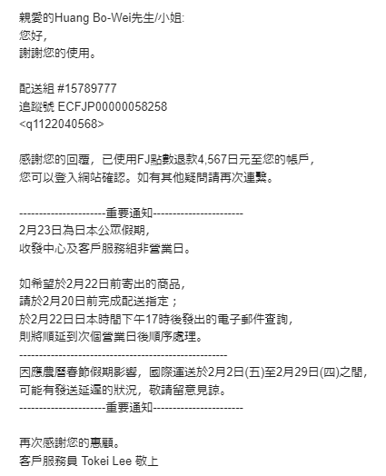

## 前言

原本以為這次交易沒啥問題

直到遇到了 DVD 刺客

.

https://page.auctions.yahoo.co.jp/jp/auction/q1122040568

簡單來說，賣家在賣場中的 title 中說賣出的商品是 Blu-ray，標題也寫得有模有樣，起始標價也是按照 Blu-ray 的價格起標

直到到手時才發現是 DVD

.

雖然回頭看賣場上面的照片，那個光碟上的 icon 的確是 DVD

(對，要用放大鏡看才會發現，並且是要在意識到需要檢查 DVD/Blu-ray 的 icon 的情況下)

但在標題有寫 Blu-ray 的情況下，通常照片就只會用來確認商品是不是有明顯傷痕，或是是不是有缺件

壓根不會想到會有人把 DVD 和 Blu-ray 搞混

.

但仔細想想，如果對方是個對動畫/3C都不熟的人，還真的有可能搞混(題外話: 那對方又是如何寫這個 title 和設定起始售價的)

唉，結果最後受傷的人都是不才

星期五發現時一懶趴火

.

## 過程

沒辦法，還是得和客服聯絡

看是不是能夠退款或是退貨

.

### 2/17(六)

問一下客服聯絡(之前問問題時沒截圖到)

主要是問有沒有辦法跟賣家申請退或，或是按照目前 DVD 版本的市價退差價，不才在想辦法把商品賣給可以接受的人

畢竟退過去麻煩糾紛多，還有手續費預計不低

.

星期六晚上回覆了

不才還挺意外星期六居然有人

.

### 2/18(日)

怕對方星期日還要上班，星期日晚上問好了

因為不知道兩種處理方式會產生的費用，所以先問問看

.

### 2/19(一)

星期一收到回覆，發現不管是退款還是退費，都沒有提到手續費(?)

只有說運費不確定能不能退回(?)

.

https://www.fromjapan.co.jp/tw/title/serviceRule#cancel

印象中官網有提到手續費，保險起見還是問一下好了。

.

### 2/20(二)

早上收到回覆

簡單來說不會有那個 30% (因為不是當下後又反悔的情況)

但是需要付擔國際運費(包含關稅)

一些交易費用，和日本的國內寄送費用(如果有的話)

如果賣家同意，並且商品送出去後，不管最後是否退貨成功都夠拿到退款(?)

.

不才還是無法理解為什麼不可抗力的取消交易有30%手續費，但退貨沒有

另外退貨怎麼看風險都在平台身上，就是挺奇怪的

如果是這樣的話，那 `500日圓的拍照服務` 是不是就沒意義了? 就算拍了發現不符合預期也要支付30%手續費

.

突然意識到距離得標好像真的要過一個月了，中午溜回家拍照和填寫訊息

.

下午收到回覆，想要確認沒拍到的其他兩卷是不是也是 DVD 版本

然後他們有查到價格，兩邊差價好像不高

.

晚上回覆價格的問題，還有那兩張 DVD

.

https://aucfree.com/search?from=2021-03&o=t2&q=%E5%B0%91%E5%A5%B3%E7%B5%82%E6%9C%AB%E6%97%85%E8%A1%8C+blu-ray+%E3%82%BB%E3%83%83%E3%83%88&to=2023-12
https://aucfree.com/search?from=2021-03&o=t2&q=%E5%B0%91%E5%A5%B3%E7%B5%82%E6%9C%AB%E6%97%85%E8%A1%8C+dvd+%E3%82%BB%E3%83%83%E3%83%88&to=2023-12

因為 DVD 交易的筆數實在太少了，所以抓取最近三年的時間

其中一筆價格在三萬初外，其他的都在兩萬多

.

### 2/21(三)

對方又不知道從哪邊找到連結

然後問能不能改抓一年內的交易價，以這三組的價格做考量算平均價格:
- https://aucfree.com/items/v1074468708
- https://aucfree.com/items/w1092496070
- https://paypayfleamarket.yahoo.co.jp/item/z236285252

.

既然是有抓到實際的成交價，那也行吧

至少損失能小一點

.

後來想想好像有點小虧，成交價很好看的那兩組都是接近未拆封

不過算了，能退總比不能退好

如果價差太大搞不好對方也不好幫忙喬

.

### 2/23(五)

早上收到回應，說部分退款成功了

詢問退款的方式(原支付方式退款還是用點數退款)

點數退款的話只能保留一年

.

晚上回信

表示退成點數就行了(反正要買東西的話很容易就花掉了)

.

### 2/24(六)

星期六早上收到通知

.

點數退還了

.

## 心得

雖然退的不多，把買錯的版本重新賣掉還會虧不少

但至少對方有認真在處理這個問題，沒有遇到不讀不回或是對話到一半斷掉的情況

以後用折價券感覺用得更心虛了

.

另外建議在買東西的時候盡可能多做一些檢查，確保意料內或是意料外的問題都能被發現

就算買家最終同意退款，處理的成本(時間或是金錢)還是相當巨大的，並且還會有一些風險存在

.