## 前言

上次在 [mandarake](../how-to-use-mandarake-oversea/index.md) 上面買了 [那就是聲優](http://soregaseiyu.com/products/) 的 BD

.

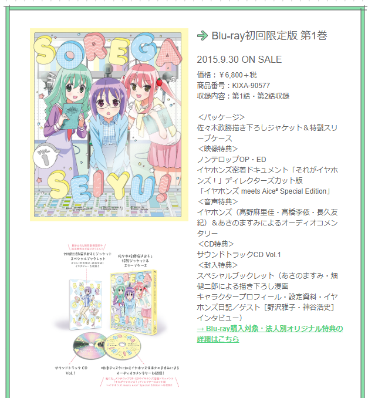

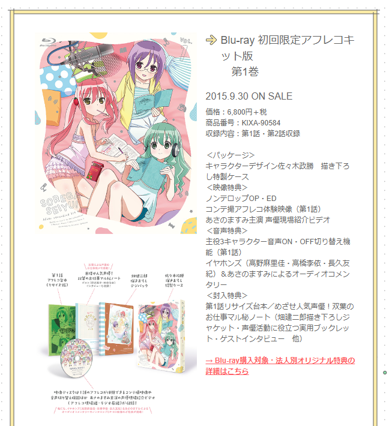

發現第一季有兩種版本(`初回限定版` 和 `アフレコキット` 版)

.

如果 `アフレコキット(配音版)` 有包含 `初回限定版` 的所有內容的話就算了

結果偏偏沒有， `アフレコキット` 版有台詞本但是沒有 `初回限定版` 的音樂 CD

機掰

.

沒辦法了，全卷 box 沒收到，至少把這個坑補齊吧

.

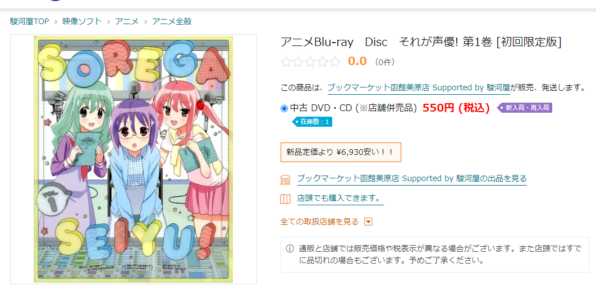

剛好駿河屋有賣(那時候看價格是 500 日幣)

原本想用代購平台買，但上一批已經運回台灣了，如果再用這個代購的話肯定之後又會想買買買

所以看有沒有辦法直接運回台灣

.

剛好發現 [駿河屋.com](https://www.suruga-ya.com/) 有優惠，寄回台灣免運

那就決定是你了

.

## 買買買

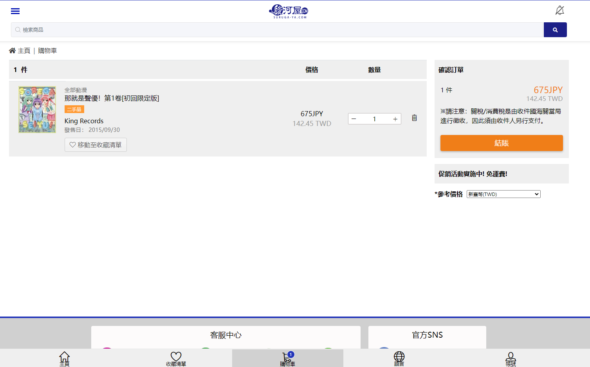

實在想不到要買啥，最後只買了這個 Orz

.

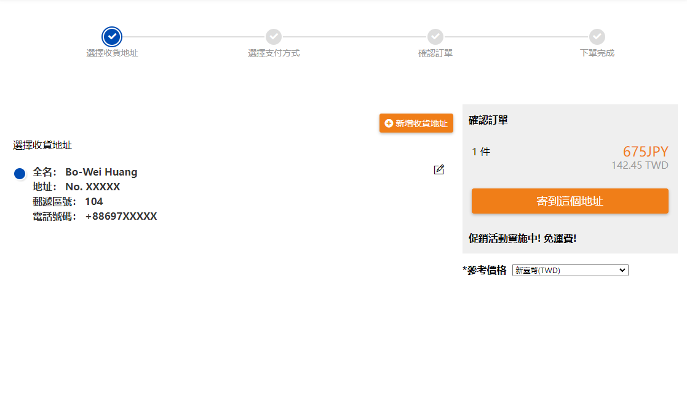

填個收貨地址

.

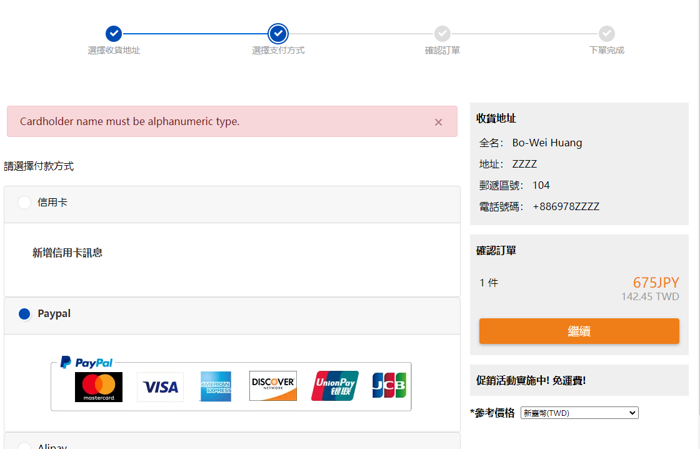

付款方式

印象中可以用金融卡

.

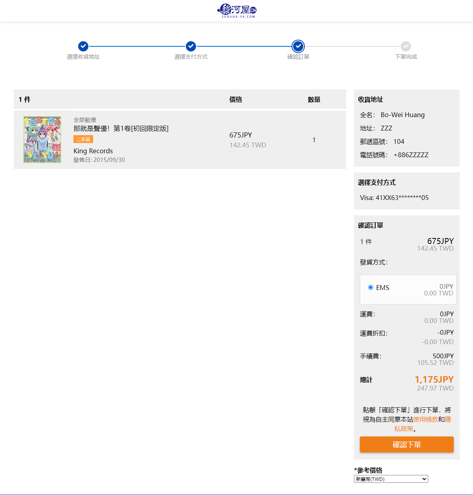

不管買多少，都會收的 500 日圓手續費

.

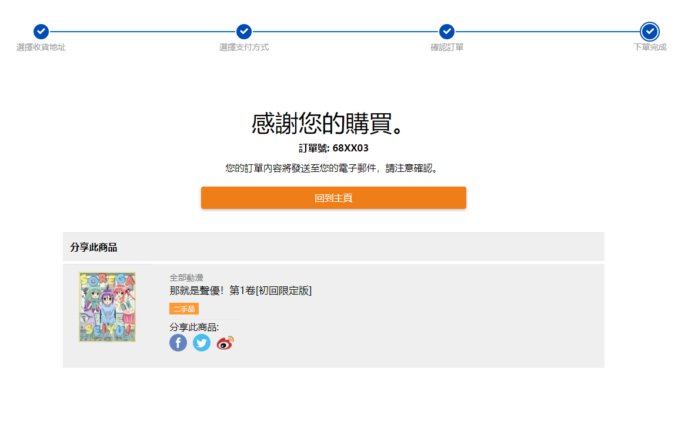

購買成功

.

## 運送

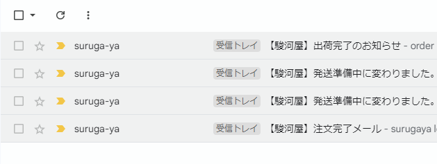

`3/24` 晚上訂購完成，`3/27` 送出

.

最後 `4/1` 到

.

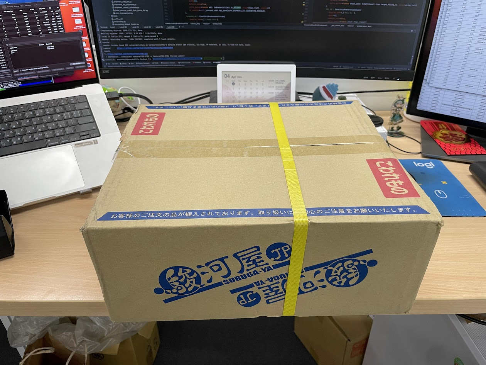

小小的包裹用大大的盒子裝

讓不才一度懷疑這個包裹是不是從京都出貨的

.

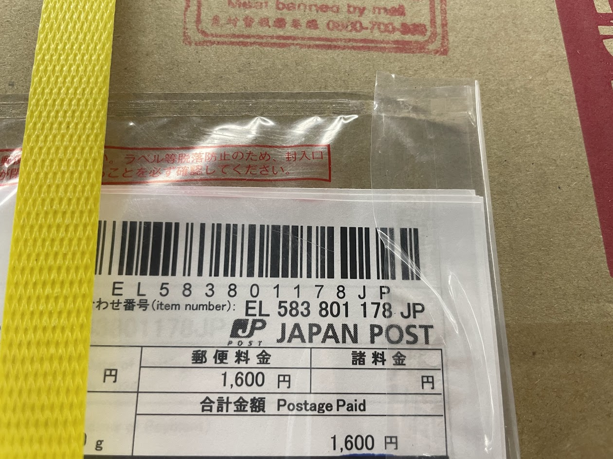

東西 `600多`，手續費 `500`

然後運費 `1600` Orz

不才以為會是一起運到台灣後在分裝(畢竟台灣有分店)，結果直接從日本出貨

是個狠人

.

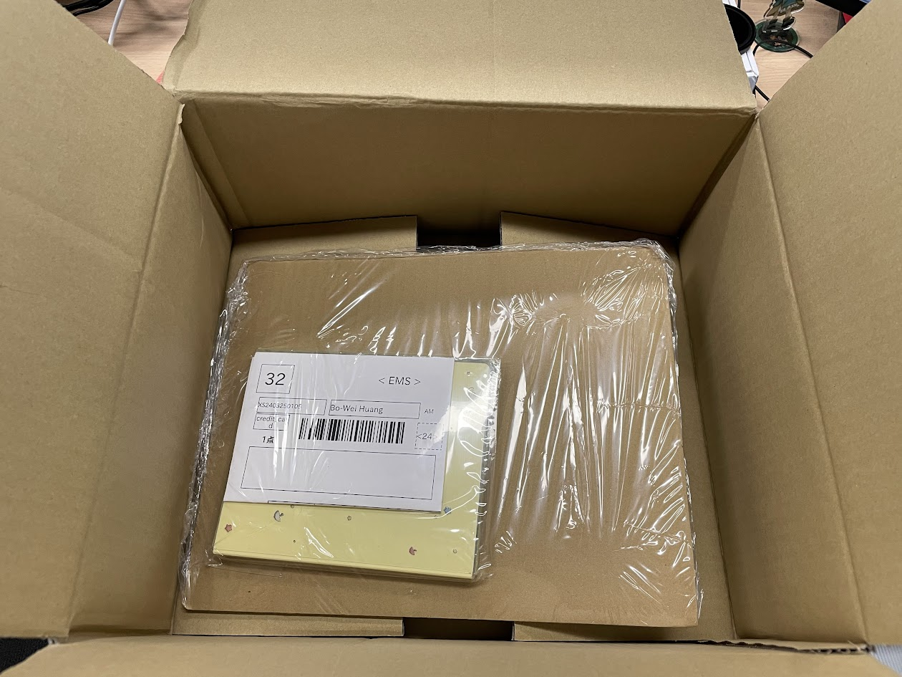

裡面就一個碟片

固定方式用的是亞馬遜工藝，把東西用塑膠套包在紙板上就完事了

但反正這東西也摔不壞，隨便啦

.

## 心得

雖然服務不錯，東西也很快到

但感覺有點尷尬

.

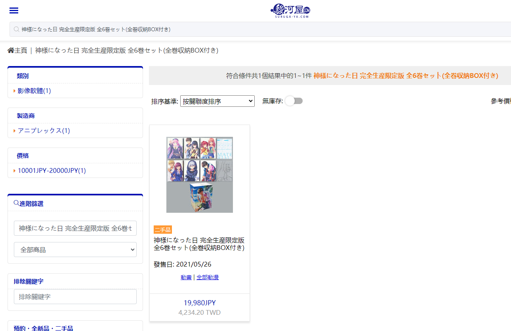

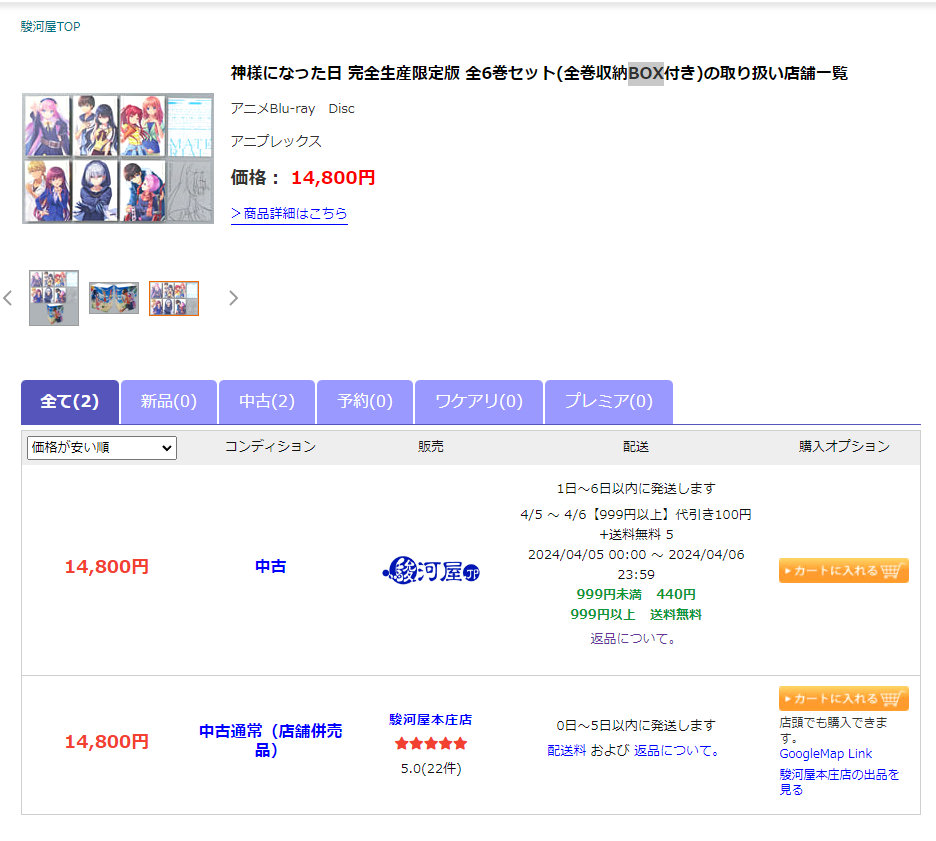

駿河屋[台灣官網](https://www.suruga-ya.com/zh-hant/products?keyword=%E7%A5%9E%E6%A7%98%E3%81%AB%E3%81%AA%E3%81%A3%E3%81%9F%E6%97%A5+BOX&btn_search=)價格和[日本](https://www.suruga-ya.jp/product/other/428066292)不一樣(通常會多個35%左右)

我是能理解價格可能會有差，但差有點多喔XD

還有 [駿河屋JP](https://www.suruga-ya.jp/) 會特價的部分 [駿河屋.com](https://www.suruga-ya.com/) 不會跟上

.

並且，[駿河屋.com](https://www.suruga-ya.com/) 只能買到 [駿河屋JP](https://www.suruga-ya.jp/) 在線上商城有販賣的商品

如果是店鋪有的，[駿河屋JP](https://www.suruga-ya.jp/) 也會顯示，但 [駿河屋.com](https://www.suruga-ya.com/) 看不到

.

如果單筆訂單運費成本是 1600 日幣(先以最便宜的的運費計算)

扣掉手續費 500 日圓，可能要買 x / 1.35(`假設商品跟日本比貴了 35 %，先把還原成日本價格`) * 0.35(`這 35% 是駿河屋.com 偷賺的`) = 1100 ，x = 4242

大概要買 `4500` 日幣的商品才能把 `駿河屋.com` 撒下去的運費補貼回來

.

好啦，下次不才會多買一點

.

大家可以算算如果要買多少以上，才不會讓 `駿河屋.com` 虧掉運費，但花的總金額比代購平台便宜 XD

應該是 x / 1.35(`假設商品跟日本比貴了 35 %，先把還原成日本價格`) * 0.3(`這 35% 是駿河屋.com 偷賺的`) = `代購手續費 + 運費的日幣金額`

x 要大於 `4500`

.

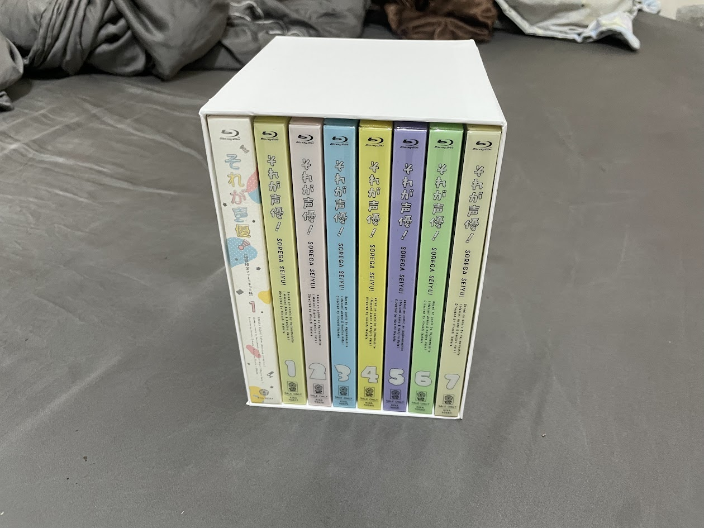

最後趁這次連假幫它做了個全卷收納 box

如果對怎麼做盒子感興趣的，可以參考 [如何製作 blu-ray 收納 box](../../02//how-to-make-anime-blur-ray-box/index.md)

不才可以沒有家，但 BD 必須有

嗚嗚嗚嗚嗚

.

另外剛剛查了一下，`アフレコキット` 是 `アフター・レコーディング キット(after recording kit，配音套件)` 的縮寫

.

以上

.

(是說真的不考慮先集運到台灣後再分裝嗎?)

.