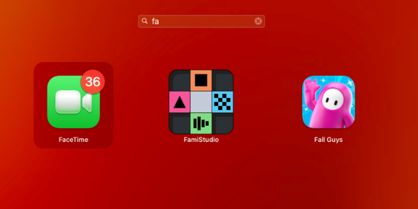
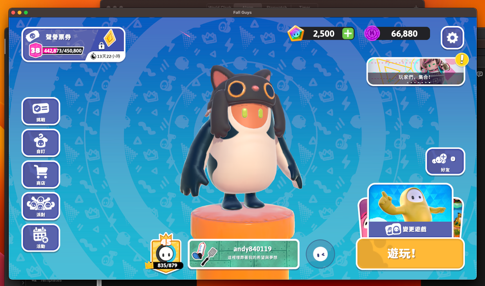

## 前言

不知不覺就到下半年了，時間過得好快QQ

.

平常玩糖豆人都是用 PC 或是 PS4

最近要去泰國，在想要怎麼解每日任務QQ

.

又挺剛好的，這一兩天 Epic 把 [Fallguys 移動到手機端了](https://www.fallguys.com/zh-CN/news/fall-guys-mobile)

那有沒有可能出國的這段時間先用手機板的 fallguys 頂一下呢?

.

不才沒有安卓平板，只有哀鳳和哀配 ~~和公司的 Macbook~~

很不幸的 Fallguys ios 版只在 Epic 商店才有，Epic 這種 ios 第三方商店又只能在歐盟地區使用(~~果然會吵的孩子有糖吃QQ~~)

.

沒辦法了，只能把整活目光放到 macbook 上，畢竟人家螢幕也大

.

## 教學

步驟也很簡單，參考幾篇文章就能夠完成了:
1. 參考[這篇文章](https://blog.csdn.net/qq_37386752/article/details/127252255)，把playcover裝到電腦上。playcover 主要用途是能夠在 macbook 上繞過憑證，透過 `.ipa` 檔案安裝第三方 ios 應用
2. 從 [decrypt](https://decrypt.day/) 下載其他人偷偷備份出來的應用，例如 [fallguys](https://decrypt.day/app/id-epics-fall-guys)。裡面有好幾個載點，不才是選第二個(因為不用登入)
3. 下載完後，從 playcover 中把這個 `.ipa` 安裝上去
4. 等它跑完，dashboard 上面就會多出 fallguys 的 app 了   
   
5. 大功告成    
   

.

## 測試

目前確定可以用的部分:
1. 登入時會跳出瀏覽器畫面，要輸入 epic 帳號密碼，這段可以正常運作
2. 聲音，畫面都沒問題，畫面很順暢
3. FPS 最高是 60 hz，就算用 120 的 macbook pro 也是一樣
4. 玩起來感覺有點像 PS4，感覺顯示特效被閹割掉了一些(並且大家都是 60hz 大家庭)
5. 用 PS4 搖桿可以正常遊玩
6. 沒有震動，並且 PS4 搖桿會被識別成 xbox 的(不才是用有線連接)
7. 如果用搖桿玩，遊戲畫面上的虛擬按鍵就會被藏起來
8. 視窗不能調整大小，但可以全螢幕遊玩，上下會有黑邊
9. 遊戲特效全開玩起來也沒問題，很順暢，偶爾會突然卡一下
10. 有些操作沒辦法用搖桿，需要用滑鼠點選(e.g. 進入遊戲，離開結算畫面...)

.

## 心得

去泰國也能解每日任務了，開心

.