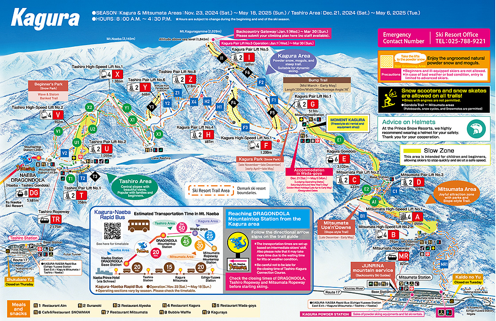
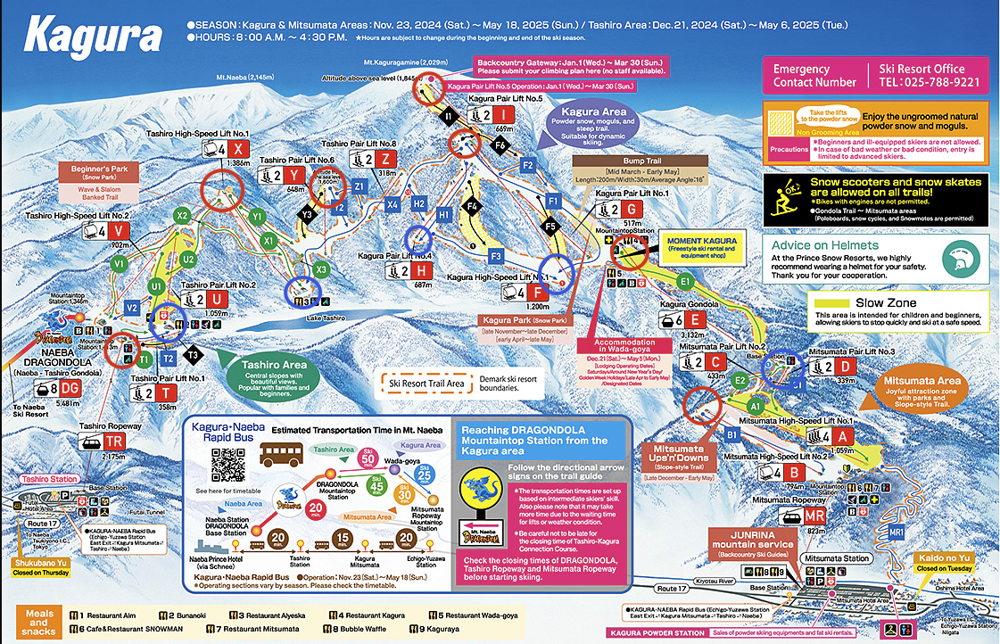
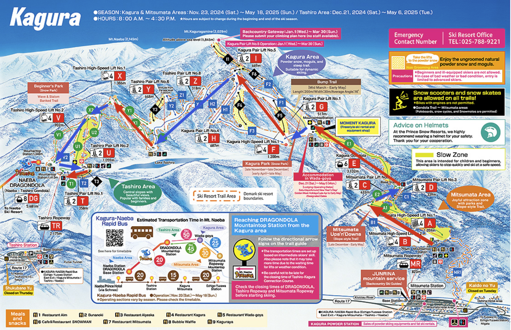
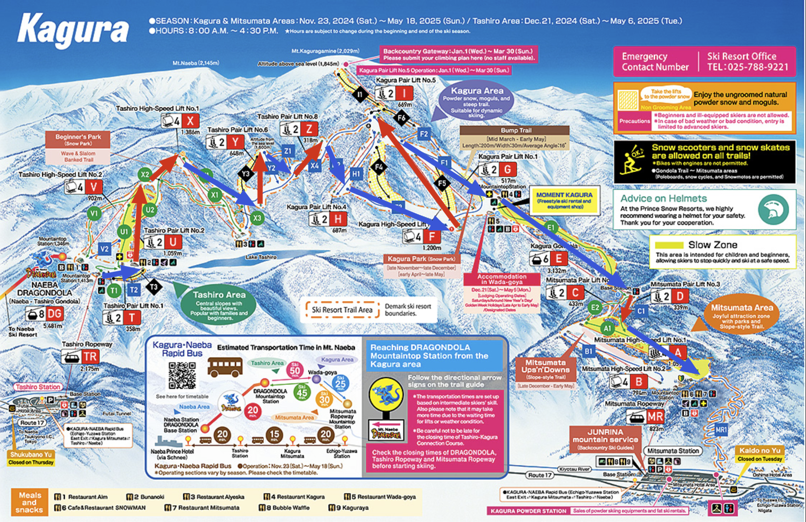

## 前言

原本想說回台灣就補上這篇，不知不覺又拖了一段時間

.

這邊整理一下如何選擇自學滑雪(尤其是單版)的話，一些要注意得事情

因為是自學沒有教練，有很多眉眉角角不會有人告訴你

這邊就整理一下自學時踩到的坑吧

.

可能會包含的部分:
- 設備: 哪些建議要租，或是要買，哪些可以不用
- 好用小物: 不是必需品但不才覺得好用的東西
- 課程: 除了推薦的影片外，一些推薦的動作
- 其他: 一些跟上面無關，但可能有用的資訊

## 設備

整理不同設備的重要程度

這邊是以不才自己在湯澤附近的神樂滑雪場為例，並且不才比較耐寒些(比當地日本人少穿半件到一件的程度)

考量點是盡可能的只買/租/帶最重要的東西，畢竟行李空間實在有限

所以請根據不同情況(e.g. 會去更冷的滑雪場)自己做調整

.

另外，這些設備請去實體門市試用。不建議上網買，可能會拿到不適合的，還不能退稅

還有可以在日本買，可能還比較便宜

試想台灣根本沒滑雪場，那些從過外進口的東西要關稅還沒多少人買，價格自然不會低

.

沒記錯話這次滑雪設備是在 [スポーツデポ](https://store.alpen-group.jp/) 買的

之前看 youtube 介紹有一條專門賣雪具的街，但不才實在懶得過去

剛好住的附近有運動用品店，品類多價格也還可以接受

.

針對不同工具介紹一下哪些該買，哪些可以用租的:
- 滑雪板 + 滑雪靴
    - 必備，一定會用到。
    - 通常是在滑雪場的店附近租，新手不建議買。
    - 雪靴盡可能挑選貼腳的，如果鞋子內部空隙太多，前刃煞車時很容易遇到墊腳尖了，但實際卻沒有影響到滑雪板的情況。可以用平常穿的鞋子尺寸做減法往下找，如果合身就把數字記下來方便下次複製貼上。
- 手套
    - 強烈建議，手直接摸冰其實有點冷。
    - 可以在日本運動用品店買，畢竟台灣的手套不用考慮到那麼冷的情況，隨便買可能實際用時發現不太保暖。
    - 毛線的不確定會不會沾雪。
    - 印象中價格[多半在 3,000 起](https://store.alpen-group.jp/f/dsd-001084009-3-1)，感覺租起來應該也不便宜，如果覺得可能會滑兩次以上可以考慮買
- 滑雪服
    - 不一定要，能夠防雪的羽絨厚外套也行
    - 以湯澤附近的神樂滑雪場為例，不才是一件內衣 + 一件睡衣 + 一件帽踢上衣 + 一件厚羽絨外套就可以了的程度
    - 防雪防風的外套在天氣好時勉強夠用，但不建議賭，一遇到陰天或是飄雪等惡劣天氣時時保暖會不太夠
- 滑雪褲
    - 不一定要，但如果有的話，雪融化時不會把衣服弄濕
    - 不才是一件睡衣 + 一件比較緊身的帆布褲就可以了的程度。但如果經常跌倒，褲子上比較容易沾到雪，雪融化時可能會冷到(但不才覺得還好)
- 頭盔 or 毛帽
    - 天氣好時可以不用，但天氣差的話，耳朵附近還是要保暖到會比較好。
    - 毛帽可以考慮，畢竟不重，天氣不好時也保暖
    - 如果買好的裝備可以放日本(e.g. 朋友家)的話，可以考慮買頭盔 + 面罩的組合，像是[這個](https://store.alpen-group.jp/f/dsg-240025-)。
        - 一來是能保暖頭部，並且頭盔其實也很輕
        - 二來是如果有戴眼鏡的話，頭盔上的面罩撥打開/關起來很方便，相對單獨的護目鏡比較不會勾到眼鏡。
        - 下雪的話，頭盔的雪很好剝掉
        - 感覺或許有可能可以保護頭部，但不才從來沒頭部著地過
        - 缺點是脖子更容易酸，不確定是因為頭的壓力更大了，還是摔倒時頭盔會因為外力拉扯脖子
        - 朋友說之後騎自行車上班時可以拿來防風
- 護目鏡
    - 因人而異。不才前幾次滑雪都沒戴還是能滑，就是有點亮。
    - 如果覺得需要但又近視的話強烈推薦頭盔 + 護目鏡。理由跟上面一樣，護目鏡在穿脫的時候很容易搆到眼鏡，堪稱狼狽大師。
- 雪地靴
    - 不一定要，布鞋或是運動鞋說真的也不是不能在雪地上行走，雪沒有結塊的話不會太滑
    - 雪地靴的好處是比較不會把襪子弄濕。如果買好的裝備可以放日本的話可以考慮買，不貴。
    - 可以考慮買了滑雪後帶回台灣。台灣常下雨，雨大的時候穿這個比較不會把襪子弄濕
- 防曬霜與護唇膏
    - 不才自己是都沒用。
- 護膝或護臀墊
    - 不才自己是都沒用，但也不是很確定用了這個會不會比較好。畢竟有些滑雪道的雪融化的話，摔下去還是會痛的。

## 好用小物

一些平常滑雪影片不會提到，但不才覺得不錯的東西:
- 能量棒，能夠幫助快速恢體力。到雪地時食量會變大很多，有時候雪場提供的食物不太夠吃。
- 能壓出雪球的工具，不才沒買但感覺應該很好玩。
- 如果想記錄滑雪過程可以考慮全景相機，因為 360 度都會拍到，所以在滑雪時不用擔心鏡頭角度，管滑管摔就對了。
    - 缺點是之後要剪片很麻煩，即時手機已經簡化了了很多步驟還是覺得麻煩。
    - 想要做比較精細的剪輯(e.g. 剪出所有摔倒的影片)會超級沒動力，因為匯入到PC流程又多又慢，手機的剪輯也做不了多複雜的事情。
- 放雪票的袋子或是夾鏈袋
    - 有些滑雪場的票是紙做的，放在口袋會爛掉
    - 比較新的滑雪場可能會用 IC 卡，但放在錢包內進出時又不好拿
    - 固定在手臂或是不用到處翻找的地方會比較方便，尤其是雙手都拿著滑雪用具的時候
    - 印象中好像有看過能在手背上放雪票的手套，連結一時間找不到
- 手套綁帶。如果會在纜車上脫下手套拍照，可能會需要
- (optional) 小零錢包，方便在公車上快速投幣

## 課程

課程會推薦這部影片，都很實用

https://www.youtube.com/playlist?list=PL_HvH06NrOQyPg-DyEtZydcFIMNjE1Bmq

.

下面的點比較像是補充，或是覺得需要注意的事情，看完教學影片後可以回來再看一遍:
- 暖身: 尤其是脖子和腳踝
    - 摔倒姿勢不對的話很傷脖子，尤其是戴著頭盔。第一天摔完回旅館都覺得脖子快爛掉了
    - 控制板子很多時候要靠腳踝，第一次使用又很容易因為緊張而用力過度，腳踝就會很酸
- 快跌倒時把重心降低，比較不會痛
    - 用力跌倒幾次後，腦子裡就會開始有放棄的念頭了。
- 開始練習換刃時，可以用手指著想要滑動的位置
    - 滑雪不一定是直直的溜下去，有時候需要透過切換前後刃的方式左右移動。用手指出位置能夠方便自己在切換左右刃時，知道自己究竟要移動到哪才是對的。
    - 如果手指出位置的話，能夠針對指出的位置修正身體的動作。等到了正確的位置後，在指出下一個位置。把換刃 + 判斷地形切成兩件事並且分開執行，會比較簡單些
    - 如果不指出位置，很多時候是否要換刃可能會靠感覺。在比較不寬的場地可能會容易摔倒
    - 二來能根據之前指出的位置和事後的結果，重新判斷自己指的位置是不是正確的
- 盡可能挑比較平坦的滑雪場
    - 以神樂和田代為例，田代的坡道相對會比較適合新手(雖然在那邊租裝備比較貴)
- 盡可能挑選人比較少的滑雪場
    - 我是菜雞，你是菜雞，大家都是菜雞，菜雞喜歡在雪道正中間跌倒，然後菜雞又怕撞到其他菜雞，就都不用練了QQ
    - `靠近車站，交通很方便，滑雪場附近有一堆飯店，工作人員會多國語言的，通常遊客不會少`，不才記得第一次去 Gala ，光是搭纜車就要排長長的隊伍。
    - 像神樂或是田代這種要搭公車上山，並且滑雪場下沒飯店，民宿也不多的滑雪場，遊客就相對不多。
    - 人多的滑雪場雪地可能會被壓得比較硬，更難滑，摔起來也更痛。
    - 人多的滑雪場，滑雪道的某一段有機會會被滑雪場開的教學團佔用，也是新手的我們可能也很難完美繞過去
- 開始能落葉飄後，可以考慮一邊深入滑雪場的場地，一邊找人少的場地練習(如果記得住場地路線和難度的話)
    - 接近入口處的滑雪場人肯定是最多的
    - 事後想想，滑雪場內其實有不少路線比出入口附近的路線更平更寬。
- `如果時間不多，不是太在意滑雪技巧提升，只希望能在不要有太多挫折又能體會滑雪的樂趣的話，只需要學會使用後刃和落葉飄，可以應付不少場地`。反正就是邊滑邊煞車這樣XD
    - 但這樣反而不會有動力想學會使用前刃和換刃，一來使用前刃會怕(畢竟身體要面向斜坡，摔下去想想就刺激)。二來以前不會摔，現在又會摔的挫折感其實有點大QQ

順便簡單說明一下如何看滑雪提供的路線圖(還是拿神樂滑雪場舉例):

乍看會以為這是一座山，上面是山的頂點

.

實際上哪邊是山頂，要根據路線的箭頭來推斷，紅色圈起來的地方是比較高的地方，藍色是較低處

.

這個滑雪場有一個兩個入口，分別是田代和三吳，可以從任意一個入口溜到另外一個。

.

如果想從`三吳`到`田代`，路線會是這樣。

紅色是搭纜車，藍色是向下滑

.

`田代`到`三吳`，路線會是這樣。

.

剛截圖到一半才發現有日文版，日文版的場地顏色才有對應難度

綠色是最簡單，接著紅色，最難是黑色，但也有遇到有些路線明明抖到不行，也被標成綠色

會落葉飄基本上能夠應付綠色到紅色區域

如果剛好需要在這個滑雪場練習前後刃和切換，推薦左上方那塊區域(也就是田代滑雪場上方)，地寬路也不會太陡

.

喜歡玩探險遊戲的小夥伴建議把截圖存起來，並且確保手機整天都有電。有時候搭纜車的地方只有代號，但附近沒有地圖

需要拿出手機來對現在在哪

.

## 其他

其他跟滑雪技術無關，教學不一定會提到的事情:
- 裝備建議在滑雪場附近的私人出租店租，會比較便宜。
    - 以田代為例，那邊滑雪場官方的出租店`一天要 6000 日幣`。如果要放鞋子要租置物櫃，300 日幣。
    - 但附近的神樂滑雪場的私人出租店`一天是 3500 日幣`，`多租一天只要 2000 日幣`，並且放鞋子不用錢，租的裝備可以借放在那邊也不用錢。
- 如過是住滑雪場附近的民宿，或是有去私人出租店，可以去問問看有沒有賣滑雪票，會比直接去櫃檯買便宜一些
    - 以神樂滑雪場為例，私人出租店賣的票兩張一萬日幣，但在滑雪場的櫃檯買一張票是 7200 日幣
- 白天時如何判斷滑雪場的狀態好不好
    - 如果在山下晴天，並且地上的雪看起來像是昨天晚上下的，恭喜滑雪場狀態不錯。
    - 如果在山下陰天，更慘還在下雪，那山上通常不太妙，因為通常山上會起霧。
    - 最討厭的情況是霧很大，一來是會讓雪地的細節全部不見，沒辦法判斷雪地是膨的還是硬的，沒辦法判斷地形。除了知道雪是白的外，得不到任何有用的資訊，基本上僅次於閉著眼睛滑。二來是眼鏡可能會起霧，眼鏡兩面加上滑雪鏡總共三面的霧氣，不才曾經遇到滑一滑前面的人被霧Ｐ到不見。
- 滑雪場通常從八點開到四點就結束了，最晚四點半要下山，可能是因為冬天太陽下的早，晚上在山上很危險。
- 距離出入口更遠的纜車路線可能會提早打洋(e.g. 三點)，目的是確保不會到了四點半人還在很遠的地方沒回來
- 如果是搭山區的公車，如果上車不需要刷卡的話，可能會需要拿乘車券，上面會印數字
    - 不然司機不會知道你是從哪一站上車
    - 公車前面的螢幕上會有很多格子，每一個格子會有數字和對應下車時要付的金額，公車每經過一站，上車時乘客拿的的編號會變大，格子上金額也會變大些。下車時把乘車券和格子上對應的金額投進零錢箱內
    - 鄉下的車子不一定能刷卡，記得準備好零錢，並且避免在下車時才開始算錢，會影響到其他乘客。

## 後記

去滑雪三次，第一次是很久以前去湯澤，體驗單雙版

第二次是去年，開始滑時發現之前學的全忘光了，又重新摸了單雙版，發現比較喜歡單板，花了兩天會落葉飄了

第三次是今年，也是花了好幾天才學會切換前刃後刃。

主要卡住的原因也很智障，前兩天鞋子穿的太大號了，還有挑的滑雪場坡度太陡了，直到第三天換了滑學場才發現。

然後總共只滑了四天，想想有點虧啊。

.

後來回想一下，可能在台灣上滑雪的課，等到日本就可以直接開始滑是相對有效率的方式，或是可以說是不差的選擇。

畢竟有專用的設備可以方便高效練習一些動作

教練也都會說中文

姿勢錯了也會及時提醒

有專門的練習機器，可以抓著桿子慢慢學會調整重心和動作

一些重要的事情教練也都會說，至少不會遇到不才那種鞋子穿太大的破事

不差錢的話跟團滑雪甚至還有人能幫你搞定日本滑學場的事情

.

邊滑邊學看起來是省下了教練費

但那邊的滑雪場還有住宿費也是要錢

.

當然上課也有缺點，除了貴外，上課也是很花時間的

.

如果和不才一樣沒花錢的小夥伴，發現進步不快的就不要太放在心上了

這個是貧窮該接受的事實(X

.

以上

.