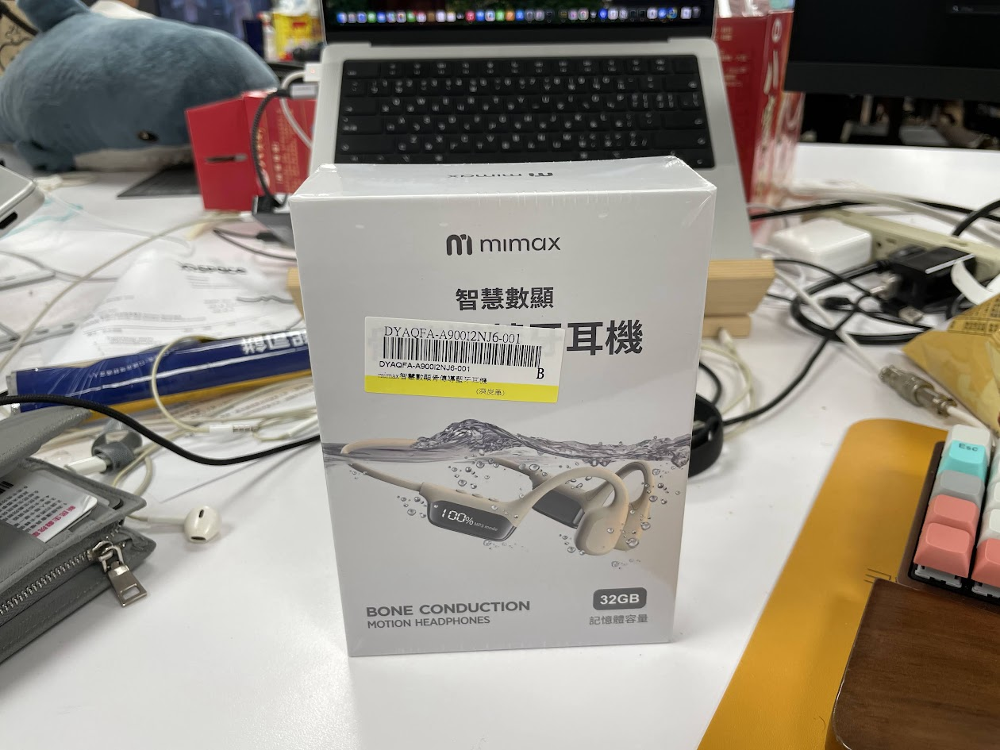
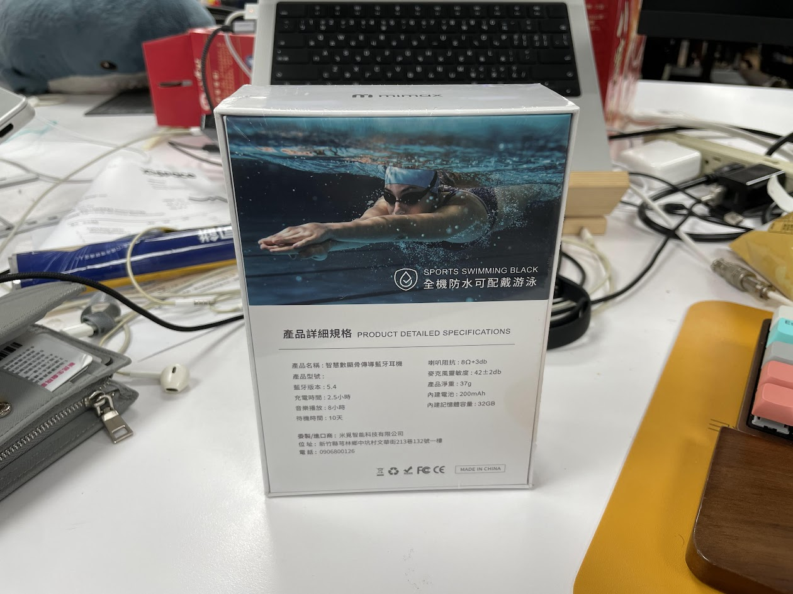
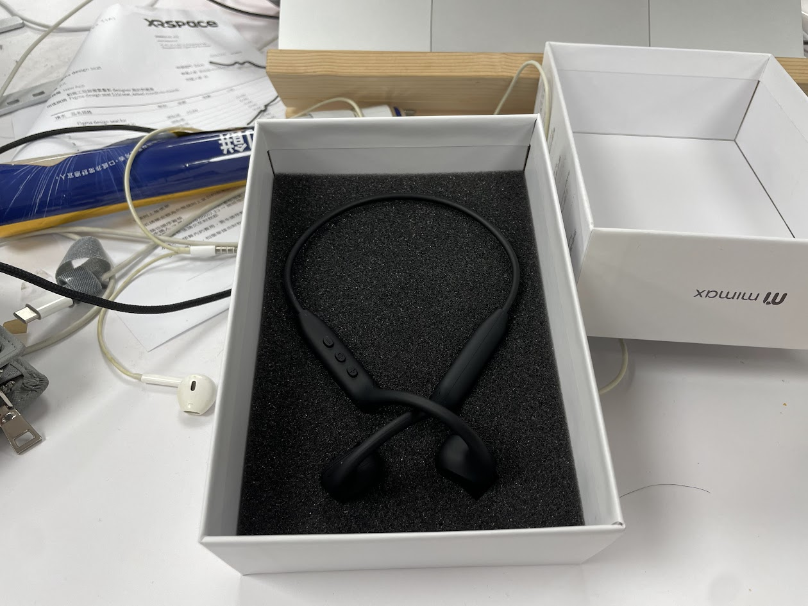
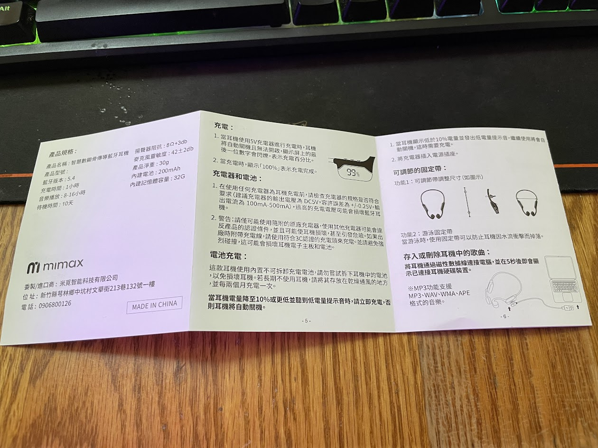
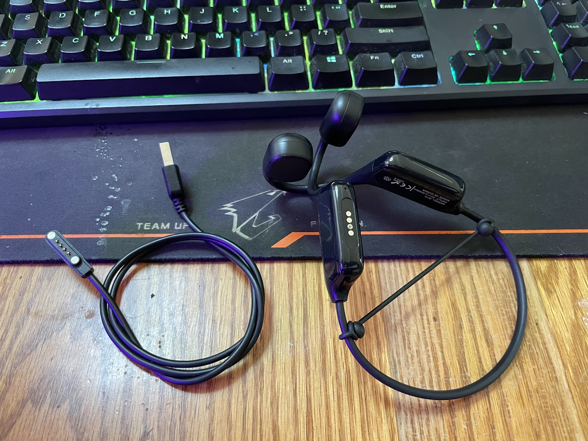
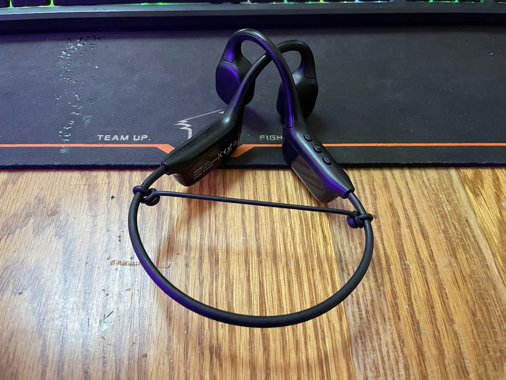

## 前言

之前騎車時是用普通的藍芽耳機

但會有一個問題，雖然耳機標榜防水(沒記錯的話)

但是因為耳機是觸控的，會有一定的機率在碰到或是沒碰到汗水的情況下被誤觸

然後耳機就播一播因為被誤觸的短按暫停，或是誤觸的常按變成通透模式或關機

.

雖然憤怒的把耳機放進盒子裡，重新戴上後有機會之後就不會發生了

但還是很憤怒

加上戴著藍芽耳機可能會聽不到外面的聲音，總覺得有點危險

最後還是考慮買個運動專用的耳機

剛好查到開放式和骨傳導的耳機

.

最後考量到聽的音樂不想被其他人聽到，就先鎖定在骨傳導

剛好看到 mimax 的骨傳導耳機也不貴，然後還有 32G 容量

當入門好像不錯

就決定是你了

.

## 開箱

開箱

.

背面

.

耳機本體

.

說明書

.

充電線採用磁吸的方式

.

## 實際使用

目前有做的運動有騎公路車，游泳，攀岩抱石和滑雪

.

騎車非常推薦

在吵雜的馬路上汽車聲音聽得非常清楚

音樂是聽得到，但是不會蓋住車子的聲音

如果到車子少的地方，音樂又會聽得非常清楚

這感覺有點像是能夠同時聽到外面和耳機的聲音，如果外面聲音大就會優先聽到外面的聲音

安全和能聽音樂都有兼顧到，總之就是很棒

.

游泳如果就純聽音樂效果很好

骨傳導耳機在耳朵密閉時聽得特別清楚

但不才測試在聽音樂時會把呼吸節奏打亂，並且耗氧量會增加不少

一開始只有游仰式時才會撥放音樂

之後把音樂調到很小聲，慢慢適應後才能在自由式中也戴耳機游

.

攀岩不是很推

雖然這玩意騎車游泳時很穩，但攀岩時手容易撥到頭，如果撥到眼鏡就可能會一起勾到這個

或是爬到比較斜的坡也會擔心掉下來(雖然技術上來說應該不會)

然後跟游泳的問題一樣，邊聽音樂邊攀岩也會把節奏打亂

另外爬一趟也就幾分鐘，實在沒必要戴耳機

所以不是很喜歡

但如果是連手機當對講機搞不好不錯

爬到比較高的地方經常聽不清楚底下的人在說什麼

.

滑雪還沒試過，但今年年去日本時應該會想順便試試看

感覺應該會很有趣

.

另外有幾點覺得也可以分享一下

第一個是買耳機附贈的綁帶

能夠讓耳機固定在頭上時更不容易產生晃動，加上這個綁帶也不會感覺到特別夾耳

並且因為更貼臉所以聲音也更清楚

不才是建議使用

.

另外第二個就是它的 MP3 模式

不才以前是挺瞧不上這種自帶容量，或是能插記憶卡的耳機

總覺得這是老人或是低端在用的東西

能用自己習慣的 app 撥放音樂它不香嗎?

.

後來發現是不才膚淺了

找個那種 20, 30G 的超大音樂壓縮包

解壓縮後一口氣全部灌進去，直接獲得一台能夠離線聽音樂的耳機

從此告別音樂焦慮，騎車時不用擔心音樂因為沒網路，或是歌單播完之類的破原因不撥了

那坨音樂包裡面可能有幾十小時的歌，基本上也不會聽膩

這是真的香

至於想聽某一首歌，或是想看音樂叫什麼名子在騎車的時候其實也不是很重要

只要歌有在播放什麼都好說

.

然後因為耳機預設是 MP3 模式， MP3 模式下音樂會比較大聲

所以之後都用這個模式為主，只有想暫時當作藍芽耳機時才切過去

.

音量在 MP3 模式下有 1~16 可以調整，每次開機預設都是 12

12 音量介於剛好到偏大聲之間，如果沒有環境噪音 9 就夠了

藍芽聲音偏小，iphone 12 連上後開到最大聲，大概是 8~9 的範圍，遇到有車的情況肯定是聽不到聲音

另外以 MP3 測試，音量12的情況下，大約隔兩公尺還是能聽到旋律和一些人聲，如果有聽過一樣歌的人應該能猜出歌曲。音量9的情況下，大概間隔 50 公分能聽到旋律。臉皮不夠厚的小夥伴建議遇到人群就把音樂暫停吧

.

然後是電量。根據之前的經驗，從早上十點騎到下午六點，電量通常剩一半左右

當然不是八個小時都在聽歌，實際撥放可能在 4~6 小時

但算下來使用一整天是沒問題

然後充電的速度沒測試，但不才覺得算很快

.

## 場景

適合場景:
- 騎車
- 游泳。但不才自己邊游泳邊聽音樂很容易把節奏打亂，目前只有在游仰式時才會使用
- 泡溫泉。耳機在耳朵有一個封閉環境時音樂會特別清楚，泡湯時把耳朵埋進水裡可以聽得很清楚，順便把其他人聊天的聲音蓋住
- 散步或跑步。不在乎音質的話可以暫時代替普通藍芽耳機，體驗不會差到很多。

.

不適合場景:
- 邊吃飯邊看影片，很容易被其他人的聲音干擾
- 想要更好的音質的場景

.

可以試試看待帶這個去泡溫泉

然後在冷泉和熱泉用用看

會發現新大陸

.

## 結論

最後整理一下這東西的優缺點

.

優點:
- 適合騎車和游泳時戴，這價位光一個運動適合使用就值回票價了
- 邊騎車邊聽音樂也能清楚的聽到外面的聲音，比用藍芽耳機安全多了
- 騎車時不用擔心音樂播到一半不播了，擺脫音樂焦慮(?)
- 音樂算清楚，音質也還 OK
- 不錯的續航力，保守估計也有八小時以上
- 充電速度算快
- 防水不錯，游泳泡湯都戴著也沒出事
- 騎車和游泳不曾掉下來。這東西穩到不才一開始甚至沒有意識到這個問題
- 配戴舒適。在有使用綁帶的情況下，配戴時可以感覺到更穩了
- MP3 模式下音量算剛好
- 打開後預設是 MP3 模式，MP3 模式最棒了
- 送修會換新品回來

.

缺點:
- 藍芽模式下的聲音比 MP3 小聲不少，需要把耳機的震動區域移動到耳朵中間才聽得清楚
- 並不能完全取代普通藍芽耳機，有些使用場景還是普通耳機好
- 跟更貴的骨傳導相比，這個在同樣的聲音大小下震動更大，並且更貴的耳機在不需要綁帶的情況下更貼合臉部
- 在寫開箱文時聽其他網友說 MP3 模式不會記住上次音量，但因為這音量剛好，所以也沒意識到這個問題
- 灌歌的速度非常慢，一小時只能灌 3GB 左右，全部灌滿可能需要 11~12 小時
- 對於經常使用藍芽模式的小夥伴可能會麻煩一點
- 充電是用特規頭，搞丟就麻煩了

.

總之如果把它當作有 MP3 功能的耳機

運動時能保證隨時都有穩定，音質不差的音樂

那這東西能很好的把這任務完成，妥妥的音樂自由神器

.