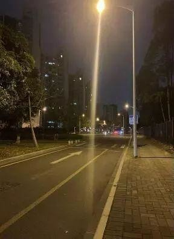

## 前言

之前去做了 [植入式手術](../experiance-of-implantable-contact-lens/index.md)

目前手術做下來幾天了，撇除掉眩光的問題外其他都挺令人滿意的

能看到 1.5 還是挺爽的，那個景色是以前想都不敢想的

.

## 手術後七個小時

當天晚上九點時視力恢復得差不多了

看遠方雙眼體感 0.9~1.0 或是更高

螢幕看得到但是有點吃力，需要更遠一點

.

出門散步時路燈的炫光很嚴重，像是圖片那樣，只是炫光位置是朝上

圖片來源: [mobile 01](https://www.mobile01.com/topicdetail.php?f=37&t=6469810)，但內容和植入式完全無關就是了

.

但水霧感幾乎消失了，到河濱看夜景會覺得這錢花得真值

很清楚，是戴眼鏡永遠看不到的景色，感覺眼睛畫面就像相機拍出來，然後用很貴的 OLED 螢幕顯示出來

未來 30 年都能看到這樣的景色，想想就很開心

.

喔對，平常在外面眼睛看不出異狀

但如果朝下看，眼睛上方的眼白的就能看到瘀血

很嚴重那種，畢竟被切了一刀

想看眼睛瘀血請自己 google ，不才現在想到這畫面會有點 PTSD

.

然後眼睛傷口會有一點點點癢

但不會到想要去揉的地步，只要不去想的話

.

## 手術後隔天早上

能看螢幕了

能寫扣，幾乎是能工作的地步了

看來介紹說手術後隔天能上班是真的(但可能還是要看各人狀況)

.

中間想到手術過程 PTSD 又犯了

不確定是不是藥物的關係，去人多光線亮和吵雜的地方有點容易被刺激到

.

眩光幾乎消失了

光暈還是有，不確定會不會隨時間消失

眼睛瘀血應該有消掉一些，第一天是整片紅，現在看起來有些地方變白了

然後左眼傷口還是有點癢

.

## 手術第三天

早上還是會覺得左眼傷口癢癢的

然後眼睛往上移動時會覺得鏡片會跟著動

但晚上就沒發生了

.

然後回診

恢復得很好的右眼可以到 1.5

左眼有點模糊，點人工淚液後好一些，免強可以到 1.0

然後醫生說位置沒跑掉都正常

.

## 手術第五天

第二次回診

左眼 1.2，右眼免強可以看到 1.5

有眼屎或是眼精榨一下的時候會有眩光的問題

然後之前提到的左眼有點癢，現在不太癢了

.

## 手術第八天

不知道為甚麼從周三開始右眼的炫光有時候又會出現

不確定是因為乾眼，有眼屎還是怎麼樣

.

這個問題目前右眼(慣用眼)比較常發生

如果只有右眼看夜景，眩光就會出現

兩隻眼睛一起看一兩秒右眼又正常了

很神奇

但有時候又不會發生

ChatGPT 說這是暫時的，不才也不是很確定

.

然後最近比較容易感覺到乾眼，不確定是術後還是眼藥水點太多了

有三瓶眼藥水一天要點四次

然後人工淚液不才經常忘記點...

.

喔對了，之前提到術後的那個超大瘀血

大概在手術後6~7天候，雖然血管還是有些紅紅的，但至少看不出有動過手術了

.

## 