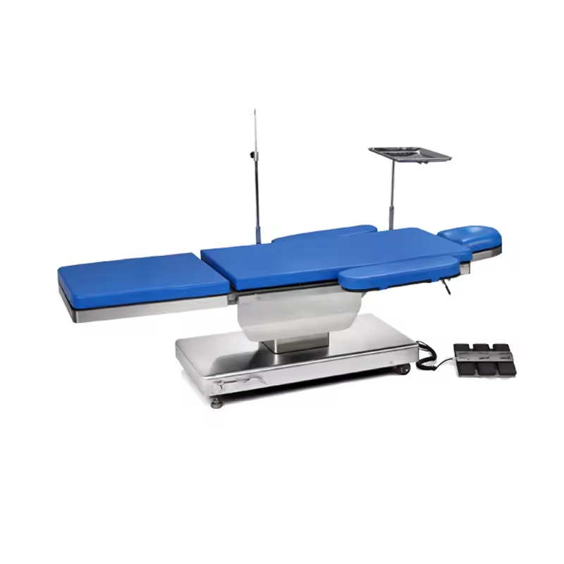

## 前言

大概去年不才的弟弟做完雷射手術後，就也跟著想做雷射把視力削掉

但因為缺點有點多(暈光，眩光，甚至還會有畏光)

加上諮詢雷射會留度數，所以醫生建議做植入式

但這鬼要 18 萬，這讓原本好不容易接受花 10 萬把近視清掉的不才又接受不了

於是這件事就當作沒發生過了

.

但今年開始運動多了，戴眼睛有時候挺礙事的

還有今年股災虧了不少

發現錢這樣放著被當韭菜收割不如花掉一些，至少虧了心理也平衡些

就回頭繼續研究雷射/植入式的事情了

.

## 諮詢

左右眼近視不一樣，近視 + 閃光 大概 1,300~1,500 度

諮詢了幾家:
- 濰視眼科: 只有做 `transPRK` ，手術方式是把前面的角膜磨掉，角膜厚度留的比較保險，沒辦法把度數清掉。沒植入式。
- 大學眼科: 選擇比較多，但費用比較貴。LASIK 根據使用機器等級從 `8W~12W` 都有，他們說可以把視力削掉，但感覺是拿角膜厚度換的(雖然範圍還在標準內)。    
  有做植入式，印象中能夠把鏡片植入到虹膜後面。好處是更不容易看出來，但費用很可觀就是了，印象中 `2X~3X` 萬。其實普通的植入式只要不是近距離死盯著對方眼睛看，正常聊天距離根本看不出來
- 瑞光: 朋友推薦，掛號費要收 2,000(其他家通常都不會收)，能折抵手術費用。   
  但感覺裡面的檢查設備是全部諮詢內最普通的。植入式價格根據是否有閃光會有變化，大約落在 `15~17W` ，應該算是中規中矩的費用。    
  因為那邊給人感覺太像公立醫院，平常人很多會擔心手術當天醫生的工作品質。還有介紹/回答問題也不深入，所以就不選那邊。    
  另外只有那家醫院不會做紅色/綠色哪個顏色比較清楚的測試，平常配眼鏡，或是其他雷射/植入是的都會做。詢問的結果是醫生說不需要，一開始覺得在唬爛，但後來買了只報了度數就拿到的隱形眼鏡來戴，也挺清楚的，或許是真的不需要吧?    
  喔對了，[檢查費1000元，藥水費1000元](https://oooooooooh.wordpress.com/2015/07/10/%EF%BC%BB%E5%BC%B7%E8%BF%AB%EF%BC%BDicl-surgery%E6%A4%8D%E5%85%A5%E5%BC%8F%E5%BE%AE%E5%9E%8B%E6%99%B6%E7%89%87%E6%89%8B%E8%A1%93%E8%AB%AE%E8%A9%A2%E7%AF%87/)，但不才最後沒拿到藥水
- 澄清: 醫院看起來高大上，手術方式最多。有建議雷射和植入式。雷射會殘留度數，大約 100，植入式不會。怕未來度數又會慢慢增加，加上考慮到之前不才的弟弟說雷射會有的那些問題，最後選了植入式。價格比瑞光高了1W。

## 手術過程

接下來講點刺激的，手術過程

只會用文字描述，不會提供任何手術圖片

如果真的想做的不建議往下觀看，或是直接跳過手術過程，因為可能知道後就不想做做手術了

有時候做這個手術靠的是無知和一股衝勁還有錢

對，滿滿的錢，錢好好用，錢很棒，錢能讓那些受過超高等教育的醫生願意幫你做手術

.

===================== 避雷開始 ======================

.

.

.

.

.

.

.

.

.

.

.

.

.

.

.

.

.

.

.

.

.

.

.

.

.

.

.

.

.

=========== 還在避雷，只需要知道單眼的手術時間大概單眼 15 分鐘就夠了 ===========

=========== 體感時間可能會到單眼 20 分鐘 =========

.

.

.

.

.

.

.

.

.

.

.

.

.

.

.

.

.

.

.

.

.

.

.

.

=== 避雷結束，就當作你們都愛聽吧 ===

雖然不會痛但會留下點 PTSD (創傷後壓力症)

在寫手術流程時 PTSD 又有點發作了，有次吃飯時也是想到手術過程突然頭暈不舒服，沒想過 PTSD 能那麼可怕

.

建議穿長袖長褲，因為手術室冷氣比較強

進去前會點縮瞳藥水和麻藥

進去手術室前會在套一件類似圍兜兜的東西

.

然後做手術的人會檢查眼睛，檢查完就會伸手在眼睛上畫標記

雖然打了麻藥理論上不會痛，但有人拿針狀物往眼睛移動就是會怕

這個害怕是刻在基因裡面那種，尤其對每次要戴隱形眼鏡都需要做一堆心理建設的不才來說

如果不要害怕的話，檢查視力時為了方便醫生檢查會在眼睛前開一個強光，死盯著那個強光就對了，因為有點縮瞳藥水所以實際強光不會到很刺眼

.

示意圖: [手術台](https://chinese.alibaba.com/product-detail/doctor-sitting-position-electric-ophthalmic-operating-62082759045.html)

接著躺上手術台，手術台頭部有一個凹槽，能夠讓頭不會左右亂晃，但也不會把頭固定死就是了

因為是先開右眼，所以醫生會對右眼先消毒，消毒不只消毒眼睛周圍的皮膚

也會消毒眼球，所以可以看到碘酒在眼睛上方，咖啡咖啡的(不會痛)

.

接著是拿一張大貼紙，醫生會說把眼睛撐大，然後把這張紙貼在臉上，剪出一個小孔

這張紙的目的是只讓眼睛露出來

~~也好，要是看著不才的醜臉做手術，醫生估計也做不下去~~

.

接著拿一個撐開眼睛的工具，把眼皮的上下撐開來

避免眼欠在中間閉眼，那眼睛就 GG 了

之後就是噴水清潔，上麻藥，很多的麻藥

.

然後開始刺激的來了

醫生會開始在眼睛的上方割開一條線

正常來說不會痛，但不才遇到開左眼時有點痛(不會到忍受不了，但就是覺得不上麻藥後面會有點可怕)，就要請醫生多補點麻藥

然後因為有麻藥的關係，只會知道眼睛有個區域被割開了，但不會知道確切在哪，和割了多大

畢竟之前也沒眼睛被切過的經驗，不會知道這個感覺是對應眼睛的哪個區域

.

示意圖圖片來源: [網路上](https://health.businessweekly.com.tw/article/ARTL003016773)

開始割之前醫生會開燈，也是強燈

他說需要這個燈他才有辦法看清楚，才能手術

但這時候不才也意識到自己也需要這盞燈

一來是下意識會盯著這盞燈，讓眼球不至於亂跑

二來是如果不專心盯這盞燈用來分散注意力，以不才的尿性根本撐不了這場手術

.

就算知道手術的人非常厲害好了

但這手術本質就是一個你不熟的人，用他的手，對是手，有機會出錯的人類之手，沒有人敢說自己的手不會失誤

拿者一把刀子和一些工具

用他的手把眼睛切開，放個沒實際親眼確認過的東西，放在不知道眼睛的哪一層

.

然後因為那東西不是放在眼睛裡就能自動固定

還要用工具在眼睛裡面搗股，想辦法把它固定在眼睛的正中心

弄完後才能收工

過程 15 分鐘，然後得全程用那隻被手術的眼睛看著這場手術完成

~~如果不知道是什麼感覺，可以看一下[來自深淵 深沉靈魂的黎明](https://ani.baha.tw/24929/01_29_00) 裡面 1:29:00 的視角 (可以順便看一下 54:00 和 1:22:26)~~

.

畫面是模糊的，但因為深度近視模糊視角看習慣了，能清楚推斷出醫生每一步到底在幹嘛

另外雖然不會痛但眼睛還是有一點感覺，能推斷醫生是不是有失誤或是太用力了

有那道光至少能很好的分散注意力，雖然沒辦法忽略掉手術過程但至少不會讓手術中太過在意

不才甘願稱那盞燈為 PTSD 縮小器

.

割完之後，兩個助手會一起對過植入式鏡片號碼，畢竟這玩意如果放錯人，或是放錯眼睛，後果是非常麻煩的

對完後，醫生就會夾著那個鏡片，從你眼睛經過

然後就會知道那鬼玩意要被放進眼睛裡了

.

之後放進眼睛裡

有一點感覺，但更多的是發現眼前那道光突然變清楚了

但只有發現光變清楚，因為根本不敢看其他地方來確認

然後任何物體在眼睛內都不會被看到，所以接下來的步驟(e.g. 醫生的刀子放進眼睛內)都看不到，但感覺得到

.

之後就會感覺到眼睛有被工具擠壓，還有似乎有拿線之類的東西輕微扯一下眼睛，用來讓鏡片固定在眼睛上

也是不痛，但有感覺

然後在固定的過程中那道光又變模糊了

.

最後就是收工，關燈

反正到鏡片的左右邊都固定完後醫生會說手術差不多了

然後眼睛會覺得脹脹的

.

先開右眼

關燈後原本是以為先出去外面休息，再開左眼

結果是直接換一隻眼，剛剛的步驟直接重複一遍

真刺激

不過想想這樣也好，畢竟直接放不才出去

要是不才中途 PTSD 發作了，估計手術就做不下去了

一口氣兩眼都做可能對大家都好

.

不太確定是不是能寫兩隻眼睛能在同一天手術完，因為其他醫院都說兩天要分開

但看到[有其他人這樣分享](https://www.facebook.com/groups/1628891777240829/posts/3343846952411961/)我就當作這樣沒法規問題吧，網路上也沒查到有法規問題

.

另外一隻眼睛手術過程也差不多，就不重複描述了

但另外一隻眼睛有遇到切開時麻藥不太夠力的問題，有點痛，不確定是不是因為比較晚動工麻藥開始退了

.

喔對了，手術過程不會到完全沒感覺，可能還是會友一些刺刺的感覺，或是眼睛脹漲，或是被擠壓的感覺，但都是可以忍受那種

單以痛覺來說，可能比根管治療還小

就是視覺上挺刺激的

.

裡面最刺激的步驟應該就是把最前面把眼球從眼睛的上方割開

還有用不知道什麼工具，伸到眼球裡面去固定鏡片

想想就舒爽

.

## 手術完成

手術完成後就~~被丟~~在手術台休息一段時間~~，順便緩解驚恐的情緒~~

之後就是被請下台，快速檢查一下眼睛位置，順便跟不才說一下手術圓滿大成功給不才委屈的心理一點安慰

然後出去等

.

12點半到，從中間視力檢查，手術前說明，手術到手術完成，還有介紹要吃要點的藥水後大概兩點

但因為四點需要做最後的檢查，所以有兩個小時的等待時間

可以選擇出去或是在醫院等

.

一開始手術完後視力很模糊，但可以感覺到比沒戴眼睛時清楚

還有水霧感很重

勉強能去地下街閒晃的等級

.

大概手術兩個小時後，右眼眼睛恢復到 0.8 左右，水霧感消失了不少，但可以感覺到畫面並不像沒戴眼鏡/隱形眼鏡那樣清晰

左眼大概0.5，並且會遇到眼睛向上移動時，裡面的鏡片好像會被帶動得更多的問題，還有眼睛脹脹的

.

手術後檢查還是聽到手術很成功，上面那些問題之後會自己好

成功很好，成功很棒，不才不想做第二次了

.

## 術後恢復

因為隔幾天記錄有點長，所以寫在這邊:

[植入式鏡片手術的過程 - 術後恢復情況](../after-implantable-contact-lens/index.md)

每隔幾天就更新一下

.

## 結論 - 值不值得

並不後悔做這個手術，畢竟錢再賺就有了，但能夠持續這樣的視力 30 年以上

至少在 30~60 歲這段時間(對，不才 30 了)，能夠和沒有近視的人有一樣或是接近的生活體驗

.

寫著突然想到小時候近視就很深了，有近視經驗的人應該都會知道近視越深因為透鏡效應的關係會讓物體看起來變小

也就是說不才看到的籃框比沒近視的人看到的小，羽毛球也是

還有在運動的時候眼鏡也會晃動影響視野

眼鏡不夠大邊緣很容易產生死角，眼鏡邊緣光線會有畸變

還有近視度數沒配足，也會連帶聽想聽力(一種是因為麥格克效應，另外一種理由是因為需要更多力氣在視覺上，聽覺就會下降)

總之就讓不才很討厭球類運動

.

## 結論 - 跟隱形眼鏡相比

另外，如果是沒戴過隱形眼鏡，但又想做手術的小夥伴

可以嘗試先試試看隱形眼鏡

一來是可以用很少的成本就體驗到沒戴隱形眼鏡的快感，度數有些微差異也意外的能接受。

二來是戴隱形眼鏡適應的時間沒想像中久，從第一次戴上去要花 40 分鐘以上，到三個星期後大概三分鐘就能戴上了，並且如果發現戴反了，還能在中途弄下來翻一面重新戴上去

並且相比植入式眼形眼鏡又是更可逆的，遇到問題摘掉就好，植入式要拿掉可是要動手術的(刺激的過程可以重溫一次)

.

有閃光可能會遇到要訂製。如果不想要訂製，只想快速買一組體驗，度數以慣用眼為主，但另外一眼不要配太深。像是不才就訂了 1,000 度的鏡片，非慣用眼的左眼近視 900，閃光 300 也不至於到頭暈，只是左眼的確不太清楚。

但會不會頭暈有時候是因人而異，畢竟不才是那種 VR 遊戲瘋狂掉禎也能撐下去玩的人。

.

如果戴了後覺得很棒，之後戴的頻率越來越高，做了更不會後悔

.

如果發現只有很少的場合需要很高的視力

例如平常使用電腦或是外出只需要 0.7 ，只有少數情況會要 1.0 (e.g. 騎車/運動)

那或許配一個度數不太夠的眼鏡 + 全矯正的隱形眼鏡是一個解

不才之前是眼鏡配到 1.0 眼睛看東西會有點痛，看螢幕不需要到 1.0 等等原因扣掉一些度數，好讓平常使用起來不是很清楚但至少舒服

.

但不才還是會私心建議去做

雖然眼鏡 + 隱形眼鏡的方案也能解決問題，但很容易因為懶或是其他原因就不去戴

矯正後就不用思考這個問題，反正視力都是足夠的狀態

.

目前左眼是 1.2，慣用眼右眼是 1.5

看風景(尤其是夜景)只能用非常爽來形容，畫質和細節直接拉滿

以河濱的夜景來說，使用眼鏡看只能看到河面有光線反射

現在視力可以看到湖面上`每一塊`反射面，騎車時也能很清楚的看到地板上的輪廓，還有遠處欄杆的輪廓

這個是以前配眼鏡不敢想的，如果要把視力配足得承受光線變得很銳利，物體看起來更小的後果

.

至於隱形眼鏡過矯能看到怎麼樣的風景不才沒有試過

但印象中有次經過隧道，因為隱形眼鏡的實際鏡片面積根本覆蓋不了瞳孔

眩光超級嚴重，可能看不了夜景吧

.

## 結論 - 相比其他手術

相比不才弟弟的雷射，前面一兩個星期或是更久都要戴墨鏡

植入式的恢復速度只能用狗幹快來形容

快到手術後兩小時不才都覺得自己能夠獨自回家(雖然最後怕出事還是請弟弟來陪不才)

還有這篇文章是手術第二天打的

中間也沒有畏光的問題

.

還有兩隻眼睛能同時做也挺爽的，至少不用承受有幾天兩眼有嚴重視差的問題

也沒有啥奇怪的麻煩，視力也都正常

多花的一萬值了

.