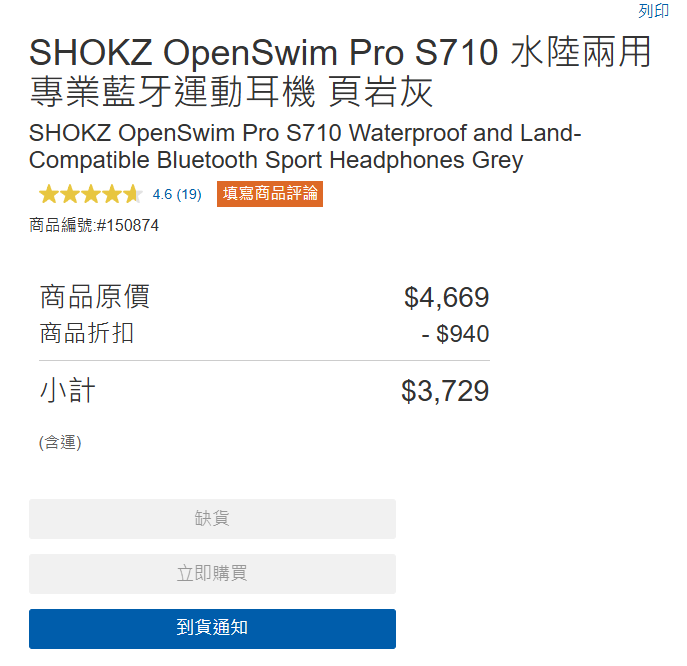
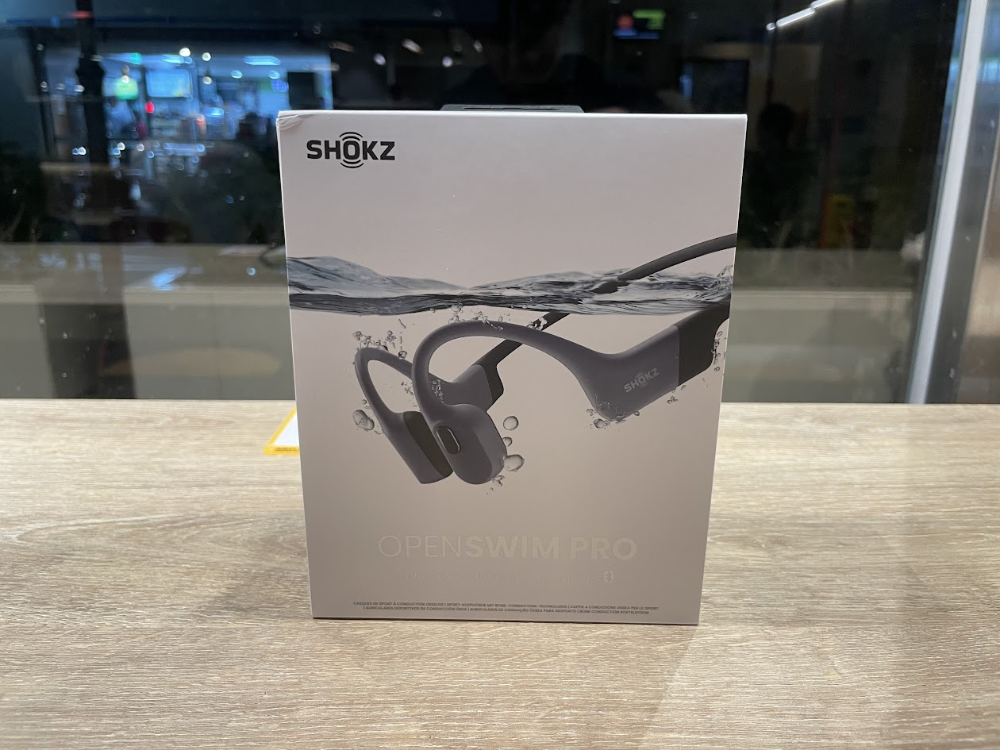
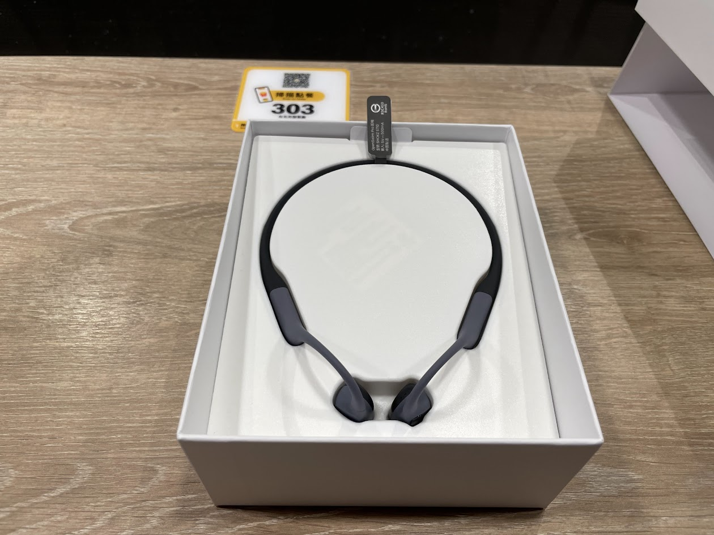
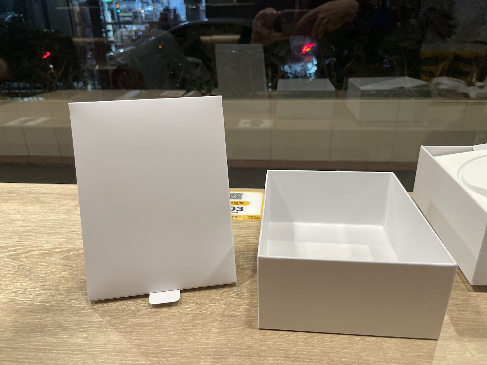
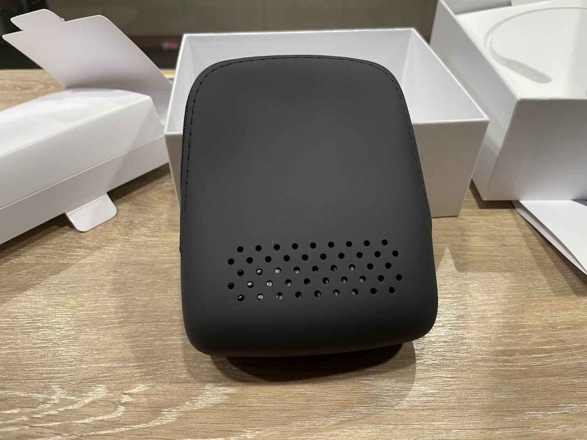
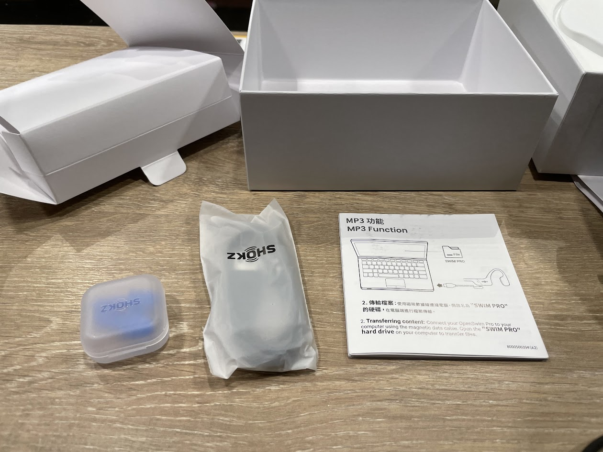
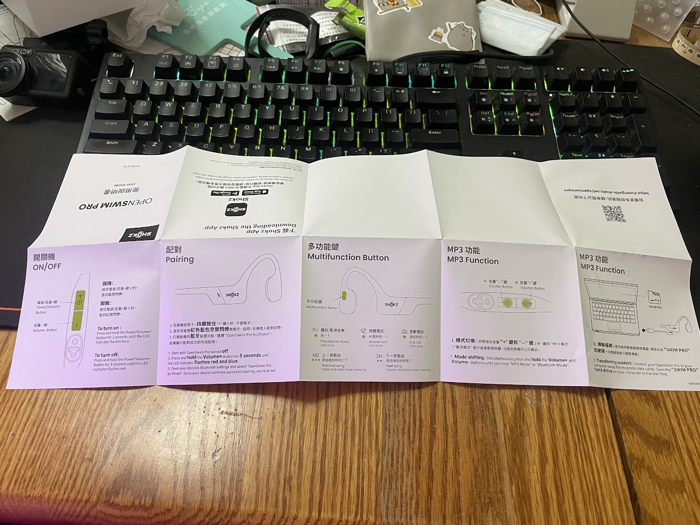

## 前言

之前買了 [mimax 的骨傳導耳機](../../06/mimax-bluetooth-headphone/index.md)

大體上除了有一些小缺點外，不才平常使用都還算滿意

但很不幸最近突然壞了，沒辦法充電進去

.

送修了後不才才發現已經離不開骨傳導耳機了

每天上下班騎公路車要用

慢跑要用

游泳藥用

就開始胡思亂想是不是該趁這個時候升級一下耳機了

.

剛好好事多正在特價

這價格還是挺香的，~~買不了吃虧買不了上當~~(後來想想這句話說 [mimax 的骨傳導耳機](../../06/mimax-bluetooth-headphone/index.md) 似乎比較適合，人家才 1000 出頭)

於是就...買了

.

## 開箱

盒子

.

耳機

.

配件盒

.

配件盒裡面是一個收納包

矽膠材質，一看就像是游泳時可以用的

.

裡面的東西有

游泳用的耳塞，特規的 充電/數據線

說明書

.

說明書內容

其實不是很重要，網路上下載得到更詳細的版本

.

## APP

app 功能不多，主要的功能有:
- 切換 MP3/藍芽模式
- 設定第二台聯接裝置(這個耳機可以連接兩個藍芽裝置)
- 長按的快捷鍵
- 語言
- 一些撥放的模式(e.g. 普通聲音或是更接近人生，在MP3模式時是不是要開啟游泳模式)

.

## 和 mimax 的數顯骨傳導耳機，或是便宜的骨傳導耳機差在哪?

相信大家可能會有一個問題

網路上有一堆便宜的骨傳導耳機

為什麼要挑貴的，差在哪

是不是值得升級?

.

不才在買的時候也有一樣的疑惑

mimax 的骨傳導耳機那時候買在 PCHome 1299 ，如果在蝦皮買應該能到 1000 出頭

OpenSwim Pro s710 沒特價時 5500 左右，是 mimax 的五倍

.

先說結論，mimax 能夠實現 OpenSwim 幾乎大部分的功能

多花了幾倍的錢主要是在這些地方上:
- 更好的外觀
- 算是更舒服地配戴
- 更少的漏音。如果不想被別人知道自己在聽什麼音樂，可能會在乎這個
- 專用的 APP
- 更少的 bug
- 相比於多數骨傳導耳機使用公版系統，更多貼心功能
  - MP3 模式下，會紀錄上次音量
  - MP3 模式下，連接手機不會中斷。(待確認)意味著手機響的時候，能夠接聽電話而不是手忙腳亂
  - 更快的複製檔案速度

.

前面三個應該是最吸引不才的地方

外觀相比 mimax ，會更像是斯文人戴的

mimax 那款耳機設計得有點粗曠，感覺像是功能有到了就行

OpenSwim 的看起來小巧多了，並且整機摸起來都有矽膠的感覺。至於會不會容易老化就是另外件事了

.

配戴感覺上

mimax 感覺像是把一個塑膠掛在耳朵上

說不穩或是壓耳朵也不至於，沒有比較沒有傷害

OpenSwim 像是耳機貼在耳朵上

配戴感更推薦這個

.

漏音問題相對於 mimax 少很多

OpenSwim 相隔30~50 公分後基本上就聽不太出音樂內容了

mimax 之前貼文提到大約隔兩公尺還是能聽到旋律和一些人聲，可以回去看心得

.

OpenSwim 有專用的 app ，有提供一些基礎功能，像是設定常按按鍵的功能

或是說要使用哪一種語言的語音之類的

還有能夠綁定兩個裝置，切換藍芽/MP3 模式等等

但認真講除了設定按鍵和語音外，這個 app 其實沒啥特別用處

大部分功能都能夠

.

最後是研發和設計思路

mimax 的骨傳導耳機，如果搜尋 `骨傳導藍牙耳機`

可能會找到一模一樣的耳機，但是不同的品牌

或是長得不一樣，但螢幕裡面顯示的字卻一樣。主要的電路板/解決方案都是一樣的，只是換了個造型

這些廠商基本上沒啥研發能力，就是買現有的方案改一改外型或是零件，或甚至不改就出了

也不能說不好，畢竟這些耳機便宜，也提供了最基礎的功能，而且也夠用

只要那些廠商在貼牌/修改時好好測試這些耳機，多半也都是不錯用的

.

市面上大多數的耳機，把 "MP3" 和 "藍芽" 視作兩個獨立的功能，如果用了 mp3 ，就不要用藍芽

而 openswim 的設計思路則是 "MP3" 和 "藍芽" 是並存的，使用者可以決定目前更情向使用哪一個，如果有必要，系統會自動切換過去。

這麼說有點抽象，舉幾個例子:
- 在撥放耳機內的歌曲時，如果用手機快捷鍵打開 siri，耳機的音樂會暫停，呼叫完 siri 後耳機的音樂會繼續撥放
- (待確認)在撥放耳機內的歌曲時，如果電話打過來了，音樂會暫停，按一下按鈕可以接通
- 同樣都是點一下撥放按鈕，在藍芽模式下是撥放手機歌曲(e.g. apple music)，在 mp3 模式下是撥放藍芽歌曲，體驗非常接近。代表平常騎車上下班時不一定要聽耳機內的音樂，那些音樂可以留到騎長途不想音樂中斷時一起聽。

.

還有檔案複製速度很快(約 9MB/s)。大概一個小時內能把32G 填滿

之前的耳機每秒只能複製 1MB，把 32G 的音樂複製過去要八個小時Orz

.

## 優點誇完了，缺點呢

相比於 `mimax智慧數顯骨傳導藍牙耳機` 的缺點:
- 耳機上沒有螢幕，判斷電量需要透過手機看(螢幕其實挺方便的)。
- 續航力比 minax 的耳機短
- 預設是藍芽不是 MP3 模式，不才使用的習慣是撥放 MP3 裡面的音樂，因為這樣能保證連續騎車幾個小時都有音樂。apple music 的歌單通常一個小時就撥放完了，運動到一半要重新找新歌其實很煩。`希望能設定預設要哪一個模式。`
- 在撥放 mp3 模式時，app 會想要同步清單，但每次同步到一半都會失敗，然後耳機就關機了。不同步撥放清單其實也能運作，就只是覺得 app 很煩。
- 有不少功能需要靠這三個按鍵的按一下，兩下，長按來觸發，邏輯上比 mimax 的耳機難懂
- app 能設定的東西太少了，並且多半能靠耳機上的按鍵設定(即使很複雜)，這 app 有點雞肋。

.

## 結論，所以我該如何選

如果只是剛開始運動，想要挑選運動專用的耳機

沒聽過骨傳導，想知道效果，不知道會用多久

可以考慮便宜的

骨傳導音質就那樣，或是說他的設計是用來能夠同時聽到外面的聲音(e.g. 在馬路上騎車時能聽到汽車聲音)，在沒啥隔音的情況下音質不會太好

有車子的時候聽得到車子聲音，沒車子時音樂的聲音會更清楚

就是聽個粗飽，但不會到不能接受

OpenSwim 音質好一點，但也就那樣，反正不會到5倍差異

.

如果不差錢，或是想升級，並且覺得上面提到的優點讓你願意掏好幾倍的錢(e.g. 外觀，或是希望在 藍芽/mp3 模式都有不錯的體驗)

缺點也能夠接受

那就買吧

.